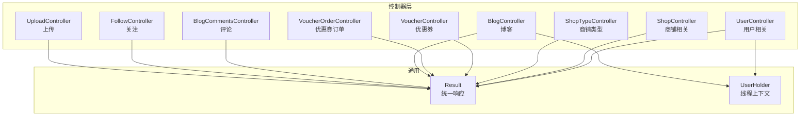
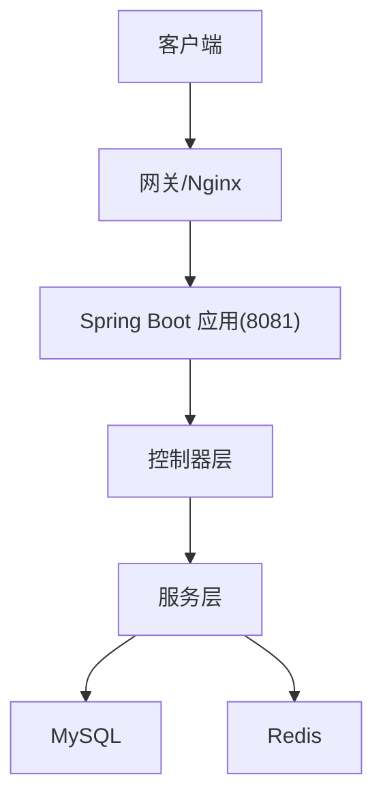
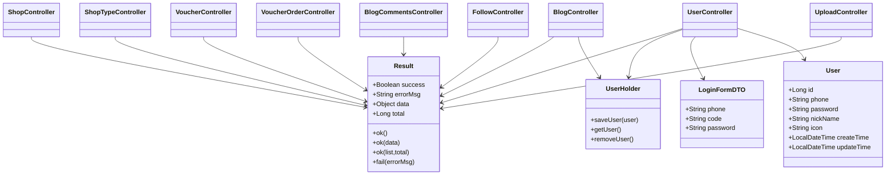

# API接口参考

<cite>
**本文引用的文件**
- [UserController.java](file://src/main/java/com/hmdp/controller/UserController.java)
- [LoginFormDTO.java](file://src/main/java/com/hmdp/dto/LoginFormDTO.java)
- [Result.java](file://src/main/java/com/hmdp/dto/Result.java)
- [User.java](file://src/main/java/com/hmdp/entity/User.java)
- [UserHolder.java](file://src/main/java/com/hmdp/utils/UserHolder.java)
- [ShopController.java](file://src/main/java/com/hmdp/controller/ShopController.java)
- [ShopTypeController.java](file://src/main/java/com/hmdp/controller/ShopTypeController.java)
- [VoucherController.java](file://src/main/java/com/hmdp/controller/VoucherController.java)
- [VoucherOrderController.java](file://src/main/java/com/hmdp/controller/VoucherOrderController.java)
- [BlogController.java](file://src/main/java/com/hmdp/controller/BlogController.java)
- [BlogCommentsController.java](file://src/main/java/com/hmdp/controller/BlogCommentsController.java)
- [FollowController.java](file://src/main/java/com/hmdp/controller/FollowController.java)
- [UploadController.java](file://src/main/java/com/hmdp/controller/UploadController.java)
- [application.yaml](file://src/main/resources/application.yaml)
- [README.md](file://README.md)
</cite>

## 目录
1. [简介](#简介)
2. [项目结构](#项目结构)
3. [核心组件](#核心组件)
4. [架构总览](#架构总览)
5. [详细接口说明](#详细接口说明)
6. [依赖关系分析](#依赖关系分析)
7. [性能与并发建议](#性能与并发建议)
8. [故障排查指南](#故障排查指南)
9. [结论](#结论)
10. [附录](#附录)

## 简介
本文件为 LSMarket 项目的完整 API 接口参考，覆盖用户、商铺、优惠券、社交（博客/评论/关注）等模块的 RESTful 接口。内容包括：
- HTTP 方法、URL 模式、请求参数与响应格式
- 参数类型、必填项、默认值与取值范围
- 成功与失败响应结构、错误码说明
- 鉴权要求、调用规范与性能建议
- 关键流程图与时序图，帮助快速理解接口行为

## 项目结构
- 控制器层位于 com.hmdp.controller，按功能域划分模块控制器
- DTO/Entity/Service 层用于封装请求参数、领域模型与业务逻辑
- 配置文件 application.yaml 定义运行端口、数据库与 Redis 连接等
- README.md 提供整体技术架构与 Redis 应用说明

图表来源
- [UserController.java](file://src/main/java/com/hmdp/controller/UserController.java#L28-L108)
- [ShopController.java](file://src/main/java/com/hmdp/controller/ShopController.java#L22-L97)
- [ShopTypeController.java](file://src/main/java/com/hmdp/controller/ShopTypeController.java#L22-L35)
- [VoucherController.java](file://src/main/java/com/hmdp/controller/VoucherController.java#L18-L58)
- [VoucherOrderController.java](file://src/main/java/com/hmdp/controller/VoucherOrderController.java#L21-L33)
- [BlogController.java](file://src/main/java/com/hmdp/controller/BlogController.java#L23-L85)
- [BlogCommentsController.java](file://src/main/java/com/hmdp/controller/BlogCommentsController.java#L16-L21)
- [FollowController.java](file://src/main/java/com/hmdp/controller/FollowController.java#L17-L39)
- [UploadController.java](file://src/main/java/com/hmdp/controller/UploadController.java#L16-L64)
- [Result.java](file://src/main/java/com/hmdp/dto/Result.java#L12-L31)
- [UserHolder.java](file://src/main/java/com/hmdp/utils/UserHolder.java#L5-L20)

章节来源
- [application.yaml](file://src/main/resources/application.yaml#L1-L42)
- [README.md](file://README.md#L1-L578)

## 核心组件
- 统一响应结构 Result
  - 字段：success（布尔）、errorMsg（字符串）、data（任意对象）、total（总数）
  - 方法：ok()/ok(data)/ok(list,total)/fail(errorMsg)
- 登录凭证 DTO LoginFormDTO
  - 字段：phone、code、password
- 用户上下文 UserHolder
  - 通过 ThreadLocal 存储当前登录用户信息，供业务使用

章节来源
- [Result.java](file://src/main/java/com/hmdp/dto/Result.java#L12-L31)
- [LoginFormDTO.java](file://src/main/java/com/hmdp/dto/LoginFormDTO.java#L6-L11)
- [UserHolder.java](file://src/main/java/com/hmdp/utils/UserHolder.java#L5-L20)

## 架构总览
- 应用运行端口与外部依赖
  - 服务器端口：8081
  - 数据源：MySQL（JDBC）
  - 缓存：Redis（Lettuce 连接池配置）
- 接口调用链路
  - 客户端 → 控制器 → 服务层 → 数据库/缓存
  - 登录态：基于 Token 的分布式会话，拦截器校验与刷新

图表来源
- [application.yaml](file://src/main/resources/application.yaml#L1-L42)
- [README.md](file://README.md#L82-L142)

章节来源
- [application.yaml](file://src/main/resources/application.yaml#L1-L42)
- [README.md](file://README.md#L82-L142)

## 详细接口说明

### 用户模块（/user）

- 获取当前登录用户信息
  - 方法与路径：GET /user/me
  - 鉴权：需要登录态（Token）
  - 请求参数：无
  - 响应：Result.success=true 时返回当前用户 DTO
  - 错误：未登录时需依赖拦截器处理（此处返回当前上下文用户）
  - 示例：curl -H "Authorization: Bearer <token>" http://localhost:8081/user/me

- 获取用户详情
  - 方法与路径：GET /user/info/{id}
  - 请求参数：id（路径变量，Long）
  - 响应：存在详情则返回详情对象（不含敏感时间字段），否则返回空数据
  - 示例：curl http://localhost:8081/user/info/123

- 根据ID查询用户
  - 方法与路径：GET /user/{id}
  - 请求参数：id（路径变量，Long）
  - 响应：存在用户则返回 UserDTO，否则返回空数据
  - 示例：curl http://localhost:8081/user/123

- 发送手机验证码
  - 方法与路径：POST /user/code
  - 请求参数：phone（表单参数，String）
  - 响应：Result.ok() 或 Result.fail()
  - 示例：curl -X POST "http://localhost:8081/user/code?phone=13800001111"

- 登录
  - 方法与路径：POST /user/login
  - 请求体：LoginFormDTO（JSON）
    - phone（手机号）
    - code（验证码，二选一）
    - password（密码，二选一）
  - 响应：Result.ok() 或 Result.fail()
  - 示例：curl -X POST http://localhost:8081/user/login -H "Content-Type: application/json" -d '{"phone":"13800001111","code":"1234"}'

- 登出
  - 方法与路径：POST /user/logout
  - 请求参数：无
  - 响应：Result.fail("功能未完成")
  - 示例：curl -X POST http://localhost:8081/user/logout

- 签到
  - 方法与路径：POST /user/sign
  - 请求参数：无
  - 响应：Result.ok() 或 Result.fail()

- 签到统计
  - 方法与路径：GET /user/sign/count
  - 请求参数：无
  - 响应：Result.ok() 返回统计结果

章节来源
- [UserController.java](file://src/main/java/com/hmdp/controller/UserController.java#L28-L108)
- [LoginFormDTO.java](file://src/main/java/com/hmdp/dto/LoginFormDTO.java#L6-L11)
- [User.java](file://src/main/java/com/hmdp/entity/User.java#L24-L67)
- [UserHolder.java](file://src/main/java/com/hmdp/utils/UserHolder.java#L5-L20)
- [Result.java](file://src/main/java/com/hmdp/dto/Result.java#L12-L31)

### 商铺模块（/shop）

- 根据ID查询商铺
  - 方法与路径：GET /shop/{id}
  - 请求参数：id（路径变量，Long）
  - 响应：Result.ok(Shop)

- 新增商铺
  - 方法与路径：POST /shop
  - 请求体：Shop（JSON）
  - 响应：Result.ok(shopId)

- 更新商铺
  - 方法与路径：PUT /shop
  - 请求体：Shop（JSON）
  - 响应：Result.ok() 或 Result.fail()

- 按类型分页查询商铺
  - 方法与路径：GET /shop/of/type
  - 请求参数：
    - typeId（整型，必填）
    - current（页码，默认1）
    - x/y（可选，Double，用于地理排序）
  - 响应：Result.ok(list)

- 按名称关键字分页查询商铺
  - 方法与路径：GET /shop/of/name
  - 请求参数：
    - name（字符串，可选）
    - current（页码，默认1）
  - 响应：Result.ok(list)

章节来源
- [ShopController.java](file://src/main/java/com/hmdp/controller/ShopController.java#L22-L97)

### 商铺类型模块（/shop-type）

- 查询类型列表
  - 方法与路径：GET /shop-type/list
  - 请求参数：无
  - 响应：Result.ok(list)

章节来源
- [ShopTypeController.java](file://src/main/java/com/hmdp/controller/ShopTypeController.java#L22-L35)

### 优惠券模块（/voucher）

- 新增秒杀券
  - 方法与路径：POST /voucher/seckill
  - 请求体：Voucher（JSON）
  - 响应：Result.ok(voucherId)

- 新增普通券
  - 方法与路径：POST /voucher
  - 请求体：Voucher（JSON）
  - 响应：Result.ok(voucherId)

- 查询某商铺的优惠券列表
  - 方法与路径：GET /voucher/list/{shopId}
  - 请求参数：shopId（路径变量，Long）
  - 响应：Result.ok(list)

章节来源
- [VoucherController.java](file://src/main/java/com/hmdp/controller/VoucherController.java#L18-L58)

### 优惠券订单模块（/voucher-order）

- 秒杀下单
  - 方法与路径：POST /voucher-order/seckill/{id}
  - 请求参数：id（路径变量，Long）
  - 响应：Result.ok() 或 Result.fail()

章节来源
- [VoucherOrderController.java](file://src/main/java/com/hmdp/controller/VoucherOrderController.java#L21-L33)

### 博客模块（/blog）

- 发布博客
  - 方法与路径：POST /blog
  - 请求体：Blog（JSON）
  - 响应：Result.ok() 或 Result.fail()

- 点赞博客
  - 方法与路径：PUT /blog/like/{id}
  - 请求参数：id（路径变量，Long）
  - 响应：Result.ok() 或 Result.fail()

- 查询我的博客（分页）
  - 方法与路径：GET /blog/of/me
  - 请求参数：current（页码，默认1）
  - 响应：Result.ok(list)

- 查询热门博客（分页）
  - 方法与路径：GET /blog/hot
  - 请求参数：current（页码，默认1）
  - 响应：Result.ok(list)

- 根据ID查询博客
  - 方法与路径：GET /blog/{id}
  - 请求参数：id（路径变量，Long）
  - 响应：Result.ok(Blog)

- 查询博客点赞用户
  - 方法与路径：GET /blog/likes/{id}
  - 请求参数：id（路径变量，Long）
  - 响应：Result.ok(list)

- 按用户ID查询博客（分页）
  - 方法与路径：GET /blog/of/user
  - 请求参数：
    - id（用户ID，Long）
    - current（页码，默认1）
  - 响应：Result.ok(list)

- 查询关注用户的博客（Feed流）
  - 方法与路径：GET /blog/of/follow
  - 请求参数：
    - lastId（Long，起始游标）
    - offset（Integer，默认0）
  - 响应：Result.ok(list)

章节来源
- [BlogController.java](file://src/main/java/com/hmdp/controller/BlogController.java#L23-L85)
- [UserHolder.java](file://src/main/java/com/hmdp/utils/UserHolder.java#L5-L20)

### 评论模块（/blog-comments）
- 当前为空实现，预留扩展点

章节来源
- [BlogCommentsController.java](file://src/main/java/com/hmdp/controller/BlogCommentsController.java#L16-L21)

### 关注模块（/follow）

- 关注/取消关注
  - 方法与路径：PUT /follow/{id}/{isFollow}
  - 请求参数：
    - id（被关注用户ID，Long）
    - isFollow（Boolean，true为关注，false为取消）
  - 响应：Result.ok() 或 Result.fail()

- 查询是否已关注
  - 方法与路径：GET /follow/or/not/{id}
  - 请求参数：id（被关注用户ID，Long）
  - 响应：Result.ok(Boolean)

- 查询共同关注
  - 方法与路径：GET /follow/common/{id}
  - 请求参数：id（目标用户ID，Long）
  - 响应：Result.ok(list)

章节来源
- [FollowController.java](file://src/main/java/com/hmdp/controller/FollowController.java#L17-L39)

### 上传模块（/upload）

- 上传博客图片
  - 方法与路径：POST /upload/blog
  - 请求：multipart/form-data，字段 file（MultipartFile）
  - 响应：Result.ok(文件名)

- 删除博客图片
  - 方法与路径：GET /upload/blog/delete
  - 请求参数：name（文件名，String）
  - 响应：Result.ok() 或 Result.fail("错误的文件名称")

章节来源
- [UploadController.java](file://src/main/java/com/hmdp/controller/UploadController.java#L16-L64)

## 依赖关系分析

图表来源
- [Result.java](file://src/main/java/com/hmdp/dto/Result.java#L12-L31)
- [User.java](file://src/main/java/com/hmdp/entity/User.java#L24-L67)
- [LoginFormDTO.java](file://src/main/java/com/hmdp/dto/LoginFormDTO.java#L6-L11)
- [UserHolder.java](file://src/main/java/com/hmdp/utils/UserHolder.java#L5-L20)
- [UserController.java](file://src/main/java/com/hmdp/controller/UserController.java#L28-L108)
- [BlogController.java](file://src/main/java/com/hmdp/controller/BlogController.java#L23-L85)

章节来源
- [Result.java](file://src/main/java/com/hmdp/dto/Result.java#L12-L31)
- [User.java](file://src/main/java/com/hmdp/entity/User.java#L24-L67)
- [LoginFormDTO.java](file://src/main/java/com/hmdp/dto/LoginFormDTO.java#L6-L11)
- [UserHolder.java](file://src/main/java/com/hmdp/utils/UserHolder.java#L5-L20)
- [UserController.java](file://src/main/java/com/hmdp/controller/UserController.java#L28-L108)
- [BlogController.java](file://src/main/java/com/hmdp/controller/BlogController.java#L23-L85)

## 性能与并发建议
- 缓存策略
  - 使用 Redis 缓存热点数据，结合逻辑过期与互斥锁避免缓存击穿
  - 对空值做短 TTL 缓存，缓解缓存穿透
- 分布式会话
  - 基于 Token + Redis Hash 存储用户信息，拦截器自动刷新 Token，降低重复登录成本
- 秒杀与高并发
  - 使用 Lua 脚本保证库存扣减原子性，Redisson 分布式锁保护临界区
  - 异步下单（Redis Stream）削峰填谷
- 地理位置
  - 使用 Redis GEO 结构进行附近查询与距离排序，显著提升查询效率
- UV 统计
  - 使用 HyperLogLog 进行去重统计，大幅降低存储与提升性能

章节来源
- [README.md](file://README.md#L48-L108)

## 故障排查指南
- 统一响应结构
  - 成功：success=true，data 为具体数据或空；失败：success=false，errorMsg 为错误描述
- 常见错误定位
  - 参数缺失或类型不匹配：检查请求体/查询参数命名与类型
  - 未登录：关注拦截器与 Token 校验，确认 Authorization 头
  - 文件上传失败：确认上传目录权限与磁盘空间
- 日志与监控
  - 应用日志级别与时间格式已在配置中设置，便于定位问题

章节来源
- [Result.java](file://src/main/java/com/hmdp/dto/Result.java#L12-L31)
- [application.yaml](file://src/main/resources/application.yaml#L38-L42)

## 结论
本接口参考文档覆盖了 LSMarket 的主要 RESTful 接口，明确了鉴权方式、请求参数、响应格式与典型错误处理。结合项目 README 中的 Redis 深度应用实践，可在高并发与复杂业务场景下获得稳定、高性能的系统表现。

## 附录

### 统一响应结构
- 字段
  - success：是否成功
  - errorMsg：错误信息
  - data：返回数据
  - total：分页总数
- 方法
  - Result.ok() / ok(data) / ok(list,total) / fail(errorMsg)

章节来源
- [Result.java](file://src/main/java/com/hmdp/dto/Result.java#L12-L31)

### 鉴权与会话
- 登录态：基于 Token 的分布式会话，拦截器负责校验与刷新
- 上下文：UserHolder 通过 ThreadLocal 保存当前用户，供业务使用

章节来源
- [UserHolder.java](file://src/main/java/com/hmdp/utils/UserHolder.java#L5-L20)
- [README.md](file://README.md#L32-L40)

### 接口调用规范
- Content-Type
  - JSON 请求体：application/json
  - 文件上传：multipart/form-data
- 认证头
  - Authorization: Bearer <token>
- 分页参数
  - current：页码（默认1）
  - offset：偏移量（部分接口）

章节来源
- [BlogController.java](file://src/main/java/com/hmdp/controller/BlogController.java#L40-L83)
- [ShopController.java](file://src/main/java/com/hmdp/controller/ShopController.java#L68-L95)