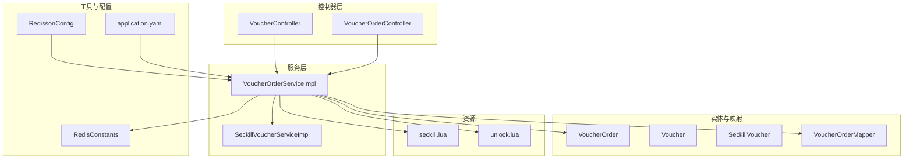
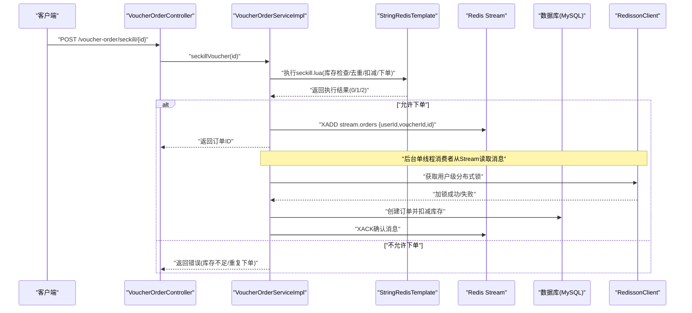
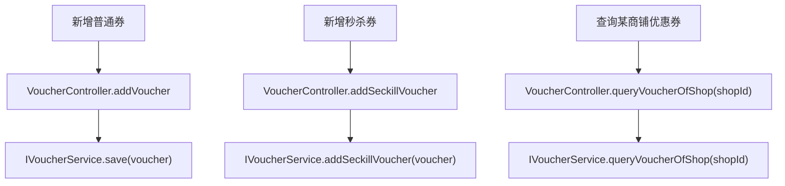
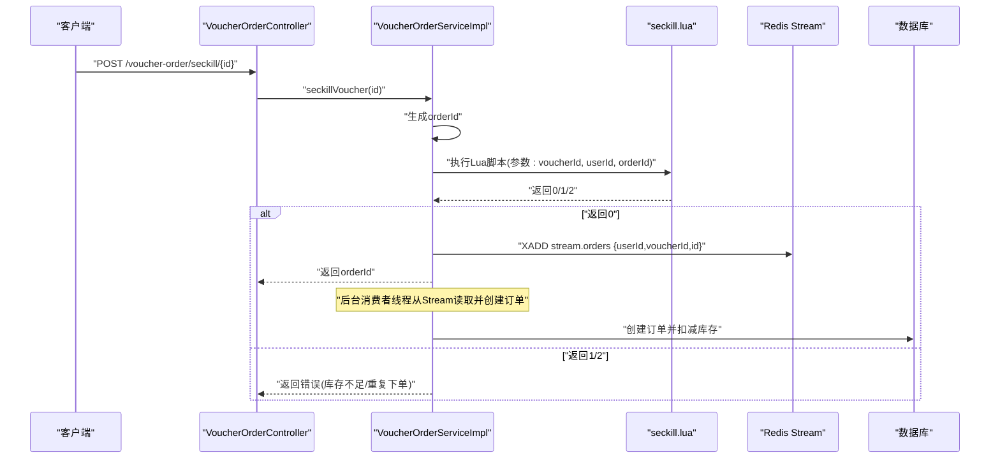
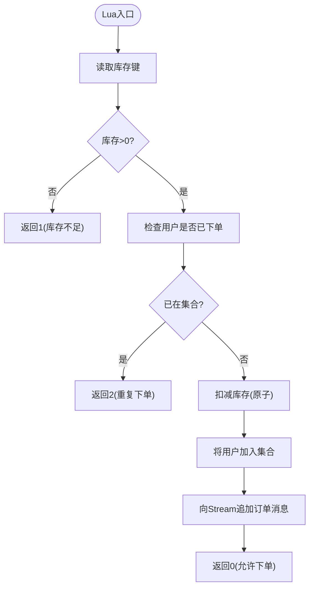
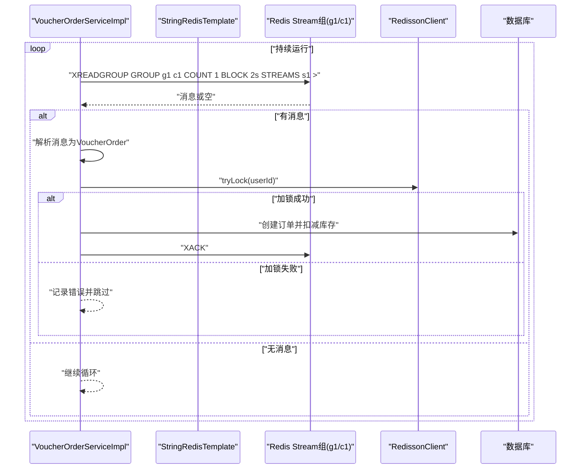
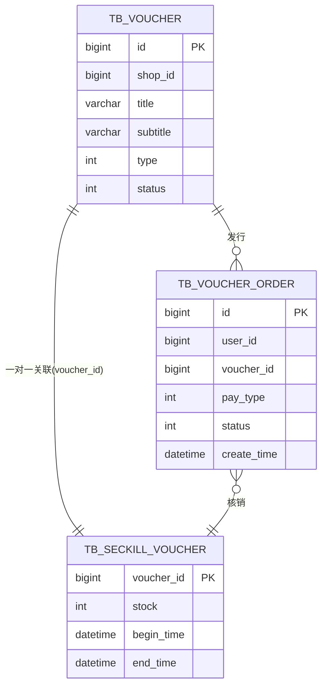
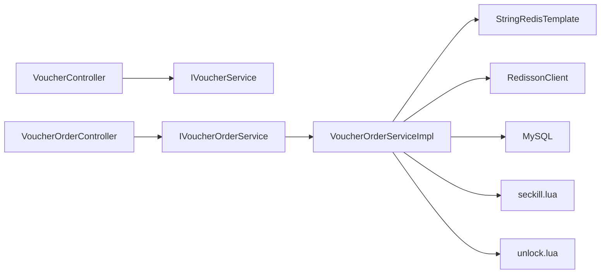

# 优惠券系统

<cite>
**本文引用的文件**
- [src/main/java/com/hmdp/controller/VoucherController.java](file://src/main/java/com/hmdp/controller/VoucherController.java)
- [src/main/java/com/hmdp/controller/VoucherOrderController.java](file://src/main/java/com/hmdp/controller/VoucherOrderController.java)
- [src/main/java/com/hmdp/service/impl/VoucherOrderServiceImpl.java](file://src/main/java/com/hmdp/service/impl/VoucherOrderServiceImpl.java)
- [src/main/java/com/hmdp/service/impl/SeckillVoucherServiceImpl.java](file://src/main/java/com/hmdp/service/impl/SeckillVoucherServiceImpl.java)
- [src/main/resources/seckill.lua](file://src/main/resources/seckill.lua)
- [src/main/resources/unlock.lua](file://src/main/resources/unlock.lua)
- [src/main/java/com/hmdp/entity/Voucher.java](file://src/main/java/com/hmdp/entity/Voucher.java)
- [src/main/java/com/hmdp/entity/SeckillVoucher.java](file://src/main/java/com/hmdp/entity/SeckillVoucher.java)
- [src/main/java/com/hmdp/entity/VoucherOrder.java](file://src/main/java/com/hmdp/entity/VoucherOrder.java)
- [src/main/java/com/hmdp/mapper/VoucherOrderMapper.java](file://src/main/java/com/hmdp/mapper/VoucherOrderMapper.java)
- [src/main/java/com/hmdp/utils/RedisConstants.java](file://src/main/java/com/hmdp/utils/RedisConstants.java)
- [src/main/java/com/hmdp/config/RedissonConfig.java](file://src/main/java/com/hmdp/config/RedissonConfig.java)
- [src/main/java/com/hmdp/service/IVoucherService.java](file://src/main/java/com/hmdp/service/IVoucherService.java)
- [src/main/java/com/hmdp/service/IVoucherOrderService.java](file://src/main/java/com/hmdp/service/IVoucherOrderService.java)
- [src/main/java/com/hmdp/service/ISeckillVoucherService.java](file://src/main/java/com/hmdp/service/ISeckillVoucherService.java)
- [src/main/resources/application.yaml](file://src/main/resources/application.yaml)
- [pom.xml](file://pom.xml)
</cite>

## 目录
1. [简介](#简介)
2. [项目结构](#项目结构)
3. [核心组件](#核心组件)
4. [架构总览](#架构总览)
5. [详细组件分析](#详细组件分析)
6. [依赖分析](#依赖分析)
7. [性能考虑](#性能考虑)
8. [故障排查指南](#故障排查指南)
9. [结论](#结论)
10. [附录](#附录)

## 简介
本技术文档围绕高并发优惠券系统展开，重点覆盖以下方面：
- 优惠券的创建与查询流程
- 秒杀券的发放与核销全流程
- 高并发秒杀系统的关键实现：库存预加载、Lua脚本原子操作、Redisson分布式锁
- 异步下单机制：基于Redis Stream的消息处理流程
- Lua脚本详解与unlock脚本作用
- 防超卖策略、性能优化与故障处理机制
- 为开发者提供可落地的高并发优惠券系统实现指导

## 项目结构
系统采用Spring Boot工程，按领域分层组织代码：
- 控制器层：对外提供HTTP接口，负责请求接入与响应封装
- 服务层：实现业务逻辑，包含秒杀券与订单处理
- 实体与映射：MyBatis Plus实体与Mapper
- 工具与配置：Redis常量、Redisson配置、Redis ID生成器等
- 资源：Lua脚本、YAML配置

图表来源
- [src/main/java/com/hmdp/controller/VoucherController.java](file://src/main/java/com/hmdp/controller/VoucherController.java#L1-L58)
- [src/main/java/com/hmdp/controller/VoucherOrderController.java](file://src/main/java/com/hmdp/controller/VoucherOrderController.java#L1-L33)
- [src/main/java/com/hmdp/service/impl/VoucherOrderServiceImpl.java](file://src/main/java/com/hmdp/service/impl/VoucherOrderServiceImpl.java#L1-L412)
- [src/main/java/com/hmdp/service/impl/SeckillVoucherServiceImpl.java](file://src/main/java/com/hmdp/service/impl/SeckillVoucherServiceImpl.java#L1-L21)
- [src/main/java/com/hmdp/entity/VoucherOrder.java](file://src/main/java/com/hmdp/entity/VoucherOrder.java#L1-L82)
- [src/main/java/com/hmdp/entity/Voucher.java](file://src/main/java/com/hmdp/entity/Voucher.java#L1-L106)
- [src/main/java/com/hmdp/entity/SeckillVoucher.java](file://src/main/java/com/hmdp/entity/SeckillVoucher.java#L1-L62)
- [src/main/java/com/hmdp/mapper/VoucherOrderMapper.java](file://src/main/java/com/hmdp/mapper/VoucherOrderMapper.java#L1-L17)
- [src/main/java/com/hmdp/utils/RedisConstants.java](file://src/main/java/com/hmdp/utils/RedisConstants.java#L1-L26)
- [src/main/java/com/hmdp/config/RedissonConfig.java](file://src/main/java/com/hmdp/config/RedissonConfig.java#L1-L21)
- [src/main/resources/application.yaml](file://src/main/resources/application.yaml#L1-L42)
- [src/main/resources/seckill.lua](file://src/main/resources/seckill.lua#L1-L32)
- [src/main/resources/unlock.lua](file://src/main/resources/unlock.lua#L1-L6)

章节来源
- [src/main/java/com/hmdp/controller/VoucherController.java](file://src/main/java/com/hmdp/controller/VoucherController.java#L1-L58)
- [src/main/java/com/hmdp/controller/VoucherOrderController.java](file://src/main/java/com/hmdp/controller/VoucherOrderController.java#L1-L33)
- [src/main/java/com/hmdp/service/impl/VoucherOrderServiceImpl.java](file://src/main/java/com/hmdp/service/impl/VoucherOrderServiceImpl.java#L1-L412)
- [src/main/java/com/hmdp/service/impl/SeckillVoucherServiceImpl.java](file://src/main/java/com/hmdp/service/impl/SeckillVoucherServiceImpl.java#L1-L21)
- [src/main/resources/application.yaml](file://src/main/resources/application.yaml#L1-L42)

## 核心组件
- 控制器
  - VoucherController：提供新增普通券、新增秒杀券、查询某商铺优惠券列表的接口
  - VoucherOrderController：提供秒杀下单接口
- 服务实现
  - VoucherOrderServiceImpl：秒杀下单、异步订单处理、分布式锁控制、Lua脚本执行
  - SeckillVoucherServiceImpl：秒杀券基础CRUD服务
- 实体与映射
  - Voucher：普通优惠券
  - SeckillVoucher：秒杀券（与Voucher一对一）
  - VoucherOrder：优惠券订单
  - VoucherOrderMapper：订单Mapper
- 工具与配置
  - RedisConstants：Redis键前缀常量
  - RedissonConfig：Redisson客户端配置
  - application.yaml：数据库、Redis连接与日志级别等配置
- 资源脚本
  - seckill.lua：秒杀原子脚本
  - unlock.lua：解锁脚本

章节来源
- [src/main/java/com/hmdp/controller/VoucherController.java](file://src/main/java/com/hmdp/controller/VoucherController.java#L1-L58)
- [src/main/java/com/hmdp/controller/VoucherOrderController.java](file://src/main/java/com/hmdp/controller/VoucherOrderController.java#L1-L33)
- [src/main/java/com/hmdp/service/impl/VoucherOrderServiceImpl.java](file://src/main/java/com/hmdp/service/impl/VoucherOrderServiceImpl.java#L1-L412)
- [src/main/java/com/hmdp/service/impl/SeckillVoucherServiceImpl.java](file://src/main/java/com/hmdp/service/impl/SeckillVoucherServiceImpl.java#L1-L21)
- [src/main/java/com/hmdp/entity/Voucher.java](file://src/main/java/com/hmdp/entity/Voucher.java#L1-L106)
- [src/main/java/com/hmdp/entity/SeckillVoucher.java](file://src/main/java/com/hmdp/entity/SeckillVoucher.java#L1-L62)
- [src/main/java/com/hmdp/entity/VoucherOrder.java](file://src/main/java/com/hmdp/entity/VoucherOrder.java#L1-L82)
- [src/main/java/com/hmdp/mapper/VoucherOrderMapper.java](file://src/main/java/com/hmdp/mapper/VoucherOrderMapper.java#L1-L17)
- [src/main/java/com/hmdp/utils/RedisConstants.java](file://src/main/java/com/hmdp/utils/RedisConstants.java#L1-L26)
- [src/main/java/com/hmdp/config/RedissonConfig.java](file://src/main/java/com/hmdp/config/RedissonConfig.java#L1-L21)
- [src/main/resources/seckill.lua](file://src/main/resources/seckill.lua#L1-L32)
- [src/main/resources/unlock.lua](file://src/main/resources/unlock.lua#L1-L6)

## 架构总览
系统采用“前端控制器 + 服务层 + Lua原子脚本 + Redis Stream异步处理 + 分布式锁”的高并发架构：
- 入口控制器接收请求
- 服务层执行Lua脚本进行库存校验、去重与下单原子操作，并向Redis Stream写入订单消息
- 单线程消费者从Stream读取消息并创建订单，同时使用Redisson分布式锁防止同一用户重复下单
- 数据库持久化订单，完成核销流程由业务侧扩展

图表来源
- [src/main/java/com/hmdp/controller/VoucherOrderController.java](file://src/main/java/com/hmdp/controller/VoucherOrderController.java#L1-L33)
- [src/main/java/com/hmdp/service/impl/VoucherOrderServiceImpl.java](file://src/main/java/com/hmdp/service/impl/VoucherOrderServiceImpl.java#L190-L208)
- [src/main/resources/seckill.lua](file://src/main/resources/seckill.lua#L1-L32)
- [src/main/java/com/hmdp/config/RedissonConfig.java](file://src/main/java/com/hmdp/config/RedissonConfig.java#L1-L21)

## 详细组件分析

### 1) 优惠券创建与查询
- 新增普通券：VoucherController调用IVoucherService保存普通券
- 新增秒杀券：VoucherController调用IVoucherService新增秒杀券，内部持久化Voucher与SeckillVoucher
- 查询某商铺优惠券：VoucherController调用IVoucherService查询该商铺下的所有优惠券

图表来源
- [src/main/java/com/hmdp/controller/VoucherController.java](file://src/main/java/com/hmdp/controller/VoucherController.java#L1-L58)
- [src/main/java/com/hmdp/service/IVoucherService.java](file://src/main/java/com/hmdp/service/IVoucherService.java#L1-L21)

章节来源
- [src/main/java/com/hmdp/controller/VoucherController.java](file://src/main/java/com/hmdp/controller/VoucherController.java#L1-L58)
- [src/main/java/com/hmdp/service/IVoucherService.java](file://src/main/java/com/hmdp/service/IVoucherService.java#L1-L21)

### 2) 秒杀下单流程（高并发）
- 请求入口：VoucherOrderController.seckillVoucher
- 服务实现：VoucherOrderServiceImpl.seckillVoucher
  - 生成订单ID
  - 执行seckill.lua脚本，原子性完成：
    - 库存检查
    - 用户重复下单检查
    - 扣减库存
    - 记录用户下单
    - 向Redis Stream写入订单消息
  - 根据脚本返回值判断是否允许下单
- 异步处理：单线程消费者从Stream读取消息，创建订单并确认消息

图表来源
- [src/main/java/com/hmdp/controller/VoucherOrderController.java](file://src/main/java/com/hmdp/controller/VoucherOrderController.java#L1-L33)
- [src/main/java/com/hmdp/service/impl/VoucherOrderServiceImpl.java](file://src/main/java/com/hmdp/service/impl/VoucherOrderServiceImpl.java#L190-L208)
- [src/main/resources/seckill.lua](file://src/main/resources/seckill.lua#L1-L32)

章节来源
- [src/main/java/com/hmdp/controller/VoucherOrderController.java](file://src/main/java/com/hmdp/controller/VoucherOrderController.java#L1-L33)
- [src/main/java/com/hmdp/service/impl/VoucherOrderServiceImpl.java](file://src/main/java/com/hmdp/service/impl/VoucherOrderServiceImpl.java#L190-L208)

### 3) Lua脚本详解（seckill.lua）
- 参数
  - ARGV[1]: 优惠券ID
  - ARGV[2]: 用户ID
  - ARGV[3]: 订单ID
- 键
  - 库存键：seckill:stock:{voucherId}
  - 订单集合键：seckill:order:{voucherId}
  - 消息队列：stream.orders
- 步骤
  1) 读取库存，若<=0则返回1（库存不足）
  2) 检查用户是否已在集合中，若在则返回2（重复下单）
  3) 扣减库存（原子递减）
  4) 将用户加入集合（记录已下单）
  5) 向Redis Stream追加订单消息
  6) 返回0（允许下单）

图表来源
- [src/main/resources/seckill.lua](file://src/main/resources/seckill.lua#L1-L32)

章节来源
- [src/main/resources/seckill.lua](file://src/main/resources/seckill.lua#L1-L32)

### 4) unlock.lua的作用
- 作用：比较当前线程标识与锁中存储的标识，一致才删除锁，避免误删他人持有的锁
- 场景：配合Redisson的基于Redis的分布式锁使用，确保锁的正确释放

章节来源
- [src/main/resources/unlock.lua](file://src/main/resources/unlock.lua#L1-L6)

### 5) 异步下单机制（Redis Stream）
- 生产者：Lua脚本执行成功后，向stream.orders追加一条消息，包含userId、voucherId、orderId
- 消费者：VoucherOrderServiceImpl启动单线程消费者，使用XREADGROUP从Stream读取消息
- 处理流程：
  - 读取消息并解析为VoucherOrder
  - 获取用户级分布式锁，防止重复下单
  - 校验用户是否已购、扣减库存、创建订单
  - 确认消息（XACK），进入下一条
- Pending List容错：异常时从“0”偏移读取Pending List，逐条重放直至清空

图表来源
- [src/main/java/com/hmdp/service/impl/VoucherOrderServiceImpl.java](file://src/main/java/com/hmdp/service/impl/VoucherOrderServiceImpl.java#L68-L127)

章节来源
- [src/main/java/com/hmdp/service/impl/VoucherOrderServiceImpl.java](file://src/main/java/com/hmdp/service/impl/VoucherOrderServiceImpl.java#L68-L127)

### 6) 分布式锁与防超卖
- 分布式锁：RedissonClient.getLock("lock:order:" + userId)，用于同一用户串行化下单
- 防超卖策略：
  - Lua脚本原子性完成库存检查、去重、扣减与下单记录
  - 数据库侧仍保留最终一致性校验（如查询订单是否存在、库存>0再扣减）
  - 通过Stream异步落库，避免热点用户阻塞主流程

章节来源
- [src/main/java/com/hmdp/service/impl/VoucherOrderServiceImpl.java](file://src/main/java/com/hmdp/service/impl/VoucherOrderServiceImpl.java#L147-L188)
- [src/main/java/com/hmdp/config/RedissonConfig.java](file://src/main/java/com/hmdp/config/RedissonConfig.java#L1-L21)

### 7) 数据模型

图表来源
- [src/main/java/com/hmdp/entity/Voucher.java](file://src/main/java/com/hmdp/entity/Voucher.java#L1-L106)
- [src/main/java/com/hmdp/entity/SeckillVoucher.java](file://src/main/java/com/hmdp/entity/SeckillVoucher.java#L1-L62)
- [src/main/java/com/hmdp/entity/VoucherOrder.java](file://src/main/java/com/hmdp/entity/VoucherOrder.java#L1-L82)

章节来源
- [src/main/java/com/hmdp/entity/Voucher.java](file://src/main/java/com/hmdp/entity/Voucher.java#L1-L106)
- [src/main/java/com/hmdp/entity/SeckillVoucher.java](file://src/main/java/com/hmdp/entity/SeckillVoucher.java#L1-L62)
- [src/main/java/com/hmdp/entity/VoucherOrder.java](file://src/main/java/com/hmdp/entity/VoucherOrder.java#L1-L82)

## 依赖分析
- 组件耦合
  - 控制器仅依赖服务接口，低耦合
  - 服务实现依赖Redis、Lua脚本、Redisson、数据库
- 外部依赖
  - Redis：库存键、订单集合、Stream、分布式锁
  - MySQL：订单持久化
  - Redisson：分布式锁
- 可能的循环依赖
  - 当前模块未见循环依赖迹象

图表来源
- [src/main/java/com/hmdp/controller/VoucherController.java](file://src/main/java/com/hmdp/controller/VoucherController.java#L1-L58)
- [src/main/java/com/hmdp/controller/VoucherOrderController.java](file://src/main/java/com/hmdp/controller/VoucherOrderController.java#L1-L33)
- [src/main/java/com/hmdp/service/impl/VoucherOrderServiceImpl.java](file://src/main/java/com/hmdp/service/impl/VoucherOrderServiceImpl.java#L1-L412)
- [src/main/java/com/hmdp/config/RedissonConfig.java](file://src/main/java/com/hmdp/config/RedissonConfig.java#L1-L21)

章节来源
- [src/main/java/com/hmdp/controller/VoucherController.java](file://src/main/java/com/hmdp/controller/VoucherController.java#L1-L58)
- [src/main/java/com/hmdp/controller/VoucherOrderController.java](file://src/main/java/com/hmdp/controller/VoucherOrderController.java#L1-L33)
- [src/main/java/com/hmdp/service/impl/VoucherOrderServiceImpl.java](file://src/main/java/com/hmdp/service/impl/VoucherOrderServiceImpl.java#L1-L412)
- [src/main/java/com/hmdp/config/RedissonConfig.java](file://src/main/java/com/hmdp/config/RedissonConfig.java#L1-L21)

## 性能考虑
- 原子性与热点控制
  - Lua脚本保证库存检查、去重、扣减与下单记录的原子性，减少数据库压力
- 异步解耦
  - 使用Redis Stream异步落库，避免请求线程被阻塞
- 分布式锁
  - 用户级分布式锁串行化同一用户的下单请求，避免重复下单与超卖风险
- 连接池与线程
  - Redis连接池配置合理，单线程消费者保障顺序性与幂等
- 缓存与预热
  - 可结合缓存模块进行库存预热（当前仓库未包含缓存实现，建议在生产环境引入）

## 故障排查指南
- 秒杀失败
  - 库存不足：Lua返回1，检查seckill:stock:{voucherId}键值
  - 重复下单：Lua返回2，检查seckill:order:{voucherId}集合
  - 分布式锁未释放：检查Redis中lock:order:{userId}键是否存在
- 消息堆积
  - 检查Stream组g1的Pending List，确认消费者线程是否正常运行
  - 若出现异常，查看handlePendingList逻辑是否触发并清理
- 日志定位
  - 开启debug日志，关注“处理订单异常”、“不允许重复下单”、“库存不足”等关键日志

章节来源
- [src/main/java/com/hmdp/service/impl/VoucherOrderServiceImpl.java](file://src/main/java/com/hmdp/service/impl/VoucherOrderServiceImpl.java#L68-L127)
- [src/main/resources/application.yaml](file://src/main/resources/application.yaml#L38-L42)

## 结论
本系统通过Lua脚本原子操作、Redis Stream异步处理与Redisson分布式锁，构建了高并发、低延迟且具备强一致性的优惠券秒杀与下单体系。结合合理的数据模型与清晰的分层设计，为后续扩展核销、退款与多商户场景提供了良好基础。

## 附录
- Redis键命名规范
  - 库存键：seckill:stock:{voucherId}
  - 用户下单集合：seckill:order:{voucherId}
  - 订单消息流：stream.orders
  - 用户级锁：lock:order:{userId}
- 依赖声明
  - Spring Data Redis、Lettuce、MyBatis Plus、Redisson、Hutool等

章节来源
- [src/main/java/com/hmdp/utils/RedisConstants.java](file://src/main/java/com/hmdp/utils/RedisConstants.java#L1-L26)
- [pom.xml](file://pom.xml#L19-L85)