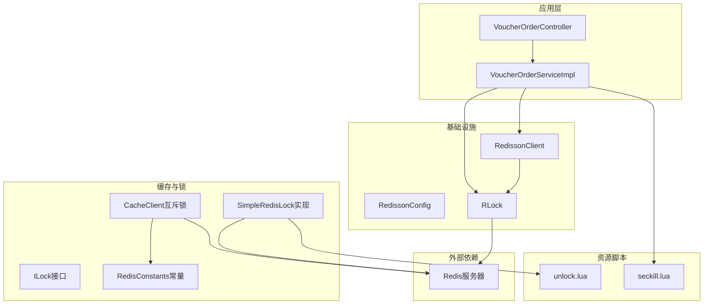
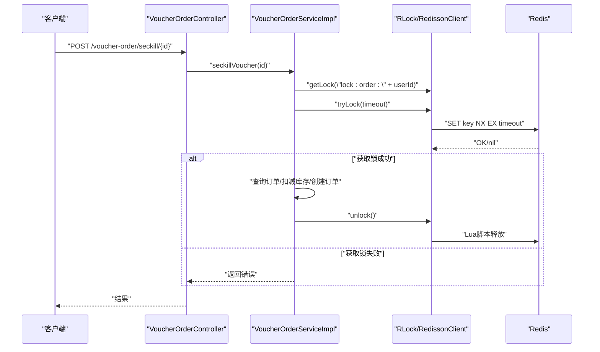
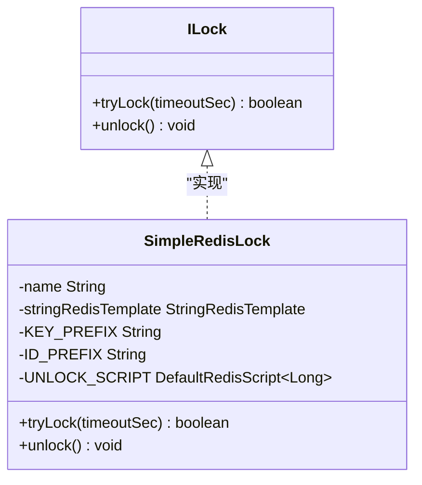
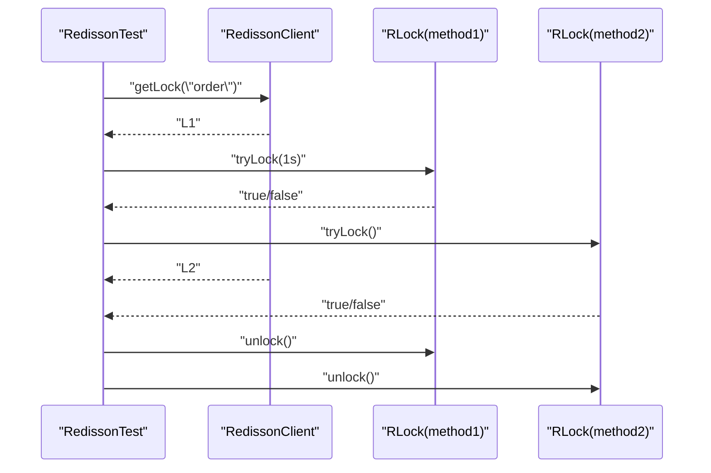
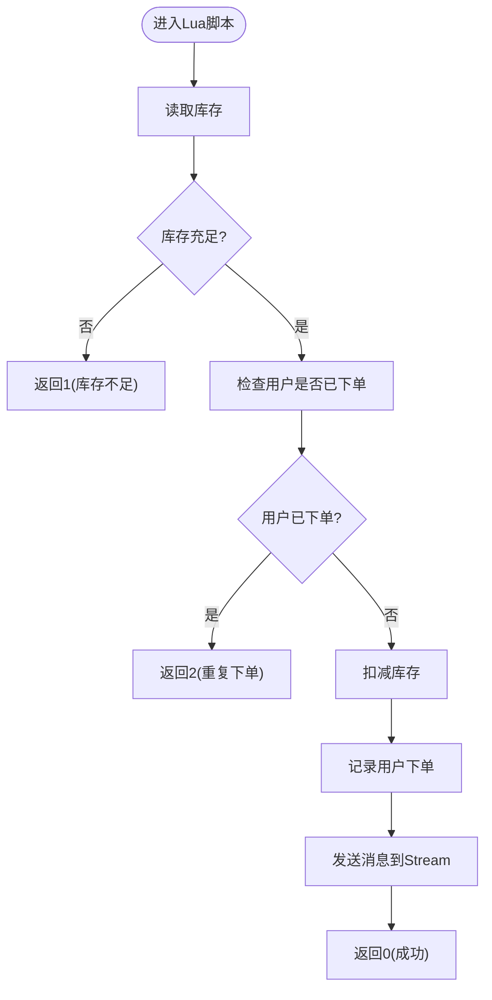
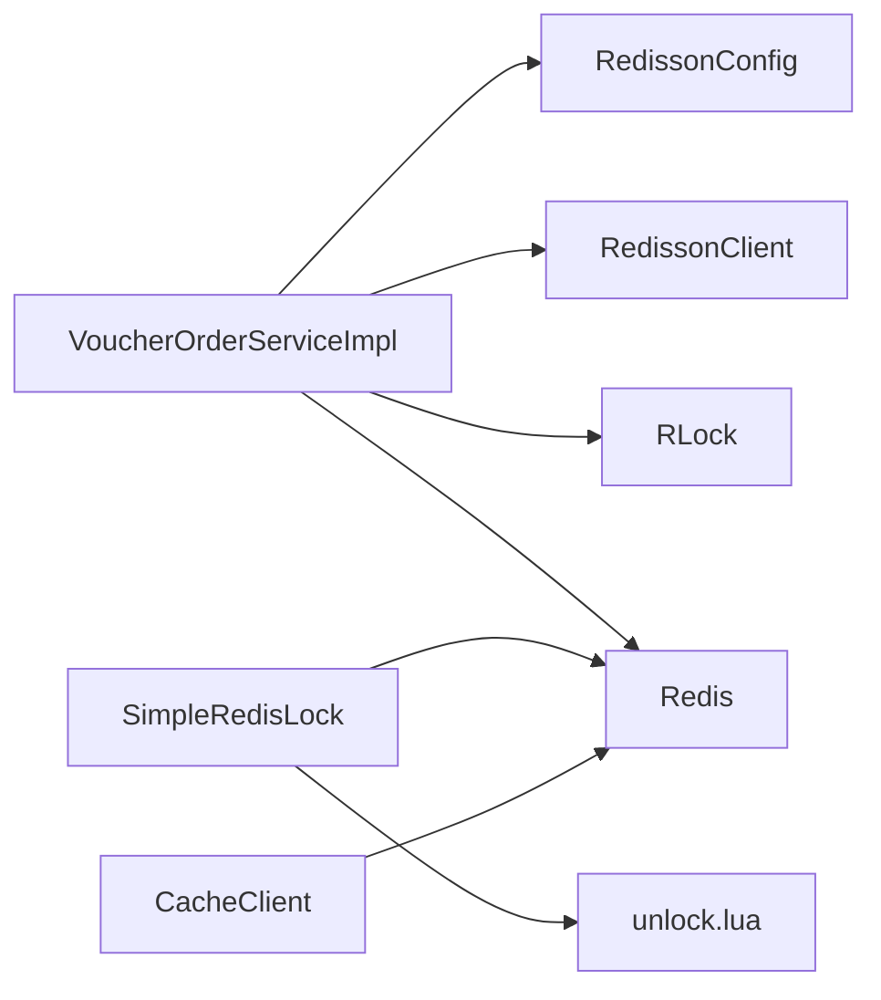

# 分布式锁实现

<cite>
**本文引用的文件**
- [ILock.java](file://src/main/java/com/hmdp/utils/ILock.java)
- [SimpleRedisLock.java](file://src/main/java/com/hmdp/utils/SimpleRedisLock.java)
- [RedissonConfig.java](file://src/main/java/com/hmdp/config/RedissonConfig.java)
- [RedissonTest.java](file://src/test/java/com/hmdp/RedissonTest.java)
- [VoucherOrderServiceImpl.java](file://src/main/java/com/hmdp/service/impl/VoucherOrderServiceImpl.java)
- [VoucherOrderController.java](file://src/main/java/com/hmdp/controller/VoucherOrderController.java)
- [IVoucherOrderService.java](file://src/main/java/com/hmdp/service/IVoucherOrderService.java)
- [RedisConstants.java](file://src/main/java/com/hmdp/utils/RedisConstants.java)
- [CacheClient.java](file://src/main/java/com/hmdp/utils/CacheClient.java)
- [application.yaml](file://src/main/resources/application.yaml)
- [unlock.lua](file://src/main/resources/unlock.lua)
- [seckill.lua](file://src/main/resources/seckill.lua)
- [README.md](file://README.md)
</cite>

## 目录
1. [引言](#引言)
2. [项目结构](#项目结构)
3. [核心组件](#核心组件)
4. [架构总览](#架构总览)
5. [详细组件分析](#详细组件分析)
6. [依赖关系分析](#依赖关系分析)
7. [性能考量](#性能考量)
8. [故障恢复与监控告警](#故障恢复与监控告警)
9. [Redisson配置与使用](#redisson配置与使用)
10. [结论](#结论)

## 引言
本文件面向开发者，系统化阐述本项目的分布式锁实现方案，涵盖设计原理、实现细节、获取与释放机制、死锁预防策略、接口设计与实现规范，并结合Redisson与自定义SimpleRedisLock两类方案，给出性能、故障恢复与监控告警建议。同时提供Redisson配置与使用方法，帮助读者构建可靠的分布式锁解决方案。

## 项目结构
本项目采用分层架构，分布式锁相关代码主要集中在以下模块：
- 接口与实现：ILock接口与SimpleRedisLock实现
- Redisson集成：RedissonConfig配置与RedissonTest测试
- 业务应用：VoucherOrderServiceImpl中对Redisson分布式锁的使用
- 资源脚本：unlock.lua与seckill.lua用于原子性控制
- 常量与工具：RedisConstants与CacheClient中对锁键的约定与互斥锁实践

图表来源
- [VoucherOrderController.java](file://src/main/java/com/hmdp/controller/VoucherOrderController.java#L21-L32)
- [VoucherOrderServiceImpl.java](file://src/main/java/com/hmdp/service/impl/VoucherOrderServiceImpl.java#L147-L317)
- [RedissonConfig.java](file://src/main/java/com/hmdp/config/RedissonConfig.java#L10-L19)
- [RedissonTest.java](file://src/test/java/com/hmdp/RedissonTest.java#L14-L58)
- [SimpleRedisLock.java](file://src/main/java/com/hmdp/utils/SimpleRedisLock.java#L11-L60)
- [CacheClient.java](file://src/main/java/com/hmdp/utils/CacheClient.java#L134-L179)
- [RedisConstants.java](file://src/main/java/com/hmdp/utils/RedisConstants.java#L3-L25)
- [unlock.lua](file://src/main/resources/unlock.lua#L1-L6)
- [seckill.lua](file://src/main/resources/seckill.lua#L1-L32)

章节来源
- [README.md](file://README.md#L82-L107)

## 核心组件
- ILock接口：定义分布式锁的统一抽象，提供tryLock与unlock两个核心方法，便于替换不同实现。
- SimpleRedisLock：基于Redis的简单分布式锁实现，使用SETNX+Lua脚本保证原子释放，避免误删他人锁。
- RedissonConfig：提供RedissonClient Bean，配置单机Redis地址。
- RedissonTest：演示RLock的获取与释放流程，验证Redisson在多线程/多方法场景下的行为。
- VoucherOrderServiceImpl：在秒杀场景中使用Redisson分布式锁，防止同一用户重复下单；同时保留SimpleRedisLock的注释实现作为对比参考。
- RedisConstants：集中管理Redis键前缀与TTL，便于统一治理。
- CacheClient：演示基于Redis的互斥锁模式（SETNX），用于缓存重建场景。
- Lua脚本：unlock.lua确保释放锁的原子性；seckill.lua保证库存扣减与下单的原子性。

章节来源
- [ILock.java](file://src/main/java/com/hmdp/utils/ILock.java#L3-L16)
- [SimpleRedisLock.java](file://src/main/java/com/hmdp/utils/SimpleRedisLock.java#L11-L60)
- [RedissonConfig.java](file://src/main/java/com/hmdp/config/RedissonConfig.java#L10-L19)
- [RedissonTest.java](file://src/test/java/com/hmdp/RedissonTest.java#L14-L58)
- [VoucherOrderServiceImpl.java](file://src/main/java/com/hmdp/service/impl/VoucherOrderServiceImpl.java#L147-L317)
- [RedisConstants.java](file://src/main/java/com/hmdp/utils/RedisConstants.java#L3-L25)
- [CacheClient.java](file://src/main/java/com/hmdp/utils/CacheClient.java#L134-L179)
- [unlock.lua](file://src/main/resources/unlock.lua#L1-L6)
- [seckill.lua](file://src/main/resources/seckill.lua#L1-L32)

## 架构总览
分布式锁在本项目中的应用路径如下：
- 控制器接收秒杀请求，调用服务层
- 服务层获取RLock或SimpleRedisLock，尝试加锁
- 加锁成功后执行业务逻辑（如查询订单、扣减库存、创建订单）
- 业务完成后释放锁
- Lua脚本保障关键操作的原子性，降低锁粒度带来的竞争

图表来源
- [VoucherOrderController.java](file://src/main/java/com/hmdp/controller/VoucherOrderController.java#L21-L32)
- [VoucherOrderServiceImpl.java](file://src/main/java/com/hmdp/service/impl/VoucherOrderServiceImpl.java#L147-L317)
- [RedissonTest.java](file://src/test/java/com/hmdp/RedissonTest.java#L27-L58)
- [SimpleRedisLock.java](file://src/main/java/com/hmdp/utils/SimpleRedisLock.java#L30-L47)
- [unlock.lua](file://src/main/resources/unlock.lua#L1-L6)

## 详细组件分析

### ILock接口设计与实现规范
- 设计目标：统一分布式锁抽象，屏蔽底层实现差异，便于切换Redisson或自定义实现。
- 方法语义：
  - tryLock(timeoutSec)：尝试获取锁，超时时间内获取成功返回true，否则false
  - unlock()：释放当前线程持有的锁
- 实现规范：
  - 必须保证释放操作的幂等性与安全性（避免误删他人锁）
  - 锁标识应具备唯一性与可区分性（线程ID/UUID组合）
  - 超时时间应合理设置，避免长时间占用导致死锁
  - 释放失败需有重试或降级策略

章节来源
- [ILock.java](file://src/main/java/com/hmdp/utils/ILock.java#L3-L16)

### SimpleRedisLock实现分析
- 锁机制：
  - 使用SETNX（或setIfAbsent）创建锁键，值为“前缀-线程ID”
  - 设置TTL，避免死锁
  - 释放时通过Lua脚本比较锁值与当前线程ID，一致才删除
- 原子性保障：
  - Lua脚本确保“比较+删除”原子执行，避免竞态条件
- 适用场景：
  - 简单场景下的分布式锁需求
  - 对Redisson依赖不敏感的环境
- 注意事项：
  - 线程模型：同一JVM内不同线程不可共享同一个SimpleRedisLock实例
  - 超时策略：需与业务执行时间匹配，避免过短导致频繁重试或过长导致资源占用

图表来源
- [ILock.java](file://src/main/java/com/hmdp/utils/ILock.java#L3-L16)
- [SimpleRedisLock.java](file://src/main/java/com/hmdp/utils/SimpleRedisLock.java#L11-L60)

章节来源
- [SimpleRedisLock.java](file://src/main/java/com/hmdp/utils/SimpleRedisLock.java#L11-L60)
- [unlock.lua](file://src/main/resources/unlock.lua#L1-L6)

### Redisson分布式锁实现与使用
- 配置：
  - 通过RedissonConfig创建RedissonClient Bean，默认连接本地Redis
- 使用方式：
  - 通过redissonClient.getLock("lock-key")获取RLock
  - tryLock(timeout, unit)尝试获取锁，支持等待超时
  - unlock()释放锁
- 业务应用：
  - VoucherOrderServiceImpl中以“lock:order:{userId}”为键进行分布式互斥，防止同一用户重复下单
  - 测试用例RedissonTest展示了多方法嵌套获取锁的正确姿势

图表来源
- [RedissonTest.java](file://src/test/java/com/hmdp/RedissonTest.java#L22-L58)
- [VoucherOrderServiceImpl.java](file://src/main/java/com/hmdp/service/impl/VoucherOrderServiceImpl.java#L147-L317)
- [RedissonConfig.java](file://src/main/java/com/hmdp/config/RedissonConfig.java#L10-L19)

章节来源
- [RedissonConfig.java](file://src/main/java/com/hmdp/config/RedissonConfig.java#L10-L19)
- [RedissonTest.java](file://src/test/java/com/hmdp/RedissonTest.java#L14-L58)
- [VoucherOrderServiceImpl.java](file://src/main/java/com/hmdp/service/impl/VoucherOrderServiceImpl.java#L147-L317)

### Lua脚本与原子性保障
- unlock.lua：
  - 通过脚本读取锁值并与传入参数比较，一致才删除，保证释放的原子性与安全性
- seckill.lua：
  - 在Redis侧完成库存检查、去重判断、扣减库存、下单记录与消息发送，保证整个流程的原子性，降低锁持有时间

图表来源
- [seckill.lua](file://src/main/resources/seckill.lua#L1-L32)

章节来源
- [unlock.lua](file://src/main/resources/unlock.lua#L1-L6)
- [seckill.lua](file://src/main/resources/seckill.lua#L1-L32)

### 缓存互斥锁与锁键治理
- CacheClient演示了基于Redis的互斥锁模式：使用SETNX+固定TTL，避免缓存击穿
- RedisConstants集中管理键前缀与TTL，便于统一治理与运维

章节来源
- [CacheClient.java](file://src/main/java/com/hmdp/utils/CacheClient.java#L134-L179)
- [RedisConstants.java](file://src/main/java/com/hmdp/utils/RedisConstants.java#L3-L25)

## 依赖关系分析
- 组件耦合：
  - VoucherOrderServiceImpl依赖RedissonClient与RLock，体现业务对分布式锁的直接依赖
  - SimpleRedisLock依赖StringRedisTemplate与Lua脚本，体现对Redis的直接依赖
  - RedissonConfig提供RedissonClient Bean，解耦业务与配置
- 外部依赖：
  - Redis服务器提供锁键存储与Lua执行能力
  - Spring Boot容器管理Bean生命周期与依赖注入

图表来源
- [VoucherOrderServiceImpl.java](file://src/main/java/com/hmdp/service/impl/VoucherOrderServiceImpl.java#L147-L317)
- [RedissonConfig.java](file://src/main/java/com/hmdp/config/RedissonConfig.java#L10-L19)
- [SimpleRedisLock.java](file://src/main/java/com/hmdp/utils/SimpleRedisLock.java#L11-L60)
- [unlock.lua](file://src/main/resources/unlock.lua#L1-L6)

章节来源
- [VoucherOrderServiceImpl.java](file://src/main/java/com/hmdp/service/impl/VoucherOrderServiceImpl.java#L147-L317)
- [RedissonConfig.java](file://src/main/java/com/hmdp/config/RedissonConfig.java#L10-L19)
- [SimpleRedisLock.java](file://src/main/java/com/hmdp/utils/SimpleRedisLock.java#L11-L60)

## 性能考量
- 锁粒度与持有时间：
  - 将锁范围限定在“用户维度”，减少锁竞争
  - 释放时机尽量靠近业务结束，缩短锁持有时间
- 超时与重试：
  - tryLock(timeout)设置合理超时，避免长时间阻塞
  - 重试间隔与上限需平衡用户体验与系统负载
- Lua脚本优化：
  - 将原子性判断与写入合并到Lua脚本，减少网络往返与锁持有时间
- 并发模型：
  - Redisson基于Netty，适合高并发场景；自定义实现需注意线程安全与脚本执行

[本节为通用性能建议，无需特定文件引用]

## 故障恢复与监控告警
- 死锁预防：
  - 设置合理的锁超时时间，避免业务异常导致锁无法释放
  - 使用Lua脚本释放锁，确保“比较+删除”的原子性
- 降级与熔断：
  - 业务失败时快速返回，避免长时间占用锁
  - 对于缓存重建场景，采用互斥锁+固定TTL，避免雪崩
- 监控与告警：
  - 监控锁获取成功率、平均等待时间、锁超时次数
  - 对异常释放（误删）进行审计与告警
  - 结合日志与指标系统，定位热点键与竞争瓶颈

[本节为通用故障恢复与监控建议，无需特定文件引用]

## Redisson配置与使用
- 配置要点：
  - RedissonConfig中设置单机Redis地址，生产环境建议使用哨兵/集群模式
  - 可扩展至多机房部署与高可用配置
- 使用建议：
  - 优先使用Redisson分布式锁，具备更完善的高可用与故障转移能力
  - 在需要细粒度控制的场景，可结合Lua脚本与自定义锁实现
- 示例流程：
  - 获取RLock -> tryLock(timeout) -> 业务处理 -> unlock()

章节来源
- [RedissonConfig.java](file://src/main/java/com/hmdp/config/RedissonConfig.java#L10-L19)
- [RedissonTest.java](file://src/test/java/com/hmdp/RedissonTest.java#L22-L58)
- [application.yaml](file://src/main/resources/application.yaml#L14-L28)

## 结论
本项目提供了两种分布式锁实现路径：Redisson分布式锁与自定义SimpleRedisLock。前者具备更强的高可用与运维能力，后者则轻量易用，适用于简单场景。结合Lua脚本与合理的锁键治理，可在高并发秒杀等场景中有效防止超卖与重复下单。建议在生产环境中优先采用Redisson，并配合完善的监控与告警体系，持续优化锁粒度与超时策略，确保系统的稳定性与性能。