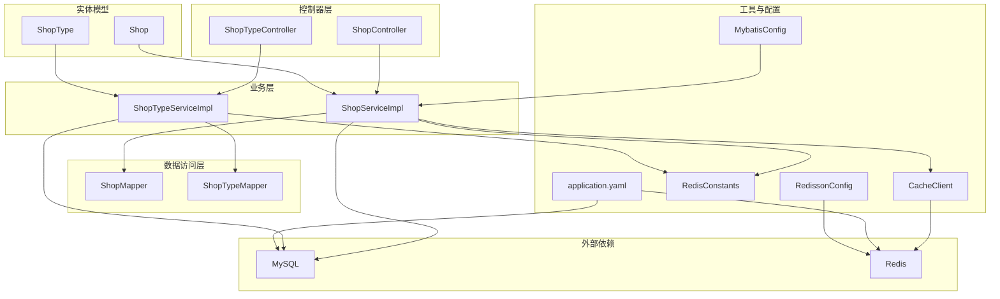
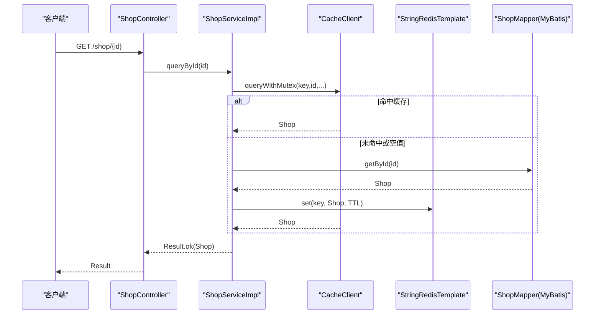
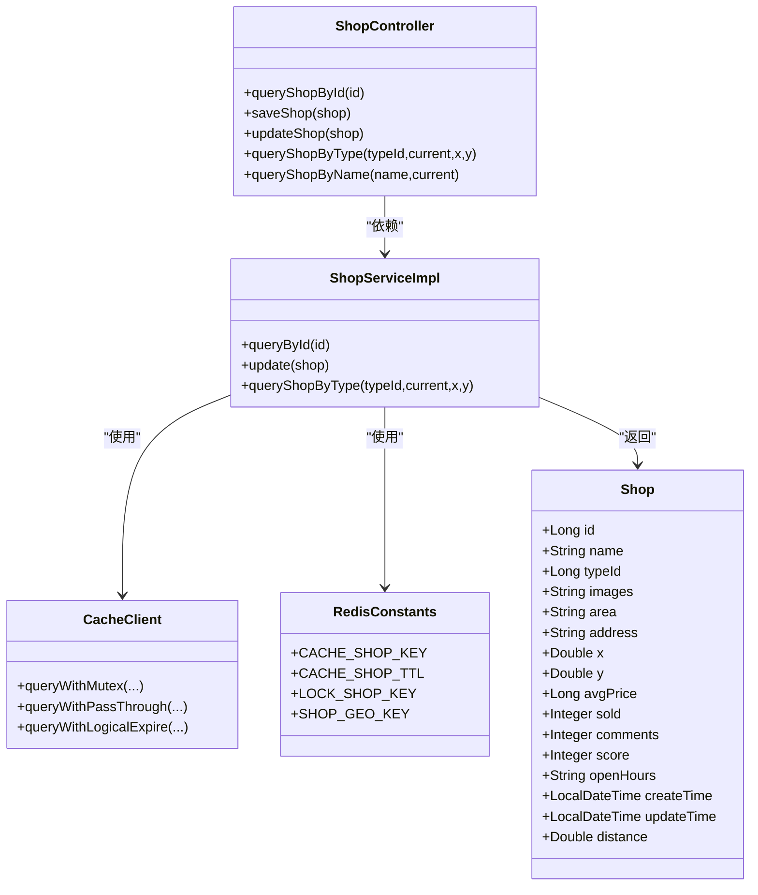
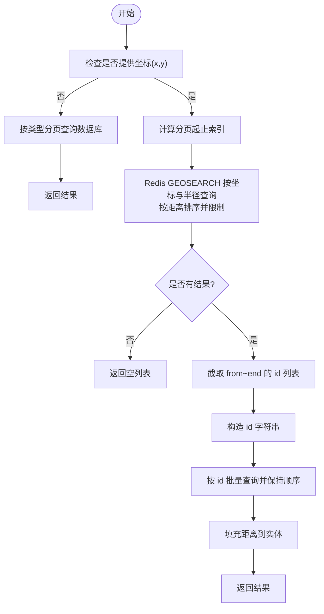
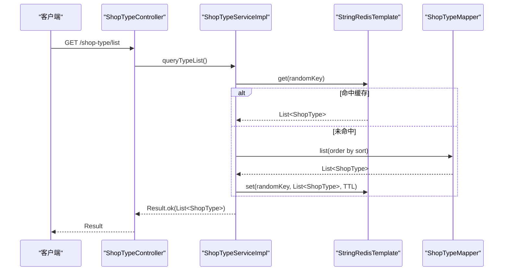
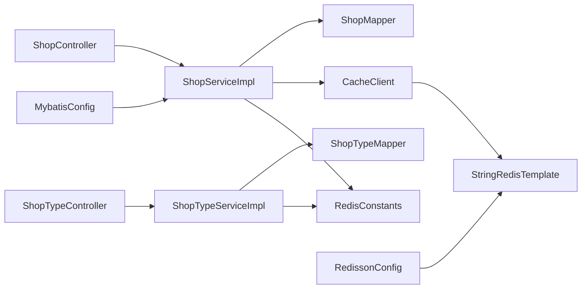

# 商铺管理系统

<cite>
**本文引用的文件**
- [ShopController.java](file://src/main/java/com/hmdp/controller/ShopController.java)
- [ShopServiceImpl.java](file://src/main/java/com/hmdp/service/impl/ShopServiceImpl.java)
- [Shop.java](file://src/main/java/com/hmdp/entity/Shop.java)
- [ShopMapper.java](file://src/main/java/com/hmdp/mapper/ShopMapper.java)
- [CacheClient.java](file://src/main/java/com/hmdp/utils/CacheClient.java)
- [RedisConstants.java](file://src/main/java/com/hmdp/utils/RedisConstants.java)
- [ShopTypeController.java](file://src/main/java/com/hmdp/controller/ShopTypeController.java)
- [ShopTypeServiceImpl.java](file://src/main/java/com/hmdp/service/impl/ShopTypeServiceImpl.java)
- [ShopType.java](file://src/main/java/com/hmdp/entity/ShopType.java)
- [application.yaml](file://src/main/resources/application.yaml)
- [hmdp.sql](file://src/main/resources/db/hmdp.sql)
- [MybatisConfig.java](file://src/main/java/com/hmdp/config/MybatisConfig.java)
- [RedissonConfig.java](file://src/main/java/com/hmdp/config/RedissonConfig.java)
- [HmDianPingApplicationTests.java](file://src/test/java/com/hmdp/HmDianPingApplicationTests.java)
</cite>

## 目录
1. [简介](#简介)
2. [项目结构](#项目结构)
3. [核心组件](#核心组件)
4. [架构总览](#架构总览)
5. [详细组件分析](#详细组件分析)
6. [依赖关系分析](#依赖关系分析)
7. [性能考量](#性能考量)
8. [故障排查指南](#故障排查指南)
9. [结论](#结论)
10. [附录](#附录)

## 简介
本项目是一个基于 Spring Boot 的商铺管理系统，提供商铺信息的增删改查、详情展示、按类型分页查询以及基于地理位置的“附近商铺”查询与距离排序能力。系统采用 Redis GEO 实现高效的空间查询，并结合多种缓存策略（空值缓存穿透防护、互斥锁防击穿、逻辑过期续期）保障高并发下的稳定性与性能。同时，系统支持商铺类型管理，提供类型列表的缓存读取与持久化。

## 项目结构
后端采用典型的分层架构：
- 控制器层：接收 HTTP 请求，封装响应
- 业务层：实现核心业务逻辑，协调缓存与数据库
- 数据访问层：MyBatis Plus Mapper 接口
- 工具与配置：Redis 缓存工具、Redis 配置、MyBatis 分页配置
- 资源与脚本：数据库初始化 SQL、应用配置

图表来源
- [ShopController.java](file://src/main/java/com/hmdp/controller/ShopController.java#L21-L96)
- [ShopTypeController.java](file://src/main/java/com/hmdp/controller/ShopTypeController.java#L21-L34)
- [ShopServiceImpl.java](file://src/main/java/com/hmdp/service/impl/ShopServiceImpl.java#L36-L134)
- [ShopTypeServiceImpl.java](file://src/main/java/com/hmdp/service/impl/ShopTypeServiceImpl.java#L32-L68)
- [CacheClient.java](file://src/main/java/com/hmdp/utils/CacheClient.java#L22-L179)
- [RedisConstants.java](file://src/main/java/com/hmdp/utils/RedisConstants.java#L3-L25)
- [application.yaml](file://src/main/resources/application.yaml#L1-L42)
- [MybatisConfig.java](file://src/main/java/com/hmdp/config/MybatisConfig.java#L9-L17)
- [RedissonConfig.java](file://src/main/java/com/hmdp/config/RedissonConfig.java#L9-L20)

章节来源
- [ShopController.java](file://src/main/java/com/hmdp/controller/ShopController.java#L21-L96)
- [ShopTypeController.java](file://src/main/java/com/hmdp/controller/ShopTypeController.java#L21-L34)
- [ShopServiceImpl.java](file://src/main/java/com/hmdp/service/impl/ShopServiceImpl.java#L36-L134)
- [ShopTypeServiceImpl.java](file://src/main/java/com/hmdp/service/impl/ShopTypeServiceImpl.java#L32-L68)
- [CacheClient.java](file://src/main/java/com/hmdp/utils/CacheClient.java#L22-L179)
- [RedisConstants.java](file://src/main/java/com/hmdp/utils/RedisConstants.java#L3-L25)
- [application.yaml](file://src/main/resources/application.yaml#L1-L42)
- [MybatisConfig.java](file://src/main/java/com/hmdp/config/MybatisConfig.java#L9-L17)
- [RedissonConfig.java](file://src/main/java/com/hmdp/config/RedissonConfig.java#L9-L20)

## 核心组件
- 商铺控制器：提供按 ID 查询、新增、更新、按类型分页查询、按名称关键字分页查询等接口
- 商铺服务实现：封装缓存策略、Redis GEO 查询、分页与距离排序
- 商铺实体：包含商铺基础信息与地理坐标字段
- 商铺类型控制器与服务：提供类型列表查询与缓存策略
- 缓存客户端：提供空值缓存、互斥锁、逻辑过期三种缓存策略
- Redis 常量：统一管理缓存键前缀与过期时间
- MyBatis 配置：启用分页插件
- Redis 配置：提供 Redisson 客户端配置

章节来源
- [ShopController.java](file://src/main/java/com/hmdp/controller/ShopController.java#L21-L96)
- [ShopServiceImpl.java](file://src/main/java/com/hmdp/service/impl/ShopServiceImpl.java#L36-L134)
- [Shop.java](file://src/main/java/com/hmdp/entity/Shop.java#L26-L109)
- [ShopTypeController.java](file://src/main/java/com/hmdp/controller/ShopTypeController.java#L21-L34)
- [ShopTypeServiceImpl.java](file://src/main/java/com/hmdp/service/impl/ShopTypeServiceImpl.java#L32-L68)
- [CacheClient.java](file://src/main/java/com/hmdp/utils/CacheClient.java#L22-L179)
- [RedisConstants.java](file://src/main/java/com/hmdp/utils/RedisConstants.java#L3-L25)
- [MybatisConfig.java](file://src/main/java/com/hmdp/config/MybatisConfig.java#L9-L17)

## 架构总览
系统通过控制器接收请求，调用服务层；服务层优先访问 Redis 缓存，未命中则回源数据库，并将结果写入缓存；对于按类型与位置的查询，服务层使用 Redis GEO 进行空间检索与距离排序，再回表查询详细信息并填充距离字段。

图表来源
- [ShopController.java](file://src/main/java/com/hmdp/controller/ShopController.java#L33-L36)
- [ShopServiceImpl.java](file://src/main/java/com/hmdp/service/impl/ShopServiceImpl.java#L45-L64)
- [CacheClient.java](file://src/main/java/com/hmdp/utils/CacheClient.java#L120-L169)

## 详细组件分析

### 商铺信息管理
- 增删改查
  - 新增：控制器接收 Shop 对象，服务层写入数据库并返回 id
  - 更新：服务层更新数据库后删除对应缓存键
  - 删除：当前控制器未提供删除接口，可在服务层扩展
  - 查询：按 ID 查询详情，支持缓存策略
- 详情展示：返回 Shop 实体，包含名称、类型、图片、地址、坐标、均价、销量、评论、评分、营业时间等字段
- 地理位置信息管理：实体包含 x、y 字段，服务层使用 Redis GEO 结构进行空间索引与查询

图表来源
- [Shop.java](file://src/main/java/com/hmdp/entity/Shop.java#L26-L109)
- [ShopController.java](file://src/main/java/com/hmdp/controller/ShopController.java#L21-L96)
- [ShopServiceImpl.java](file://src/main/java/com/hmdp/service/impl/ShopServiceImpl.java#L36-L134)
- [CacheClient.java](file://src/main/java/com/hmdp/utils/CacheClient.java#L22-L179)
- [RedisConstants.java](file://src/main/java/com/hmdp/utils/RedisConstants.java#L3-L25)

章节来源
- [ShopController.java](file://src/main/java/com/hmdp/controller/ShopController.java#L21-L96)
- [ShopServiceImpl.java](file://src/main/java/com/hmdp/service/impl/ShopServiceImpl.java#L36-L134)
- [Shop.java](file://src/main/java/com/hmdp/entity/Shop.java#L26-L109)

### 基于 Redis GEO 的附近商铺查询与距离计算
- 数据结构：按商铺类型分组，使用 Redis GEO 存储每个类型的商铺经纬度，键格式为常量前缀 + 类型 id
- 查询流程：
  - 若传入坐标，使用 GEOSEARCH 按坐标与半径查询，按距离排序并限制返回条数
  - 截取当前页的 id 列表，回表按 id 批量查询并保持原始顺序
  - 将距离填充到实体的 distance 字段
- 性能要点：
  - 使用批量 GEOADD 初始化 GEO 索引
  - 使用 LIMIT 控制查询范围，避免全表扫描
  - 使用 ORDER BY FIELD 保持与 GEO 查询一致的顺序

图表来源
- [ShopServiceImpl.java](file://src/main/java/com/hmdp/service/impl/ShopServiceImpl.java#L80-L134)
- [RedisConstants.java](file://src/main/java/com/hmdp/utils/RedisConstants.java#L23-L24)
- [HmDianPingApplicationTests.java](file://src/test/java/com/hmdp/HmDianPingApplicationTests.java#L70-L94)

章节来源
- [ShopServiceImpl.java](file://src/main/java/com/hmdp/service/impl/ShopServiceImpl.java#L80-L134)
- [RedisConstants.java](file://src/main/java/com/hmdp/utils/RedisConstants.java#L23-L24)
- [HmDianPingApplicationTests.java](file://src/test/java/com/hmdp/HmDianPingApplicationTests.java#L70-L94)

### 商铺类型管理
- 类型列表查询：按 sort 升序返回类型列表
- 缓存策略：使用随机 key 前缀写入 Redis，设置固定 TTL，命中则直接返回，未命中回源数据库并写入缓存
- 实体字段：包含 id、name、icon、sort 等

图表来源
- [ShopTypeController.java](file://src/main/java/com/hmdp/controller/ShopTypeController.java#L27-L33)
- [ShopTypeServiceImpl.java](file://src/main/java/com/hmdp/service/impl/ShopTypeServiceImpl.java#L42-L68)

章节来源
- [ShopTypeController.java](file://src/main/java/com/hmdp/controller/ShopTypeController.java#L21-L34)
- [ShopTypeServiceImpl.java](file://src/main/java/com/hmdp/service/impl/ShopTypeServiceImpl.java#L32-L68)
- [ShopType.java](file://src/main/java/com/hmdp/entity/ShopType.java#L26-L64)

### 缓存策略与性能优化
- 空值缓存穿透防护：当数据库查询为空时，写入空值并设置短 TTL，后续请求直接返回空
- 互斥锁防击穿：同一 key 并发重建时，仅允许一个线程回源数据库，其他线程等待
- 逻辑过期续期：缓存中嵌入过期时间，未过期直接返回，过期则异步重建并更新缓存
- Redis GEO 初始化：批量写入 GEOADD，减少网络往返
- 分页与排序：GEOSEARCH 返回有序结果，回表时使用 ORDER BY FIELD 保持顺序一致性

章节来源
- [CacheClient.java](file://src/main/java/com/hmdp/utils/CacheClient.java#L45-L169)
- [RedisConstants.java](file://src/main/java/com/hmdp/utils/RedisConstants.java#L9-L18)
- [HmDianPingApplicationTests.java](file://src/test/java/com/hmdp/HmDianPingApplicationTests.java#L70-L94)

### API 接口规范与使用示例
- 获取商铺详情
  - 方法：GET
  - 路径：/shop/{id}
  - 参数：路径变量 id
  - 返回：Result 包含 Shop
- 新增商铺
  - 方法：POST
  - 路径：/shop
  - 请求体：Shop 对象
  - 返回：Result 包含新建 id
- 更新商铺
  - 方法：PUT
  - 路径：/shop
  - 请求体：Shop 对象（需包含 id）
  - 返回：Result
- 按类型分页查询（可选坐标）
  - 方法：GET
  - 路径：/shop/of/type
  - 查询参数：typeId、current、x（可选）、y（可选）
  - 返回：Result 包含商铺列表（带距离）
- 按名称关键字分页查询
  - 方法：GET
  - 路径：/shop/of/name
  - 查询参数：name（可选）、current
  - 返回：Result 包含商铺列表
- 获取商铺类型列表
  - 方法：GET
  - 路径：/shop-type/list
  - 返回：Result 包含类型列表

章节来源
- [ShopController.java](file://src/main/java/com/hmdp/controller/ShopController.java#L21-L96)
- [ShopTypeController.java](file://src/main/java/com/hmdp/controller/ShopTypeController.java#L21-L34)

## 依赖关系分析
- 控制器依赖服务接口，服务实现依赖 Mapper 与缓存工具
- 缓存工具依赖 RedisTemplate，使用 Redis 常量定义键与 TTL
- MyBatis 配置启用分页插件，确保分页查询正确执行
- Redis 配置提供 Redisson 客户端（用于分布式锁等场景）

图表来源
- [ShopController.java](file://src/main/java/com/hmdp/controller/ShopController.java#L21-L96)
- [ShopTypeController.java](file://src/main/java/com/hmdp/controller/ShopTypeController.java#L21-L34)
- [ShopServiceImpl.java](file://src/main/java/com/hmdp/service/impl/ShopServiceImpl.java#L36-L134)
- [ShopTypeServiceImpl.java](file://src/main/java/com/hmdp/service/impl/ShopTypeServiceImpl.java#L32-L68)
- [CacheClient.java](file://src/main/java/com/hmdp/utils/CacheClient.java#L22-L179)
- [RedisConstants.java](file://src/main/java/com/hmdp/utils/RedisConstants.java#L3-L25)
- [MybatisConfig.java](file://src/main/java/com/hmdp/config/MybatisConfig.java#L9-L17)
- [RedissonConfig.java](file://src/main/java/com/hmdp/config/RedissonConfig.java#L9-L20)

章节来源
- [ShopController.java](file://src/main/java/com/hmdp/controller/ShopController.java#L21-L96)
- [ShopTypeController.java](file://src/main/java/com/hmdp/controller/ShopTypeController.java#L21-L34)
- [ShopServiceImpl.java](file://src/main/java/com/hmdp/service/impl/ShopServiceImpl.java#L36-L134)
- [ShopTypeServiceImpl.java](file://src/main/java/com/hmdp/service/impl/ShopTypeServiceImpl.java#L32-L68)
- [CacheClient.java](file://src/main/java/com/hmdp/utils/CacheClient.java#L22-L179)
- [RedisConstants.java](file://src/main/java/com/hmdp/utils/RedisConstants.java#L3-L25)
- [MybatisConfig.java](file://src/main/java/com/hmdp/config/MybatisConfig.java#L9-L17)
- [RedissonConfig.java](file://src/main/java/com/hmdp/config/RedissonConfig.java#L9-L20)

## 性能考量
- 缓存层
  - 使用互斥锁避免缓存击穿，短 TTL 的空值缓存防止穿透
  - 逻辑过期策略在保证一致性的同时降低热点重建压力
- 数据层
  - 分页插件确保分页查询性能稳定
  - 回表查询使用 in 与 ORDER BY FIELD 保持顺序，避免额外排序成本
- 缓存预热
  - 使用批量 GEOADD 初始化 GEO 索引，减少运行时写入开销
- 网络与连接
  - 合理配置 Redis 连接池参数，避免高并发下的连接争用

[本节为通用性能建议，无需特定文件引用]

## 故障排查指南
- 缓存未命中或频繁回源
  - 检查 Redis 是否启动且连接正常
  - 确认缓存键前缀与 TTL 配置正确
  - 观察互斥锁是否导致重建延迟
- GEO 查询无结果
  - 确认 GEO 索引是否按类型正确初始化
  - 检查坐标字段是否正确写入
- 分页与排序异常
  - 确认分页参数与默认大小一致
  - 检查回表查询的 id 顺序是否正确
- 类型列表为空
  - 检查数据库类型表是否存在数据
  - 确认缓存写入与读取逻辑

章节来源
- [CacheClient.java](file://src/main/java/com/hmdp/utils/CacheClient.java#L45-L169)
- [RedisConstants.java](file://src/main/java/com/hmdp/utils/RedisConstants.java#L3-L25)
- [HmDianPingApplicationTests.java](file://src/test/java/com/hmdp/HmDianPingApplicationTests.java#L70-L94)

## 结论
本系统通过 Redis GEO 实现高效的附近商铺查询与距离排序，结合多种缓存策略保障高并发场景下的稳定性与性能。商铺与类型管理模块职责清晰，接口设计简洁易用。建议在生产环境中进一步完善删除接口、监控缓存命中率与延迟，并持续优化分页与查询参数以获得更佳体验。

## 附录
- 数据库初始化脚本包含商铺与商铺类型表结构与示例数据
- 应用配置文件定义了数据库与 Redis 连接参数

章节来源
- [hmdp.sql](file://src/main/resources/db/hmdp.sql#L103-L171)
- [application.yaml](file://src/main/resources/application.yaml#L1-L42)