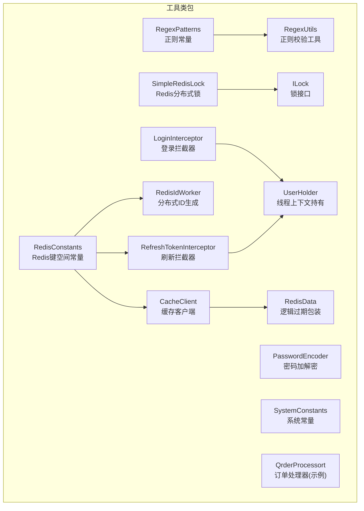
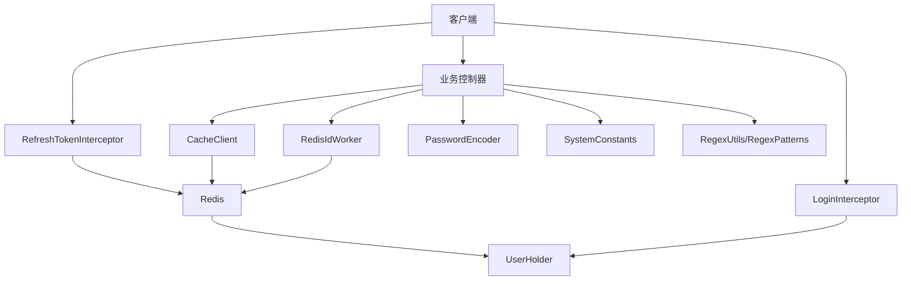
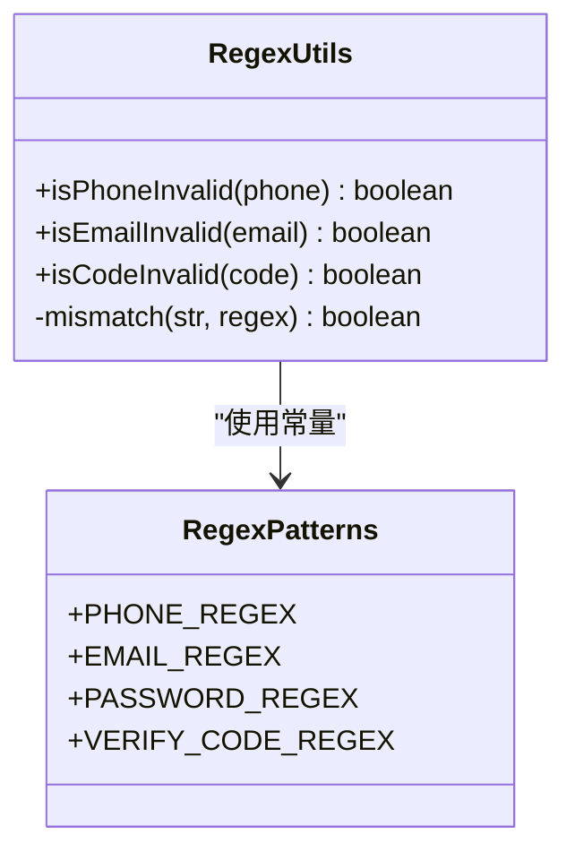
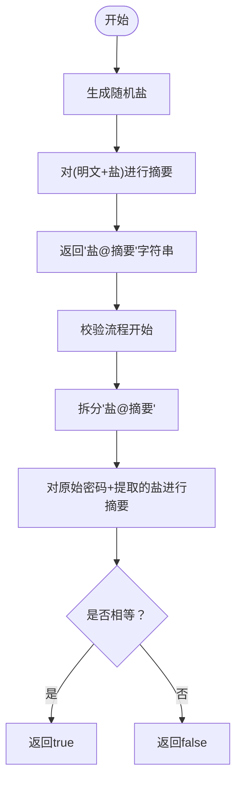
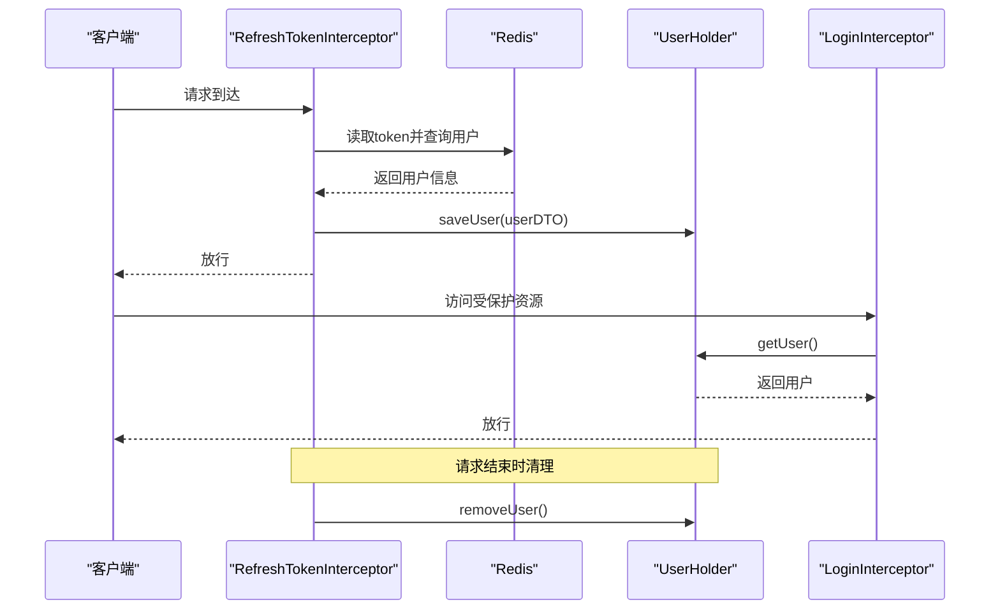
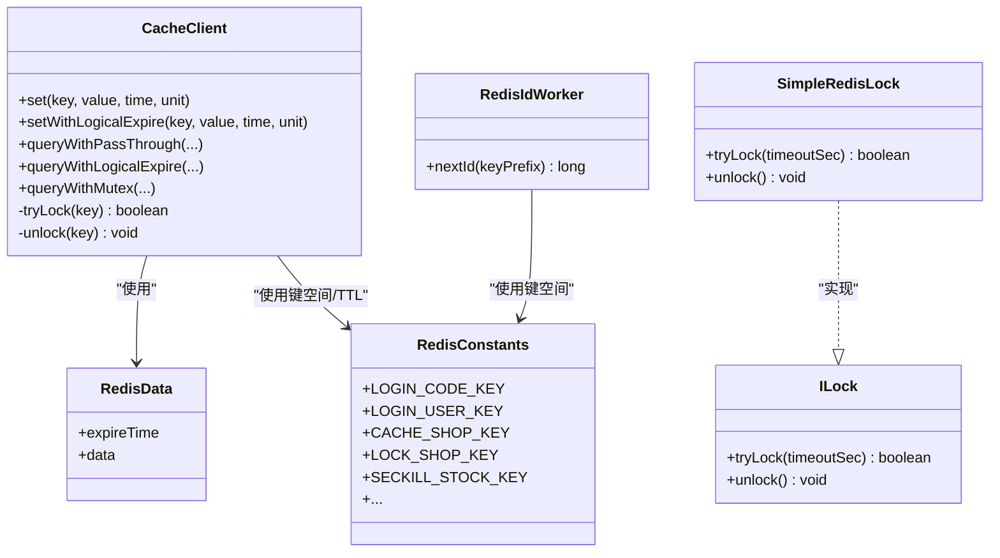
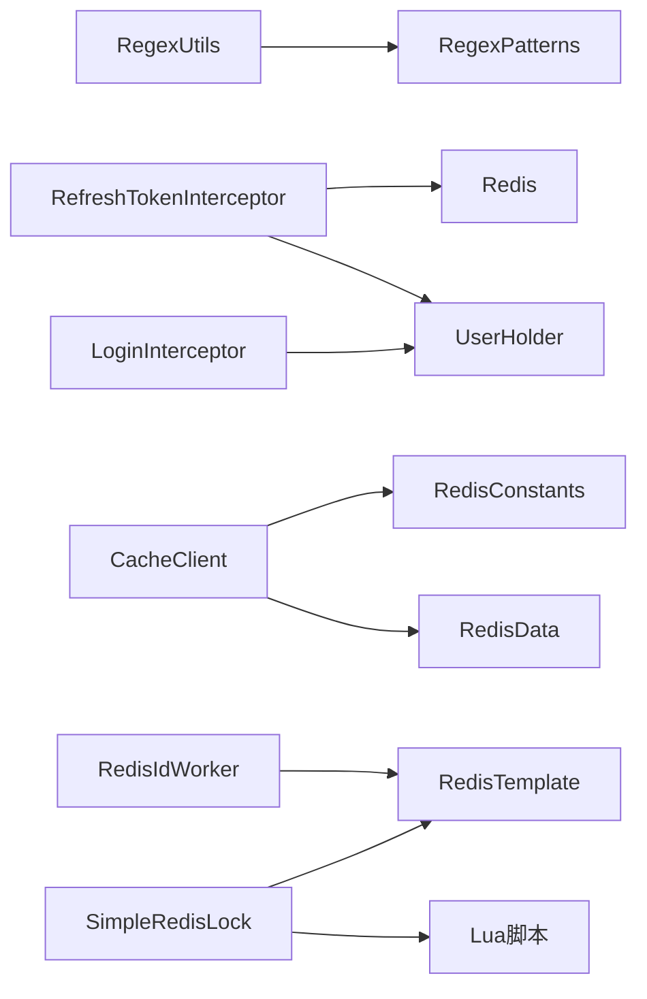

# 工具类库

<cite>
**本文引用的文件**
- [RegexPatterns.java](file://src/main/java/com/hmdp/utils/RegexPatterns.java)
- [RegexUtils.java](file://src/main/java/com/hmdp/utils/RegexUtils.java)
- [PasswordEncoder.java](file://src/main/java/com/hmdp/utils/PasswordEncoder.java)
- [SystemConstants.java](file://src/main/java/com/hmdp/utils/SystemConstants.java)
- [UserHolder.java](file://src/main/java/com/hmdp/utils/UserHolder.java)
- [LoginInterceptor.java](file://src/main/java/com/hmdp/utils/LoginInterceptor.java)
- [RefreshTokenInterceptor.java](file://src/main/java/com/hmdp/utils/RefreshTokenInterceptor.java)
- [RedisConstants.java](file://src/main/java/com/hmdp/utils/RedisConstants.java)
- [RedisData.java](file://src/main/java/com/hmdp/utils/RedisData.java)
- [RedisIdWorker.java](file://src/main/java/com/hmdp/utils/RedisIdWorker.java)
- [CacheClient.java](file://src/main/java/com/hmdp/utils/CacheClient.java)
- [SimpleRedisLock.java](file://src/main/java/com/hmdp/utils/SimpleRedisLock.java)
- [ILock.java](file://src/main/java/com/hmdp/utils/ILock.java)
- [QrderProcessort.java](file://src/main/java/com/hmdp/utils/QrderProcessort.java)
- [MvcConfig.java](file://src/main/java/com/hmdp/config/MvcConfig.java)
- [HmDianPingApplicationTests.java](file://src/test/java/com/hmdp/HmDianPingApplicationTests.java)
</cite>

## 目录
1. [简介](#简介)
2. [项目结构](#项目结构)
3. [核心组件](#核心组件)
4. [架构总览](#架构总览)
5. [详细组件分析](#详细组件分析)
6. [依赖分析](#依赖分析)
7. [性能考量](#性能考量)
8. [故障排查指南](#故障排查指南)
9. [结论](#结论)
10. [附录](#附录)

## 简介
本文件为工具类库的综合参考文档，覆盖以下主题：
- 正则表达式工具类的实现与常用模式匹配规则
- 密码加密工具类的安全实现与最佳实践
- 系统常量定义的组织结构与使用规范
- UserHolder 工具类的 ThreadLocal 实现与线程安全保证
- 其他实用工具类的功能说明与使用示例
- 为开发者提供完整使用指南与扩展建议

## 项目结构
工具类集中位于包 com.hmdp.utils 下，围绕“验证、加密、常量、会话持有、Redis 缓存与分布式锁”等主题进行模块化组织。

图表来源
- [RegexPatterns.java](file://src/main/java/com/hmdp/utils/RegexPatterns.java#L1-L25)
- [RegexUtils.java](file://src/main/java/com/hmdp/utils/RegexUtils.java#L1-L43)
- [PasswordEncoder.java](file://src/main/java/com/hmdp/utils/PasswordEncoder.java#L1-L35)
- [SystemConstants.java](file://src/main/java/com/hmdp/utils/SystemConstants.java#L1-L9)
- [UserHolder.java](file://src/main/java/com/hmdp/utils/UserHolder.java#L1-L20)
- [LoginInterceptor.java](file://src/main/java/com/hmdp/utils/LoginInterceptor.java#L1-L23)
- [RefreshTokenInterceptor.java](file://src/main/java/com/hmdp/utils/RefreshTokenInterceptor.java#L1-L55)
- [RedisConstants.java](file://src/main/java/com/hmdp/utils/RedisConstants.java#L1-L26)
- [RedisData.java](file://src/main/java/com/hmdp/utils/RedisData.java#L1-L12)
- [RedisIdWorker.java](file://src/main/java/com/hmdp/utils/RedisIdWorker.java#L1-L43)
- [CacheClient.java](file://src/main/java/com/hmdp/utils/CacheClient.java#L1-L180)
- [SimpleRedisLock.java](file://src/main/java/com/hmdp/utils/SimpleRedisLock.java#L1-L61)
- [ILock.java](file://src/main/java/com/hmdp/utils/ILock.java#L1-L17)
- [QrderProcessort.java](file://src/main/java/com/hmdp/utils/QrderProcessort.java#L1-L50)

章节来源
- [RegexPatterns.java](file://src/main/java/com/hmdp/utils/RegexPatterns.java#L1-L25)
- [RegexUtils.java](file://src/main/java/com/hmdp/utils/RegexUtils.java#L1-L43)
- [PasswordEncoder.java](file://src/main/java/com/hmdp/utils/PasswordEncoder.java#L1-L35)
- [SystemConstants.java](file://src/main/java/com/hmdp/utils/SystemConstants.java#L1-L9)
- [UserHolder.java](file://src/main/java/com/hmdp/utils/UserHolder.java#L1-L20)
- [LoginInterceptor.java](file://src/main/java/com/hmdp/utils/LoginInterceptor.java#L1-L23)
- [RefreshTokenInterceptor.java](file://src/main/java/com/hmdp/utils/RefreshTokenInterceptor.java#L1-L55)
- [RedisConstants.java](file://src/main/java/com/hmdp/utils/RedisConstants.java#L1-L26)
- [RedisData.java](file://src/main/java/com/hmdp/utils/RedisData.java#L1-L12)
- [RedisIdWorker.java](file://src/main/java/com/hmdp/utils/RedisIdWorker.java#L1-L43)
- [CacheClient.java](file://src/main/java/com/hmdp/utils/CacheClient.java#L1-L180)
- [SimpleRedisLock.java](file://src/main/java/com/hmdp/utils/SimpleRedisLock.java#L1-L61)
- [ILock.java](file://src/main/java/com/hmdp/utils/ILock.java#L1-L17)
- [QrderProcessort.java](file://src/main/java/com/hmdp/utils/QrderProcessort.java#L1-L50)

## 核心组件
- 正则表达式工具链：RegexPatterns 提供各类业务正则常量；RegexUtils 基于常量封装校验方法，统一处理空值与匹配结果。
- 密码加密工具：PasswordEncoder 使用随机盐与摘要算法对明文密码进行编码，并支持按相同盐进行比对验证。
- 系统常量：SystemConstants 定义上传目录、默认分页参数等系统级常量，便于集中管理与替换。
- 会话持有与拦截：UserHolder 通过 ThreadLocal 存储当前用户；LoginInterceptor 与 RefreshTokenInterceptor 在请求生命周期内注入/清理用户上下文。
- Redis 工具链：RedisConstants 统一键空间与TTL；RedisData 包装逻辑过期；CacheClient 提供穿透、互斥锁、逻辑过期三种缓存策略；RedisIdWorker 基于时间戳+序列号生成全局递增ID；SimpleRedisLock 基于Lua脚本实现可重入安全释放。
- 其他工具：QrderProcessort 为订单处理示例组件（当前注释）。

章节来源
- [RegexPatterns.java](file://src/main/java/com/hmdp/utils/RegexPatterns.java#L1-L25)
- [RegexUtils.java](file://src/main/java/com/hmdp/utils/RegexUtils.java#L1-L43)
- [PasswordEncoder.java](file://src/main/java/com/hmdp/utils/PasswordEncoder.java#L1-L35)
- [SystemConstants.java](file://src/main/java/com/hmdp/utils/SystemConstants.java#L1-L9)
- [UserHolder.java](file://src/main/java/com/hmdp/utils/UserHolder.java#L1-L20)
- [LoginInterceptor.java](file://src/main/java/com/hmdp/utils/LoginInterceptor.java#L1-L23)
- [RefreshTokenInterceptor.java](file://src/main/java/com/hmdp/utils/RefreshTokenInterceptor.java#L1-L55)
- [RedisConstants.java](file://src/main/java/com/hmdp/utils/RedisConstants.java#L1-L26)
- [RedisData.java](file://src/main/java/com/hmdp/utils/RedisData.java#L1-L12)
- [RedisIdWorker.java](file://src/main/java/com/hmdp/utils/RedisIdWorker.java#L1-L43)
- [CacheClient.java](file://src/main/java/com/hmdp/utils/CacheClient.java#L1-L180)
- [SimpleRedisLock.java](file://src/main/java/com/hmdp/utils/SimpleRedisLock.java#L1-L61)
- [ILock.java](file://src/main/java/com/hmdp/utils/ILock.java#L1-L17)
- [QrderProcessort.java](file://src/main/java/com/hmdp/utils/QrderProcessort.java#L1-L50)

## 架构总览
工具类在应用中的协作关系如下：

图表来源
- [RefreshTokenInterceptor.java](file://src/main/java/com/hmdp/utils/RefreshTokenInterceptor.java#L1-L55)
- [LoginInterceptor.java](file://src/main/java/com/hmdp/utils/LoginInterceptor.java#L1-L23)
- [UserHolder.java](file://src/main/java/com/hmdp/utils/UserHolder.java#L1-L20)
- [CacheClient.java](file://src/main/java/com/hmdp/utils/CacheClient.java#L1-L180)
- [RedisIdWorker.java](file://src/main/java/com/hmdp/utils/RedisIdWorker.java#L1-L43)
- [PasswordEncoder.java](file://src/main/java/com/hmdp/utils/PasswordEncoder.java#L1-L35)
- [SystemConstants.java](file://src/main/java/com/hmdp/utils/SystemConstants.java#L1-L9)
- [RegexUtils.java](file://src/main/java/com/hmdp/utils/RegexUtils.java#L1-L43)
- [RegexPatterns.java](file://src/main/java/com/hmdp/utils/RegexPatterns.java#L1-L25)

## 详细组件分析

### 正则表达式工具类
- 设计要点
  - RegexPatterns 将常用正则以常量形式集中定义，便于复用与维护。
  - RegexUtils 对空值进行前置校验，避免 NPE；通过 StrUtil 判空与 String.matches 进行匹配判断。
- 常用规则
  - 手机号：遵循中国大陆手机号段规则的正则。
  - 邮箱：基础邮箱格式校验。
  - 密码：4~32位字母、数字、下划线组合。
  - 验证码：6位数字或字母。
- 使用建议
  - 在业务层调用 RegexUtils 的静态方法进行快速校验。
  - 如需扩展规则，优先在 RegexPatterns 中新增常量并在 RegexUtils 中补充对应校验方法。

图表来源
- [RegexPatterns.java](file://src/main/java/com/hmdp/utils/RegexPatterns.java#L1-L25)
- [RegexUtils.java](file://src/main/java/com/hmdp/utils/RegexUtils.java#L1-L43)

章节来源
- [RegexPatterns.java](file://src/main/java/com/hmdp/utils/RegexPatterns.java#L1-L25)
- [RegexUtils.java](file://src/main/java/com/hmdp/utils/RegexUtils.java#L1-L43)

### 密码加密工具类
- 安全实现
  - 编码：随机生成盐，拼接后进行摘要计算，最终以“盐@摘要”的形式存储。
  - 校验：解析存储的盐，对原始密码按同样规则计算摘要并比较。
- 最佳实践
  - 永远不要存储明文密码。
  - 每次编码都应生成新盐，避免重复盐导致被彩虹表攻击。
  - 对输入进行严格判空与格式校验，防止异常传播。
  - 建议在上层业务中统一使用该工具类进行密码处理。

图表来源
- [PasswordEncoder.java](file://src/main/java/com/hmdp/utils/PasswordEncoder.java#L1-L35)

章节来源
- [PasswordEncoder.java](file://src/main/java/com/hmdp/utils/PasswordEncoder.java#L1-L35)

### 系统常量定义
- 组织结构
  - 将系统级常量集中在一个类中，包括上传目录、默认/最大分页大小、用户昵称前缀等。
- 使用规范
  - 通过静态访问使用常量，避免魔法数与硬编码路径。
  - 修改常量时需同步评估相关配置与业务逻辑。

章节来源
- [SystemConstants.java](file://src/main/java/com/hmdp/utils/SystemConstants.java#L1-L9)

### UserHolder 工具类与拦截器
- ThreadLocal 实现
  - 使用私有的 ThreadLocal 成员变量保存当前用户。
  - 提供 saveUser、getUser、removeUser 三个静态方法，简化线程上下文操作。
- 线程安全保证
  - ThreadLocal 为每个线程提供独立副本，天然具备线程隔离性。
  - 在请求结束时务必调用 removeUser 清理，避免线程复用导致的内存泄漏。
- 拦截器协作
  - LoginInterceptor：若 ThreadLocal 中无用户则拒绝访问。
  - RefreshTokenInterceptor：从Redis读取用户信息填充到 ThreadLocal，并在请求完成后清理。

图表来源
- [RefreshTokenInterceptor.java](file://src/main/java/com/hmdp/utils/RefreshTokenInterceptor.java#L1-L55)
- [LoginInterceptor.java](file://src/main/java/com/hmdp/utils/LoginInterceptor.java#L1-L23)
- [UserHolder.java](file://src/main/java/com/hmdp/utils/UserHolder.java#L1-L20)

章节来源
- [UserHolder.java](file://src/main/java/com/hmdp/utils/UserHolder.java#L1-L20)
- [LoginInterceptor.java](file://src/main/java/com/hmdp/utils/LoginInterceptor.java#L1-L23)
- [RefreshTokenInterceptor.java](file://src/main/java/com/hmdp/utils/RefreshTokenInterceptor.java#L1-L55)

### Redis 工具链
- RedisConstants：统一管理键空间前缀与TTL，便于集中维护。
- RedisData：封装逻辑过期时间与数据对象，用于逻辑过期策略。
- CacheClient：提供三种缓存策略
  - 透传策略：命中即返，未命中查库并回填。
  - 逻辑过期策略：命中后判断过期时间，未过期直接返回，已过期尝试获取互斥锁异步重建。
  - 互斥锁策略：获取锁失败则短暂等待重试，成功后重建缓存。
- RedisIdWorker：基于时间戳+序列号生成全局唯一ID，序列号按天自增，避免热点。
- SimpleRedisLock：基于 Lua 脚本释放锁，确保释放与加锁线程一致，避免误删他人锁。

图表来源
- [RedisConstants.java](file://src/main/java/com/hmdp/utils/RedisConstants.java#L1-L26)
- [RedisData.java](file://src/main/java/com/hmdp/utils/RedisData.java#L1-L12)
- [CacheClient.java](file://src/main/java/com/hmdp/utils/CacheClient.java#L1-L180)
- [RedisIdWorker.java](file://src/main/java/com/hmdp/utils/RedisIdWorker.java#L1-L43)
- [SimpleRedisLock.java](file://src/main/java/com/hmdp/utils/SimpleRedisLock.java#L1-L61)
- [ILock.java](file://src/main/java/com/hmdp/utils/ILock.java#L1-L17)

章节来源
- [RedisConstants.java](file://src/main/java/com/hmdp/utils/RedisConstants.java#L1-L26)
- [RedisData.java](file://src/main/java/com/hmdp/utils/RedisData.java#L1-L12)
- [CacheClient.java](file://src/main/java/com/hmdp/utils/CacheClient.java#L1-L180)
- [RedisIdWorker.java](file://src/main/java/com/hmdp/utils/RedisIdWorker.java#L1-L43)
- [SimpleRedisLock.java](file://src/main/java/com/hmdp/utils/SimpleRedisLock.java#L1-L61)
- [ILock.java](file://src/main/java/com/hmdp/utils/ILock.java#L1-L17)

### 其他实用工具类
- QrderProcessort：订单处理示例组件（当前注释），可作为任务调度与生命周期管理的参考模板。
- 使用示例与测试
  - HmDianPingApplicationTests 展示了 CacheClient 与 RedisIdWorker 的典型用法，包括逻辑过期写入、并发ID生成与Geo数据写入等。

章节来源
- [QrderProcessort.java](file://src/main/java/com/hmdp/utils/QrderProcessort.java#L1-L50)
- [HmDianPingApplicationTests.java](file://src/test/java/com/hmdp/HmDianPingApplicationTests.java#L1-L113)

## 依赖分析
- 组件耦合
  - RegexUtils 依赖 RegexPatterns 常量，保持校验逻辑与规则分离。
  - Interceptor 依赖 UserHolder 进行上下文注入与清理。
  - CacheClient 依赖 RedisConstants 与 RedisData，形成清晰的键空间与过期模型。
  - RedisIdWorker 依赖 RedisTemplate 进行自增计数。
  - SimpleRedisLock 依赖 Lua 脚本与 RedisTemplate，实现原子解锁。
- 外部依赖
  - Hutool 提供字符串、JSON、Bean 工具能力。
  - Spring Data Redis 提供 RedisTemplate 能力。
  - Spring MVC 提供拦截器机制。

图表来源
- [RegexUtils.java](file://src/main/java/com/hmdp/utils/RegexUtils.java#L1-L43)
- [RegexPatterns.java](file://src/main/java/com/hmdp/utils/RegexPatterns.java#L1-L25)
- [RefreshTokenInterceptor.java](file://src/main/java/com/hmdp/utils/RefreshTokenInterceptor.java#L1-L55)
- [UserHolder.java](file://src/main/java/com/hmdp/utils/UserHolder.java#L1-L20)
- [CacheClient.java](file://src/main/java/com/hmdp/utils/CacheClient.java#L1-L180)
- [RedisConstants.java](file://src/main/java/com/hmdp/utils/RedisConstants.java#L1-L26)
- [RedisData.java](file://src/main/java/com/hmdp/utils/RedisData.java#L1-L12)
- [RedisIdWorker.java](file://src/main/java/com/hmdp/utils/RedisIdWorker.java#L1-L43)
- [SimpleRedisLock.java](file://src/main/java/com/hmdp/utils/SimpleRedisLock.java#L1-L61)

章节来源
- [MvcConfig.java](file://src/main/java/com/hmdp/config/MvcConfig.java#L1-L200)

## 性能考量
- 正则校验
  - RegexUtils 对空值提前返回，减少不必要的匹配开销。
- 缓存策略
  - 逻辑过期策略在高并发场景下通过互斥锁避免缓存击穿，同时异步重建降低主线程阻塞。
  - 互斥锁策略在锁竞争激烈时采用短暂休眠重试，平衡吞吐与一致性。
- 分布式ID
  - RedisIdWorker 将时间戳与序列号组合，避免热点Key，提升生成效率。
- 密码加密
  - 摘要计算成本可控，建议结合更安全的现代算法（如 bcrypt/scrypt/pbkdf2）替代 MD5，进一步增强抗攻击能力。

## 故障排查指南
- 密码校验失败
  - 检查存储格式是否包含“@”分隔符；确认盐未被篡改。
- 用户未登录被拦截
  - 确认拦截器链路是否正确注入用户；检查请求头 token 是否有效。
- 缓存未命中或频繁重建
  - 检查键空间前缀与 TTL 配置；确认逻辑过期时间与互斥锁键是否一致。
- 分布式锁误释放
  - 确认使用 Lua 脚本释放锁；避免跨线程释放他人锁。
- 线程泄漏
  - 确保每次请求结束后调用 removeUser 清理 ThreadLocal。

章节来源
- [PasswordEncoder.java](file://src/main/java/com/hmdp/utils/PasswordEncoder.java#L1-L35)
- [RefreshTokenInterceptor.java](file://src/main/java/com/hmdp/utils/RefreshTokenInterceptor.java#L1-L55)
- [CacheClient.java](file://src/main/java/com/hmdp/utils/CacheClient.java#L1-L180)
- [SimpleRedisLock.java](file://src/main/java/com/hmdp/utils/SimpleRedisLock.java#L1-L61)
- [UserHolder.java](file://src/main/java/com/hmdp/utils/UserHolder.java#L1-L20)

## 结论
本工具类库围绕“验证、加密、常量、会话、缓存与分布式锁”构建了高内聚、低耦合的基础设施层。通过集中化的常量与工具方法，提升了代码可维护性与安全性；借助拦截器与 ThreadLocal 实现了轻量级的会话管理；通过多种缓存策略与分布式ID/锁工具满足高并发场景需求。建议在后续版本中引入更强的密码哈希算法与更完善的日志监控体系。

## 附录
- 扩展建议
  - 密码：引入 pbkdf2/bcrypt/scrypt 等现代算法，增加迭代次数与随机盐长度。
  - 缓存：增加缓存统计指标与降级策略，支持多级缓存。
  - 并发：对 CacheClient 的重建线程池进行动态配置与限流。
  - 安全：对敏感常量（如上传目录）进行环境变量注入与权限控制。