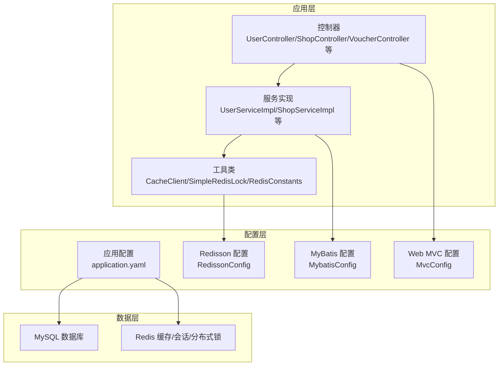
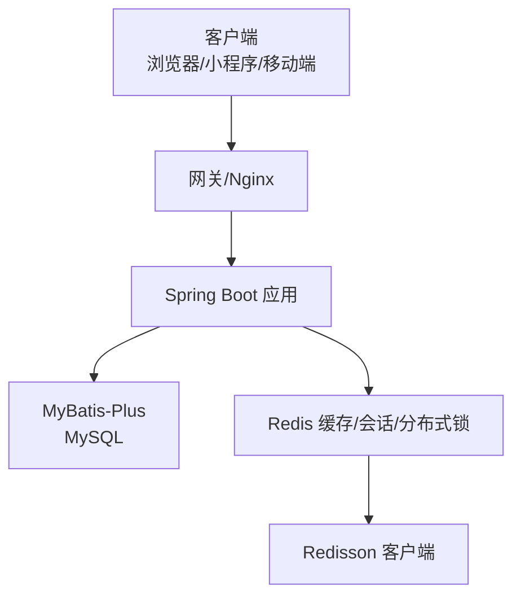
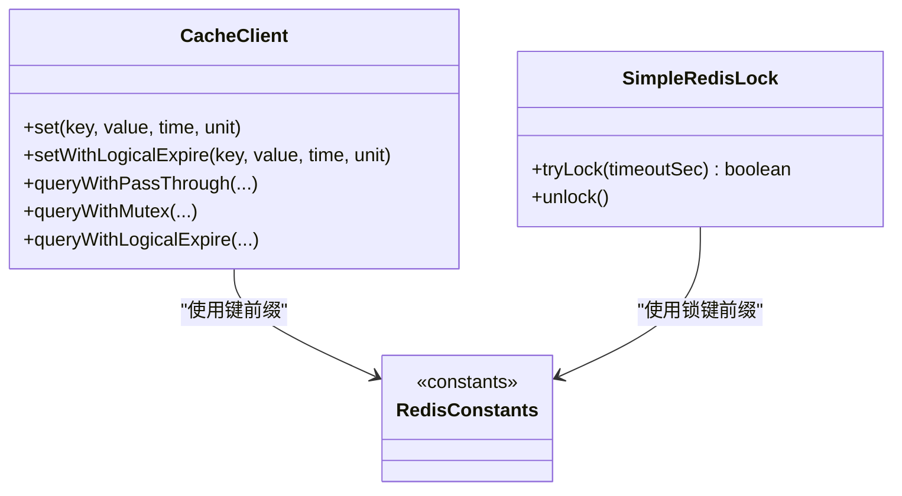
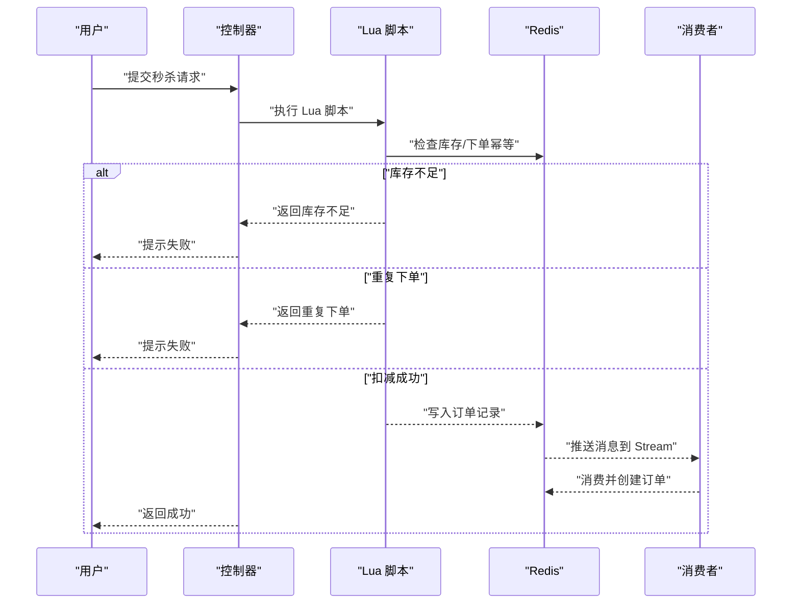
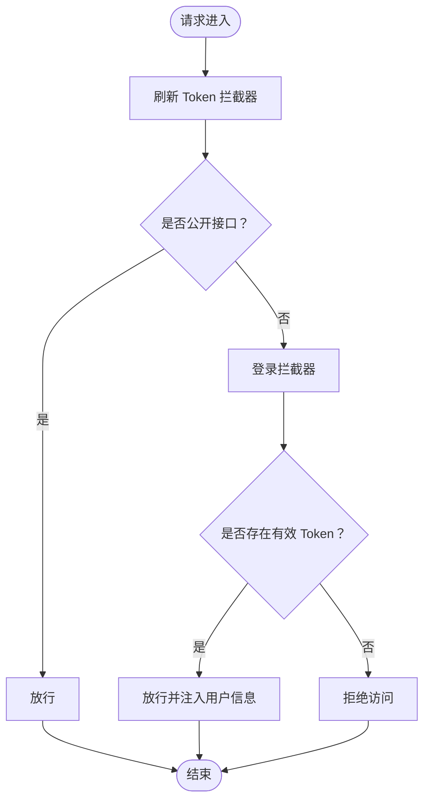
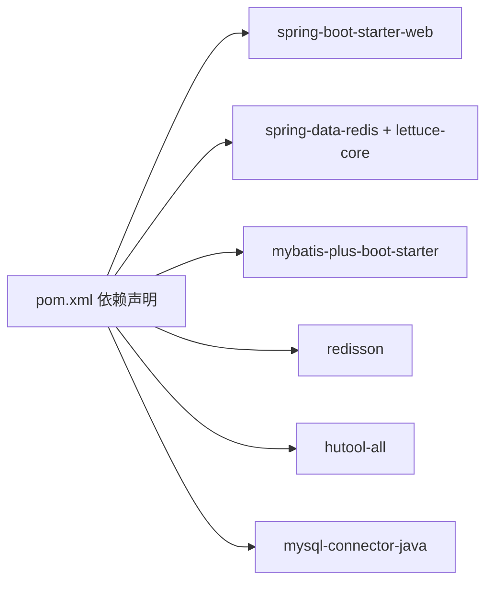

# 快速开始

<cite>
**本文引用的文件**
- [README.md](file://README.md)
- [pom.xml](file://pom.xml)
- [application.yaml](file://src/main/resources/application.yaml)
- [HmDianPingApplication.java](file://src/main/java/com/hmdp/HmDianPingApplication.java)
- [hmdp.sql](file://src/main/resources/db/hmdp.sql)
- [RedissonConfig.java](file://src/main/java/com/hmdp/config/RedissonConfig.java)
- [CacheClient.java](file://src/main/java/com/hmdp/utils/CacheClient.java)
- [seckill.lua](file://src/main/resources/seckill.lua)
- [unlock.lua](file://src/main/resources/unlock.lua)
- [RedisConstants.java](file://src/main/java/com/hmdp/utils/RedisConstants.java)
- [SimpleRedisLock.java](file://src/main/java/com/hmdp/utils/SimpleRedisLock.java)
- [MvcConfig.java](file://src/main/java/com/hmdp/config/MvcConfig.java)
- [MybatisConfig.java](file://src/main/java/com/hmdp/config/MybatisConfig.java)
</cite>

## 目录
1. [简介](#简介)
2. [项目结构](#项目结构)
3. [核心组件](#核心组件)
4. [架构总览](#架构总览)
5. [详细组件分析](#详细组件分析)
6. [依赖分析](#依赖分析)
7. [性能考虑](#性能考虑)
8. [故障排查指南](#故障排查指南)
9. [结论](#结论)
10. [附录](#附录)

## 简介
本指南面向初学者，帮助你在本地快速搭建 LSMarket（凌水市集）开发环境，并成功启动与访问应用。项目基于 Spring Boot 2.7、MySQL 8.0、Redis 7.0 与 Redisson 3.0，覆盖缓存优化、分布式会话、秒杀系统、社交功能、地理位置查询、签到与 UV 统计等 Redis 深度应用场景。

## 项目结构
- 后端采用 Spring Boot 单体架构，主要模块：
  - 配置层：数据库连接、Redis、Redisson、MyBatis-Plus、拦截器等
  - 控制器层：用户、商铺、优惠券、博客、关注等业务接口
  - 服务层：各业务的实现类
  - 实体与映射：实体类与对应的 Mapper
  - 工具类：缓存客户端、分布式锁、拦截器、常量等
  - 资源文件：数据库初始化脚本、MyBatis XML 映射、Redis Lua 脚本、应用配置

图表来源
- [application.yaml](file://src/main/resources/application.yaml#L1-L42)
- [RedissonConfig.java](file://src/main/java/com/hmdp/config/RedissonConfig.java#L1-L21)
- [MybatisConfig.java](file://src/main/java/com/hmdp/config/MybatisConfig.java#L1-L18)
- [MvcConfig.java](file://src/main/java/com/hmdp/config/MvcConfig.java#L1-L35)

章节来源
- [HmDianPingApplication.java](file://src/main/java/com/hmdp/HmDianPingApplication.java#L1-L16)
- [application.yaml](file://src/main/resources/application.yaml#L1-L42)

## 核心组件
- 应用入口与扫描：Spring Boot 启动类负责扫描 Mapper 包并启动应用
- 数据源与 Redis：通过 application.yaml 配置 MySQL 与 Redis 连接参数
- Redisson 客户端：提供分布式锁与高级能力
- 缓存客户端：封装缓存穿透、击穿、雪崩的解决方案
- Lua 脚本：秒杀库存扣减与幂等校验
- 拦截器链：登录拦截与 Token 刷新

章节来源
- [HmDianPingApplication.java](file://src/main/java/com/hmdp/HmDianPingApplication.java#L1-L16)
- [application.yaml](file://src/main/resources/application.yaml#L1-L42)
- [RedissonConfig.java](file://src/main/java/com/hmdp/config/RedissonConfig.java#L1-L21)
- [CacheClient.java](file://src/main/java/com/hmdp/utils/CacheClient.java#L1-L180)
- [seckill.lua](file://src/main/resources/seckill.lua#L1-L32)
- [unlock.lua](file://src/main/resources/unlock.lua#L1-L6)
- [MvcConfig.java](file://src/main/java/com/hmdp/config/MvcConfig.java#L1-L35)

## 架构总览
应用采用“Web 层 → 业务层 → 缓存/数据库”的分层设计，Redis 作为缓存、分布式会话与分布式锁的核心支撑，MySQL 存放业务数据，Redisson 提供分布式能力，Lua 脚本保障秒杀场景的原子性。

图表来源
- [application.yaml](file://src/main/resources/application.yaml#L1-L42)
- [RedissonConfig.java](file://src/main/java/com/hmdp/config/RedissonConfig.java#L1-L21)

## 详细组件分析

### 环境要求与安装步骤
- 环境要求
  - JDK 8+
  - Maven 3.8+
  - MySQL 8.0+
  - Redis 7.0+
  - Redisson 3.0+

- 安装步骤
  1) 克隆仓库
     - 使用版本控制工具克隆项目到本地
  2) 初始化数据库
     - 登录 MySQL，创建数据库并执行初始化 SQL
  3) 启动 Redis
     - 启动本地 Redis 服务并通过 ping 测试连通性
  4) 配置应用参数
     - 修改应用配置文件中的数据库与 Redis 连接信息
  5) 编译与打包
     - 使用 Maven 清理并打包项目
  6) 启动应用
     - 运行打包后的 JAR 文件
  7) 访问应用
     - 通过浏览器访问 API 文档与 Swagger 页面

章节来源
- [README.md](file://README.md#L333-L419)
- [application.yaml](file://src/main/resources/application.yaml#L1-L42)
- [hmdp.sql](file://src/main/resources/db/hmdp.sql#L1-L266)

### 应用启动与访问
- 启动方式
  - 使用 Maven 插件构建并运行 Spring Boot 应用
  - 应用启动后监听指定端口
- 访问方式
  - API 文档页面
  - Swagger UI 页面

章节来源
- [README.md](file://README.md#L414-L418)
- [HmDianPingApplication.java](file://src/main/java/com/hmdp/HmDianPingApplication.java#L1-L16)

### 配置文件详解
- 应用配置（application.yaml）
  - server.port：应用监听端口
  - spring.datasource.*：数据库连接参数
  - spring.redis.*：Redis 连接参数与连接池配置
  - mybatis-plus.*：MyBatis-Plus 全局配置
  - logging.*：日志格式与级别

- Redisson 配置（RedissonConfig）
  - 单机模式连接本地 Redis

- MyBatis 配置（MybatisConfig）
  - 分页插件注册，适配 MySQL

- MVC 配置（MvcConfig）
  - 注册登录拦截器与 Token 刷新拦截器，排除公开接口

章节来源
- [application.yaml](file://src/main/resources/application.yaml#L1-L42)
- [RedissonConfig.java](file://src/main/java/com/hmdp/config/RedissonConfig.java#L1-L21)
- [MybatisConfig.java](file://src/main/java/com/hmdp/config/MybatisConfig.java#L1-L18)
- [MvcConfig.java](file://src/main/java/com/hmdp/config/MvcConfig.java#L1-L35)

### 缓存与分布式锁
- 缓存客户端（CacheClient）
  - 提供三种缓存策略：
    - 缓存穿透：缓存空值
    - 缓存击穿：互斥锁 + 逻辑过期
    - 缓存雪崩：TTL 随机值
  - 使用 Redis Template 序列化/反序列化对象

- 分布式锁（SimpleRedisLock）
  - 基于 Redis SET NX + Lua 脚本释放锁
  - 锁键前缀与线程标识组合，避免误删

- Redis 常量（RedisConstants）
  - 定义登录验证码、登录会话、缓存键前缀、锁键前缀、秒杀相关键等

图表来源
- [CacheClient.java](file://src/main/java/com/hmdp/utils/CacheClient.java#L1-L180)
- [SimpleRedisLock.java](file://src/main/java/com/hmdp/utils/SimpleRedisLock.java#L1-L61)
- [RedisConstants.java](file://src/main/java/com/hmdp/utils/RedisConstants.java#L1-L26)

章节来源
- [CacheClient.java](file://src/main/java/com/hmdp/utils/CacheClient.java#L1-L180)
- [SimpleRedisLock.java](file://src/main/java/com/hmdp/utils/SimpleRedisLock.java#L1-L61)
- [RedisConstants.java](file://src/main/java/com/hmdp/utils/RedisConstants.java#L1-L26)

### 秒杀流程与 Lua 脚本
- 秒杀流程
  - 校验库存与幂等（用户是否已下单）
  - 原子性扣减库存与记录下单用户
  - 异步入队（Stream）通知后续处理

- Lua 脚本（seckill.lua）
  - 基于 Redis 原子命令实现库存扣减与下单记录
  - 返回码用于表示不同结果（库存不足、重复下单、成功）

图表来源
- [seckill.lua](file://src/main/resources/seckill.lua#L1-L32)

章节来源
- [seckill.lua](file://src/main/resources/seckill.lua#L1-L32)
- [unlock.lua](file://src/main/resources/unlock.lua#L1-L6)

### 登录拦截与 Token 刷新
- 拦截器链
  - RefreshTokenInterceptor：全局拦截，刷新 Token
  - LoginInterceptor：业务拦截，校验登录状态
  - 对公开接口（如登录、验证码、部分查询）进行放行

图表来源
- [MvcConfig.java](file://src/main/java/com/hmdp/config/MvcConfig.java#L1-L35)

章节来源
- [MvcConfig.java](file://src/main/java/com/hmdp/config/MvcConfig.java#L1-L35)

## 依赖分析
- 核心依赖
  - Spring Boot Starter Web：Web 应用
  - Spring Boot Starter Data Redis：Redis 客户端
  - MyBatis-Plus：ORM 框架
  - Redisson：分布式能力
  - Hutool：常用工具库
  - MySQL Connector：数据库驱动

图表来源
- [pom.xml](file://pom.xml#L1-L108)

章节来源
- [pom.xml](file://pom.xml#L1-L108)

## 性能考虑
- 缓存优化三剑客
  - 缓存穿透：缓存空值 + 可选布隆过滤器
  - 缓存击穿：互斥锁 + 逻辑过期
  - 缓存雪崩：TTL 随机值 + 多级缓存
- 秒杀系统
  - Lua 原子扣减 + Redisson 分布式锁
  - 异步消息队列削峰填谷
- 地理位置查询
  - GEO 数据结构按距离排序，显著提升查询效率
- 签到与 UV 统计
  - BitMap 与 HyperLogLog 降低存储与提升性能

章节来源
- [README.md](file://README.md#L180-L281)
- [CacheClient.java](file://src/main/java/com/hmdp/utils/CacheClient.java#L1-L180)

## 故障排查指南
- 数据库连接失败
  - 检查 application.yaml 中的数据库 URL、用户名、密码
  - 确认数据库已创建并执行初始化 SQL
- Redis 连接失败
  - 检查 Redis 服务是否启动
  - 校验 application.yaml 与 RedissonConfig 中的主机与端口
- 启动报错（端口占用）
  - 修改 application.yaml 中的 server.port
- 权限与拦截问题
  - 检查 MVC 拦截器配置，确认放行路径
- 秒杀异常
  - 核对 Lua 脚本与键命名是否与代码一致

章节来源
- [application.yaml](file://src/main/resources/application.yaml#L1-L42)
- [RedissonConfig.java](file://src/main/java/com/hmdp/config/RedissonConfig.java#L1-L21)
- [MvcConfig.java](file://src/main/java/com/hmdp/config/MvcConfig.java#L1-L35)
- [hmdp.sql](file://src/main/resources/db/hmdp.sql#L1-L266)

## 结论
通过本快速开始指南，你可以在本地完成 LSMarket 的环境准备、数据库初始化、Redis 配置与应用启动，并顺利访问 API 文档与 Swagger 页面。建议在开发过程中结合 README 的性能优化与架构说明，逐步深入理解 Redis 在实际业务中的应用。

## 附录
- 常用命令参考
  - 克隆仓库、编译打包、启动应用、连接 Redis、导入数据库等
- 配置项清单
  - 数据库连接、Redis 连接、MyBatis-Plus、日志级别等

章节来源
- [README.md](file://README.md#L343-L419)
- [application.yaml](file://src/main/resources/application.yaml#L1-L42)