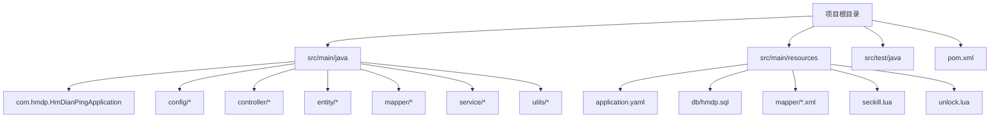
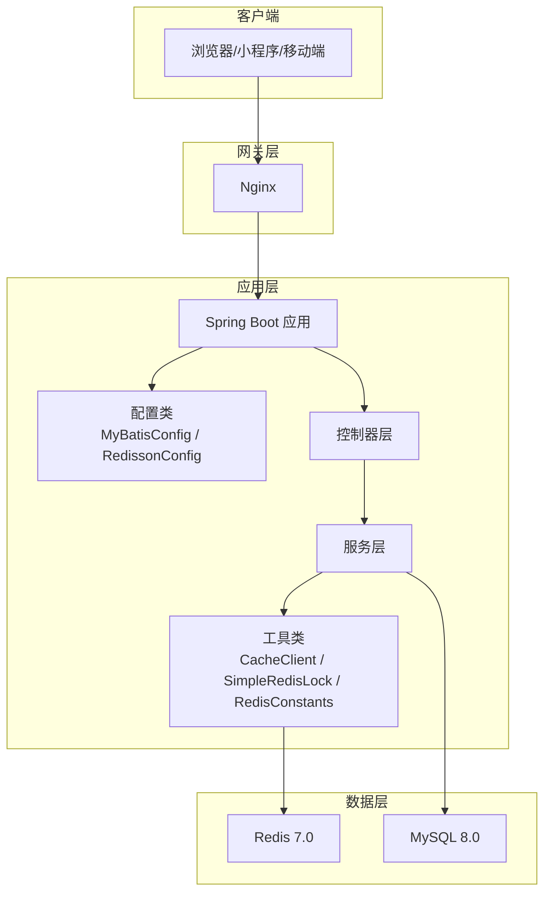
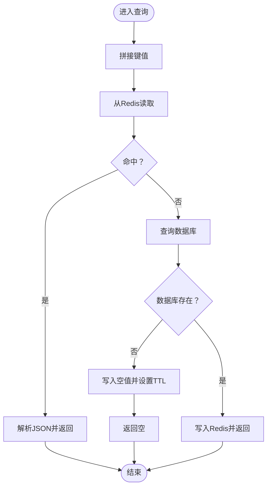
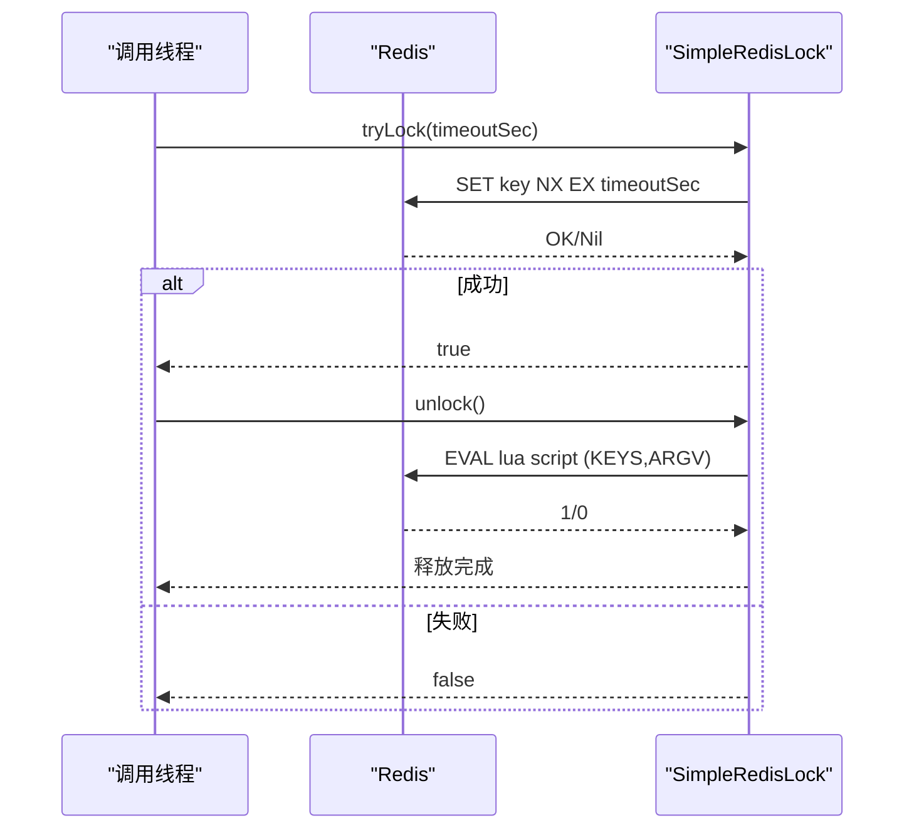
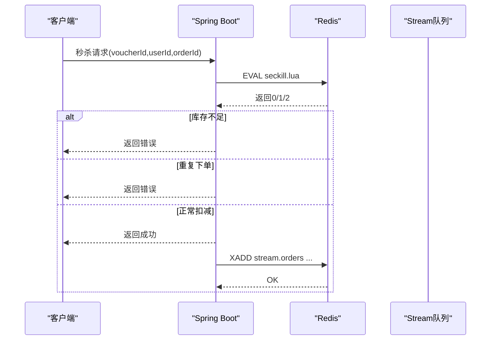
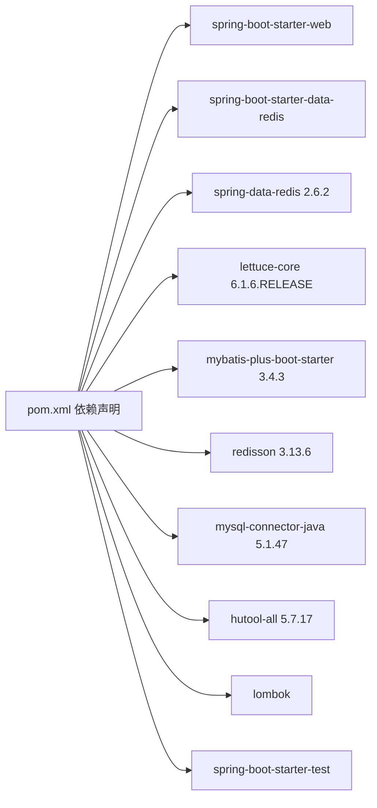

# 技术栈与依赖

<cite>
**本文引用的文件**
- [pom.xml](file://pom.xml)
- [application.yaml](file://src/main/resources/application.yaml)
- [HmDianPingApplication.java](file://src/main/java/com/hmdp/HmDianPingApplication.java)
- [MybatisConfig.java](file://src/main/java/com/hmdp/config/MybatisConfig.java)
- [RedissonConfig.java](file://src/main/java/com/hmdp/config/RedissonConfig.java)
- [CacheClient.java](file://src/main/java/com/hmdp/utils/CacheClient.java)
- [RedisConstants.java](file://src/main/java/com/hmdp/utils/RedisConstants.java)
- [RedisData.java](file://src/main/java/com/hmdp/utils/RedisData.java)
- [ILock.java](file://src/main/java/com/hmdp/utils/ILock.java)
- [SimpleRedisLock.java](file://src/main/java/com/hmdp/utils/SimpleRedisLock.java)
- [seckill.lua](file://src/main/resources/seckill.lua)
- [unlock.lua](file://src/main/resources/unlock.lua)
- [RedissonTest.java](file://src/test/java/com/hmdp/RedissonTest.java)
- [README.md](file://README.md)
</cite>

## 目录
1. [引言](#引言)
2. [项目结构](#项目结构)
3. [核心组件](#核心组件)
4. [架构总览](#架构总览)
5. [详细组件分析](#详细组件分析)
6. [依赖分析](#依赖分析)
7. [性能考量](#性能考量)
8. [故障排查指南](#故障排查指南)
9. [结论](#结论)
10. [附录](#附录)

## 引言
本文件面向LSMarket项目，系统梳理并解释其技术栈与依赖，重点覆盖：
- 核心技术栈版本与选择理由（Spring Boot 2.7、MyBatis-Plus 3.5、Redis 7.0、Redisson 3.0、MySQL 8.0）
- 项目依赖管理配置（核心依赖、开发工具、测试框架）
- 配置文件结构与关键配置项作用
- 依赖版本兼容性与升级指导
- 开发者最佳实践建议

## 项目结构
项目采用标准Spring Boot工程结构，核心目录与职责如下：
- src/main/java：后端源码，包含启动类、配置类、控制器、实体、映射器、服务、工具类等
- src/main/resources：资源文件，包含数据库SQL、MyBatis Mapper XML、应用配置、Lua脚本等
- src/test/java：测试代码，包含Redisson相关测试
- pom.xml：Maven构建与依赖管理

图表来源
- [HmDianPingApplication.java](file://src/main/java/com/hmdp/HmDianPingApplication.java#L1-L16)
- [application.yaml](file://src/main/resources/application.yaml#L1-L42)
- [pom.xml](file://pom.xml#L1-L108)

章节来源
- [HmDianPingApplication.java](file://src/main/java/com/hmdp/HmDianPingApplication.java#L1-L16)
- [application.yaml](file://src/main/resources/application.yaml#L1-L42)
- [pom.xml](file://pom.xml#L1-L108)

## 核心组件
- 启动类与扫描：启动类启用Spring Boot并扫描Mapper包，确保MyBatis-Plus能够自动发现Mapper接口。
- 配置类：MyBatis-Plus分页插件配置；Redisson客户端配置。
- 缓存工具：统一的缓存客户端，封装缓存穿透、击穿、雪崩的解决方案，并提供逻辑过期与互斥锁两种重建策略。
- 分布式锁：基于Redis的简单分布式锁，支持Lua脚本安全释放，避免误删。
- Lua脚本：秒杀场景的原子性扣减库存、下单与消息入队。
- 配置文件：集中管理数据库、Redis、MyBatis-Plus、Jackson、日志级别等关键配置。

章节来源
- [MybatisConfig.java](file://src/main/java/com/hmdp/config/MybatisConfig.java#L1-L18)
- [RedissonConfig.java](file://src/main/java/com/hmdp/config/RedissonConfig.java#L1-L21)
- [CacheClient.java](file://src/main/java/com/hmdp/utils/CacheClient.java#L1-L180)
- [SimpleRedisLock.java](file://src/main/java/com/hmdp/utils/SimpleRedisLock.java#L1-L61)
- [seckill.lua](file://src/main/resources/seckill.lua#L1-L32)
- [unlock.lua](file://src/main/resources/unlock.lua#L1-L6)
- [application.yaml](file://src/main/resources/application.yaml#L1-L42)

## 架构总览
系统采用“Web层 + 应用层 + 数据层”的三层架构，结合Redis与MySQL实现高性能与高可用。

图表来源
- [HmDianPingApplication.java](file://src/main/java/com/hmdp/HmDianPingApplication.java#L1-L16)
- [MybatisConfig.java](file://src/main/java/com/hmdp/config/MybatisConfig.java#L1-L18)
- [RedissonConfig.java](file://src/main/java/com/hmdp/config/RedissonConfig.java#L1-L21)
- [CacheClient.java](file://src/main/java/com/hmdp/utils/CacheClient.java#L1-L180)
- [SimpleRedisLock.java](file://src/main/java/com/hmdp/utils/SimpleRedisLock.java#L1-L61)
- [application.yaml](file://src/main/resources/application.yaml#L1-L42)

## 详细组件分析

### 依赖管理与版本选择
- Spring Boot 2.7：项目父POM版本为2.3.12.RELEASE，但项目声明JDK 11，且README标注技术栈为Spring Boot 2.7，表明项目以Spring Boot 2.x生态为核心，具备良好的兼容性与稳定性。
- MyBatis-Plus 3.5：当前pom中使用3.4.3，README标注3.5，建议以pom为准；MyBatis-Plus提供强大的分页、代码生成、条件构造器等能力，适配本项目复杂查询与分页需求。
- Redis 7.0：README明确标注Redis 7.0，项目中大量使用Redis数据结构（String、Hash、List、Set、ZSet、BitMap、HyperLogLog、GEO）及Lua脚本，7.0版本带来更好的性能与新特性支持。
- Redisson 3.0：pom中使用3.13.6，README标注3.0，用于实现分布式锁、分布式集合等高级特性，配合Lua脚本保障原子性。
- MySQL 8.0：pom中使用MySQL Connector/J 5.1.47，README标注8.0，建议升级至8.x以获得更好的性能与安全性；项目中使用MyBatis-Plus访问MySQL。
- 工具库：Hutool 5.7.17提供丰富的工具方法，简化字符串、JSON、日期等处理；Lombok减少样板代码。
- 测试：Spring Boot Test用于集成测试，RedissonTest演示分布式锁的使用。

章节来源
- [pom.xml](file://pom.xml#L1-L108)
- [README.md](file://README.md#L82-L95)

### 配置文件结构与关键配置项
- server：端口与优雅停机配置
- spring.application.name：应用名称
- spring.datasource：数据库驱动、URL、用户名、密码
- spring.redis：Redis主机、端口、数据库索引、Lettuce连接池配置
- mybatis-plus：类型别名包扫描、分页插件等
- logging：日志级别与时间格式

章节来源
- [application.yaml](file://src/main/resources/application.yaml#L1-L42)

### 缓存客户端（CacheClient）
CacheClient封装了三种缓存策略：
- 缓存穿透：当数据库无结果时写入空值并设置短生命周期，避免持续穿透
- 缓存击穿：互斥锁策略，同一Key只允许一个线程重建缓存，其他线程短暂等待
- 缓存雪崩：逻辑过期策略，将过期时间随机化，避免同时失效

图表来源
- [CacheClient.java](file://src/main/java/com/hmdp/utils/CacheClient.java#L45-L73)

章节来源
- [CacheClient.java](file://src/main/java/com/hmdp/utils/CacheClient.java#L1-L180)
- [RedisConstants.java](file://src/main/java/com/hmdp/utils/RedisConstants.java#L1-L26)

### 分布式锁（SimpleRedisLock）
- 使用Redis的SET key value NX EX seconds实现加锁
- 使用Lua脚本原子释放锁，避免误删
- 锁键前缀与线程标识组合，确保可重入与安全释放

图表来源
- [SimpleRedisLock.java](file://src/main/java/com/hmdp/utils/SimpleRedisLock.java#L30-L47)
- [unlock.lua](file://src/main/resources/unlock.lua#L1-L6)

章节来源
- [SimpleRedisLock.java](file://src/main/java/com/hmdp/utils/SimpleRedisLock.java#L1-L61)
- [ILock.java](file://src/main/java/com/hmdp/utils/ILock.java#L1-L17)
- [unlock.lua](file://src/main/resources/unlock.lua#L1-L6)

### 秒杀流程（Lua脚本）
- 原子性检查库存、去重下单、扣减库存、下单记录、消息入队
- 通过Lua脚本保证多条命令的原子性，降低网络往返与竞争条件

图表来源
- [seckill.lua](file://src/main/resources/seckill.lua#L1-L32)

章节来源
- [seckill.lua](file://src/main/resources/seckill.lua#L1-L32)

### Redisson配置与测试
- RedissonConfig：单机模式配置，连接本地Redis
- RedissonTest：演示RLock的获取与释放，验证分布式锁行为

章节来源
- [RedissonConfig.java](file://src/main/java/com/hmdp/config/RedissonConfig.java#L1-L21)
- [RedissonTest.java](file://src/test/java/com/hmdp/RedissonTest.java#L1-L60)

## 依赖分析
- Spring Boot Starter：web、data-redis（排除默认实现后手动引入spring-data-redis与lettuce-core）、test
- MyBatis-Plus：持久层增强，提供分页插件与代码生成
- Redis：spring-data-redis + lettuce-core，提供高性能连接池
- Redisson：分布式锁、分布式集合等高级特性
- MySQL Connector：JDBC驱动（建议升级至8.x）
- 工具库：Hutool、Lombok
- 测试：JUnit 5 + Spring Boot Test

图表来源
- [pom.xml](file://pom.xml#L19-L85)

章节来源
- [pom.xml](file://pom.xml#L1-L108)

## 性能考量
- 缓存优化：通过缓存穿透、击穿、雪崩的综合方案，显著降低数据库压力，提升响应速度
- 分布式锁：Redisson + Lua脚本保障高并发下的原子性与一致性
- Lua脚本：秒杀流程中使用Lua脚本，减少网络往返与竞态条件
- 连接池：Lettuce连接池参数可调，建议根据QPS与延迟目标进行压测优化
- 日志与监控：建议接入Prometheus/Grafana进行系统监控与告警

[本节为通用性能建议，不直接分析具体文件]

## 故障排查指南
- Redis连接失败：检查application.yaml中的host/port/password/database配置，确认Redis服务运行正常
- 分布式锁误删：确认使用Lua脚本释放锁，避免跨线程误删；检查线程标识前缀与释放脚本一致性
- 秒杀异常：核对Lua脚本参数与键命名规则，确保库存、下单去重逻辑正确
- 数据库连接异常：核对application.yaml中的URL、用户名、密码，确认MySQL服务与网络可达
- 缓存穿透：确认空值缓存策略与TTL设置，避免频繁穿透数据库

章节来源
- [application.yaml](file://src/main/resources/application.yaml#L9-L18)
- [SimpleRedisLock.java](file://src/main/java/com/hmdp/utils/SimpleRedisLock.java#L40-L47)
- [seckill.lua](file://src/main/resources/seckill.lua#L1-L32)

## 结论
LSMarket项目以Spring Boot为核心，结合MyBatis-Plus、Redis 7.0、Redisson 3.0与MySQL 8.0，构建了高性能、可扩展的本地生活服务平台。通过缓存优化、分布式锁与Lua脚本等关键技术，有效解决了高并发场景下的性能与一致性问题。建议在现有基础上逐步升级MySQL驱动与MyBatis-Plus版本，完善监控与测试体系，持续优化缓存策略与连接池参数。

[本节为总结性内容，不直接分析具体文件]

## 附录

### 版本兼容性与升级指导
- Spring Boot 2.7：建议保持与JDK 11兼容，关注Spring Data Redis与Lettuce版本匹配
- MyBatis-Plus：当前3.4.3，建议升级至3.5.x以获得最新特性与修复
- Redis 7.0：与Lettuce 6.1.6.RELEASE兼容良好，注意新版本的配置项变化
- Redisson 3.0：当前3.13.6，建议升级至3.20+以获得更好的性能与稳定性
- MySQL 8.0：当前5.1.47驱动，建议升级至8.x驱动以获得更好的性能与安全性
- 工具库：Hutool 5.7.17与Lombok无需升级，保持稳定即可

章节来源
- [pom.xml](file://pom.xml#L16-L85)
- [README.md](file://README.md#L82-L95)

### 最佳实践建议
- 缓存策略：优先使用逻辑过期+互斥锁重建，避免热点Key过期风暴
- 分布式锁：统一使用Redisson + Lua脚本，确保锁的可重入与安全释放
- Lua脚本：将关键业务封装为Lua脚本，减少网络往返与竞态条件
- 连接池：根据QPS与延迟目标调整Lettuce连接池参数，定期压测优化
- 日志与监控：开启必要的日志级别，接入监控系统，建立告警机制
- 测试：完善单元测试与集成测试，特别是分布式锁与缓存一致性测试

[本节为通用最佳实践建议，不直接分析具体文件]