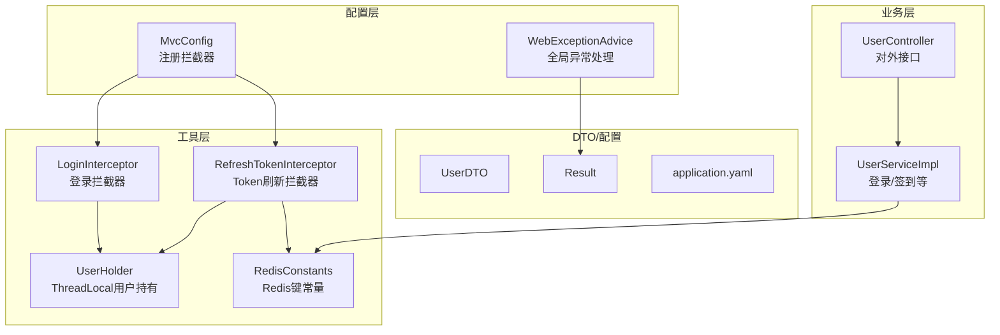
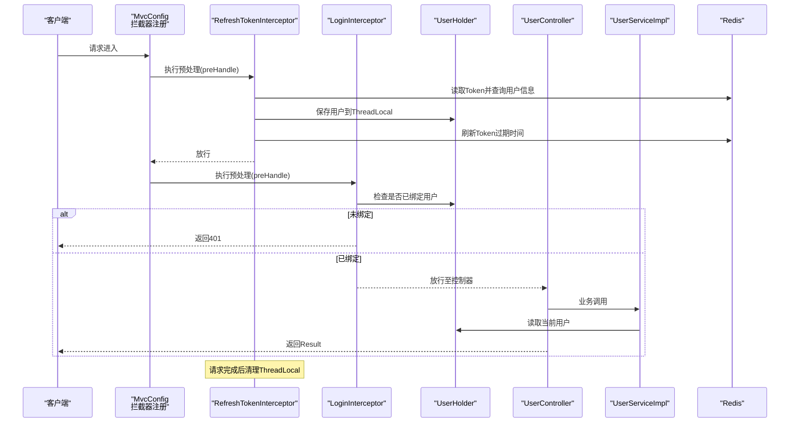
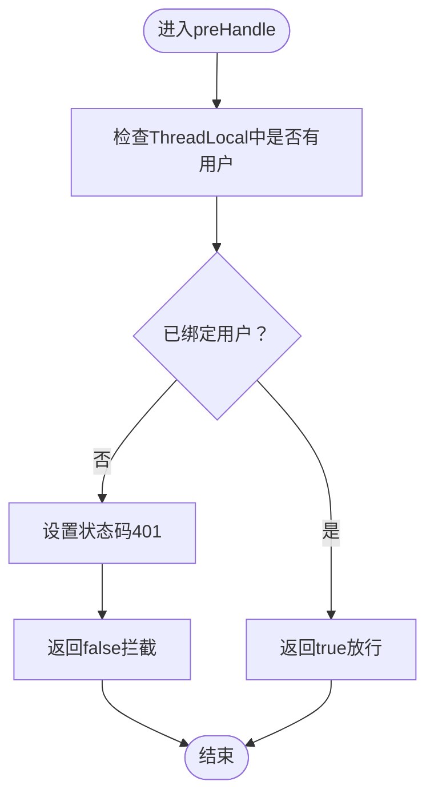
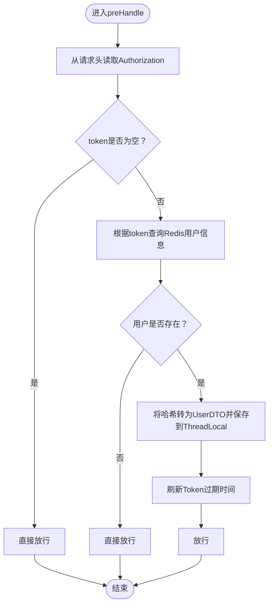
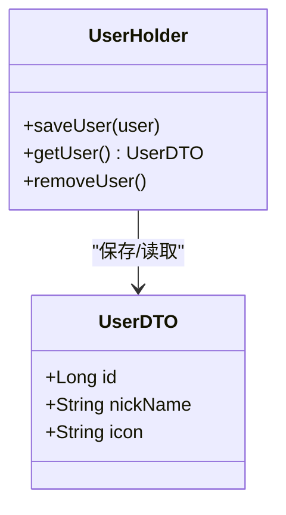
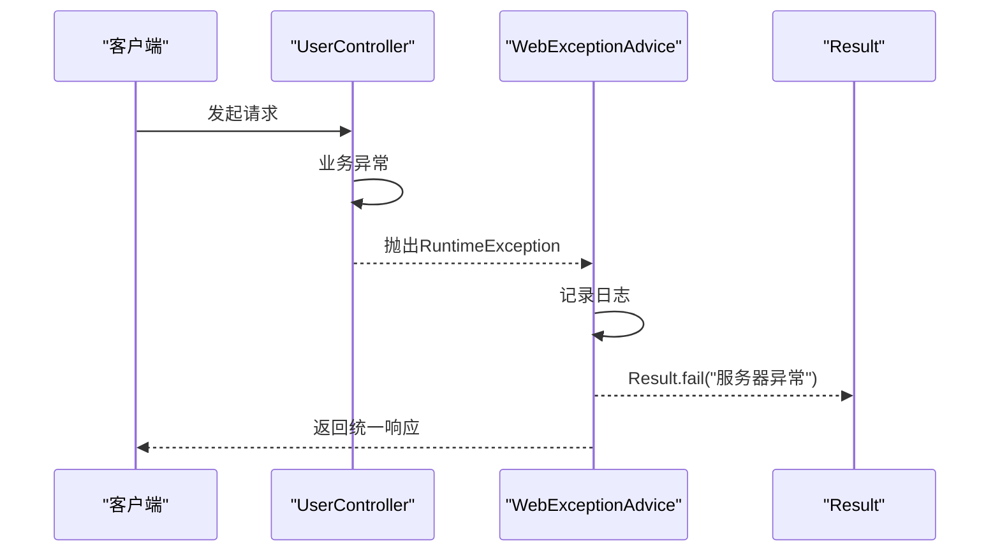
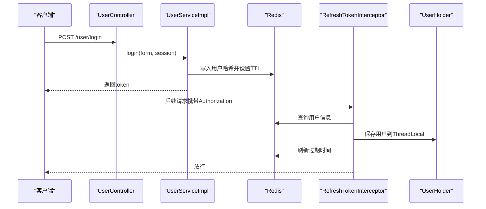
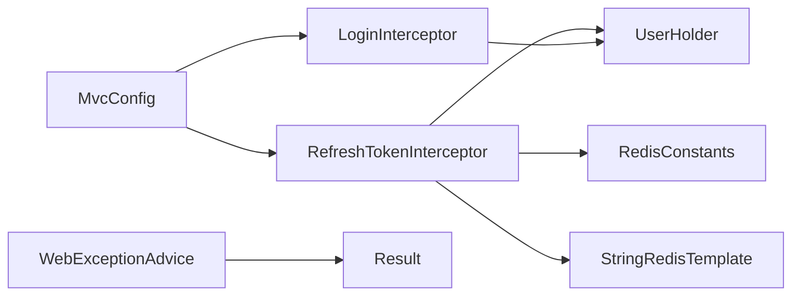

# 拦截器与安全

<cite>
**本文引用的文件列表**
- [MvcConfig.java](file://src/main/java/com/hmdp/config/MvcConfig.java)
- [WebExceptionAdvice.java](file://src/main/java/com/hmdp/config/WebExceptionAdvice.java)
- [LoginInterceptor.java](file://src/main/java/com/hmdp/utils/LoginInterceptor.java)
- [RefreshTokenInterceptor.java](file://src/main/java/com/hmdp/utils/RefreshTokenInterceptor.java)
- [UserHolder.java](file://src/main/java/com/hmdp/utils/UserHolder.java)
- [RedisConstants.java](file://src/main/java/com/hmdp/utils/RedisConstants.java)
- [UserDTO.java](file://src/main/java/com/hmdp/dto/UserDTO.java)
- [Result.java](file://src/main/java/com/hmdp/dto/Result.java)
- [application.yaml](file://src/main/resources/application.yaml)
- [UserServiceImpl.java](file://src/main/java/com/hmdp/service/impl/UserServiceImpl.java)
- [UserController.java](file://src/main/java/com/hmdp/controller/UserController.java)
</cite>

## 目录
1. [简介](#简介)
2. [项目结构](#项目结构)
3. [核心组件](#核心组件)
4. [架构总览](#架构总览)
5. [详细组件分析](#详细组件分析)
6. [依赖关系分析](#依赖关系分析)
7. [性能考量](#性能考量)
8. [故障排查指南](#故障排查指南)
9. [结论](#结论)
10. [附录](#附录)

## 简介
本文件面向开发者，系统性阐述本项目的拦截器与安全模块，重点覆盖：
- 登录拦截器的实现原理：Token 校验、用户信息提取、ThreadLocal 存储机制
- Token 刷新拦截器的工作流程与安全策略
- 全局异常处理机制
- 权限控制、安全配置与防护措施
- 拦截器链的执行顺序与作用域
- 提供完整的 Web 安全解决方案实现指导

## 项目结构
围绕“拦截器与安全”主题，涉及的关键目录与文件如下：
- 配置层：MvcConfig（注册拦截器）、WebExceptionAdvice（全局异常）
- 工具层：LoginInterceptor（登录校验）、RefreshTokenInterceptor（Token刷新）、UserHolder（线程本地用户）、RedisConstants（Redis键常量）
- DTO 层：UserDTO（用户信息载体）、Result（统一响应）
- 应用配置：application.yaml（Redis、日志等）
- 业务层：UserServiceImpl（登录、签到等）、UserController（对外接口）

图表来源
- [MvcConfig.java](file://src/main/java/com/hmdp/config/MvcConfig.java#L18-L33)
- [WebExceptionAdvice.java](file://src/main/java/com/hmdp/config/WebExceptionAdvice.java#L10-L16)
- [LoginInterceptor.java](file://src/main/java/com/hmdp/utils/LoginInterceptor.java#L8-L21)
- [RefreshTokenInterceptor.java](file://src/main/java/com/hmdp/utils/RefreshTokenInterceptor.java#L17-L47)
- [UserHolder.java](file://src/main/java/com/hmdp/utils/UserHolder.java#L5-L18)
- [RedisConstants.java](file://src/main/java/com/hmdp/utils/RedisConstants.java#L3-L7)
- [UserServiceImpl.java](file://src/main/java/com/hmdp/service/impl/UserServiceImpl.java#L68-L109)
- [UserController.java](file://src/main/java/com/hmdp/controller/UserController.java#L50-L71)
- [application.yaml](file://src/main/resources/application.yaml#L14-L26)

章节来源
- [MvcConfig.java](file://src/main/java/com/hmdp/config/MvcConfig.java#L12-L33)
- [application.yaml](file://src/main/resources/application.yaml#L1-L42)

## 核心组件
- 登录拦截器（LoginInterceptor）：在请求到达业务控制器前，检查当前线程是否已绑定用户信息，若无则拒绝访问。
- Token 刷新拦截器（RefreshTokenInterceptor）：从请求头读取 Authorization Token，查询 Redis 中的用户信息，填充 ThreadLocal，并刷新 Token 过期时间；请求完成后清理 ThreadLocal。
- 用户持有器（UserHolder）：基于 ThreadLocal 的用户上下文管理，提供存取与清理能力。
- 全局异常处理（WebExceptionAdvice）：统一捕获运行时异常，记录日志并返回标准 Result 结构。
- Redis 常量（RedisConstants）：定义登录验证码、登录 Token、过期时间等键空间与 TTL。
- DTO/响应（UserDTO、Result）：用户信息载体与统一响应封装。

章节来源
- [LoginInterceptor.java](file://src/main/java/com/hmdp/utils/LoginInterceptor.java#L8-L21)
- [RefreshTokenInterceptor.java](file://src/main/java/com/hmdp/utils/RefreshTokenInterceptor.java#L17-L53)
- [UserHolder.java](file://src/main/java/com/hmdp/utils/UserHolder.java#L5-L18)
- [WebExceptionAdvice.java](file://src/main/java/com/hmdp/config/WebExceptionAdvice.java#L10-L16)
- [RedisConstants.java](file://src/main/java/com/hmdp/utils/RedisConstants.java#L3-L7)
- [UserDTO.java](file://src/main/java/com/hmdp/dto/UserDTO.java#L6-L10)
- [Result.java](file://src/main/java/com/hmdp/dto/Result.java#L12-L29)

## 架构总览
拦截器链在 Spring MVC 中按注册顺序执行，先执行 Token 刷新拦截器，再执行登录拦截器。业务控制器通过 UserHolder 获取当前用户上下文，实现无侵入式权限控制。

图表来源
- [MvcConfig.java](file://src/main/java/com/hmdp/config/MvcConfig.java#L18-L33)
- [RefreshTokenInterceptor.java](file://src/main/java/com/hmdp/utils/RefreshTokenInterceptor.java#L25-L53)
- [LoginInterceptor.java](file://src/main/java/com/hmdp/utils/LoginInterceptor.java#L10-L21)
- [UserHolder.java](file://src/main/java/com/hmdp/utils/UserHolder.java#L8-L18)
- [UserController.java](file://src/main/java/com/hmdp/controller/UserController.java#L66-L71)
- [UserServiceImpl.java](file://src/main/java/com/hmdp/service/impl/UserServiceImpl.java#L111-L115)

## 详细组件分析

### 登录拦截器（LoginInterceptor）
- 作用：在业务控制器之前进行登录态校验，未登录直接拒绝。
- 关键点：
  - 通过 UserHolder.getUser() 判断当前线程是否已绑定用户
  - 若为空，设置响应状态码并返回 false 拦截请求
  - 若存在用户，返回 true 放行
- 适用范围：默认对所有路径生效，排除了公开资源路径（如登录页、静态资源、部分查询接口）

图表来源
- [LoginInterceptor.java](file://src/main/java/com/hmdp/utils/LoginInterceptor.java#L10-L21)

章节来源
- [LoginInterceptor.java](file://src/main/java/com/hmdp/utils/LoginInterceptor.java#L8-L21)
- [MvcConfig.java](file://src/main/java/com/hmdp/config/MvcConfig.java#L21-L30)

### Token 刷新拦截器（RefreshTokenInterceptor）
- 作用：从请求头提取 Authorization Token，校验并加载用户到 ThreadLocal，同时刷新 Token 在 Redis 中的过期时间；请求完成后清理 ThreadLocal。
- 关键流程：
  - 从请求头读取 token
  - 使用 Redis 键前缀与 token 组合查询用户哈希数据
  - 将哈希映射转换为 UserDTO 并保存到 ThreadLocal
  - 刷新 Redis 中该 token 的过期时间
  - 请求完成后在 afterCompletion 中移除 ThreadLocal 用户
- 安全策略：
  - 仅当请求头存在 token 且 Redis 中存在对应用户时才刷新
  - 对未携带 token 或无效 token 的请求直接放行，避免阻断匿名访问
  - 使用固定键前缀与 TTL，便于统一管理与清理

图表来源
- [RefreshTokenInterceptor.java](file://src/main/java/com/hmdp/utils/RefreshTokenInterceptor.java#L25-L53)
- [RedisConstants.java](file://src/main/java/com/hmdp/utils/RedisConstants.java#L6-L7)

章节来源
- [RefreshTokenInterceptor.java](file://src/main/java/com/hmdp/utils/RefreshTokenInterceptor.java#L17-L53)
- [RedisConstants.java](file://src/main/java/com/hmdp/utils/RedisConstants.java#L3-L7)

### 用户持有器（UserHolder）
- 作用：以 ThreadLocal 为作用域保存当前用户上下文，支持保存、获取与清理。
- 使用场景：
  - 在 Token 刷新拦截器中保存用户
  - 在业务控制器或服务层读取当前用户
  - 在请求完成后清理，避免内存泄漏

图表来源
- [UserHolder.java](file://src/main/java/com/hmdp/utils/UserHolder.java#L5-L18)
- [UserDTO.java](file://src/main/java/com/hmdp/dto/UserDTO.java#L6-L10)

章节来源
- [UserHolder.java](file://src/main/java/com/hmdp/utils/UserHolder.java#L5-L18)
- [UserDTO.java](file://src/main/java/com/hmdp/dto/UserDTO.java#L6-L10)

### 全局异常处理（WebExceptionAdvice）
- 作用：统一捕获运行时异常，记录日志并返回 Result.fail 的统一响应结构。
- 适用范围：所有控制器抛出的 RuntimeException 及其子类。

图表来源
- [WebExceptionAdvice.java](file://src/main/java/com/hmdp/config/WebExceptionAdvice.java#L10-L16)
- [Result.java](file://src/main/java/com/hmdp/dto/Result.java#L27-L29)

章节来源
- [WebExceptionAdvice.java](file://src/main/java/com/hmdp/config/WebExceptionAdvice.java#L10-L16)
- [Result.java](file://src/main/java/com/hmdp/dto/Result.java#L12-L29)

### 登录流程与 Token 存储（配合拦截器）
- 登录时，服务层生成随机 Token，将用户信息写入 Redis（哈希），并设置过期时间。
- 客户端后续请求在请求头携带 Authorization: token。
- Token 刷新拦截器负责读取并校验，加载用户到 ThreadLocal，刷新过期时间。

图表来源
- [UserServiceImpl.java](file://src/main/java/com/hmdp/service/impl/UserServiceImpl.java#L68-L109)
- [RefreshTokenInterceptor.java](file://src/main/java/com/hmdp/utils/RefreshTokenInterceptor.java#L25-L46)
- [RedisConstants.java](file://src/main/java/com/hmdp/utils/RedisConstants.java#L6-L7)

章节来源
- [UserServiceImpl.java](file://src/main/java/com/hmdp/service/impl/UserServiceImpl.java#L68-L109)
- [UserController.java](file://src/main/java/com/hmdp/controller/UserController.java#L50-L54)

## 依赖关系分析
- 注册顺序与作用域：
  - Token 刷新拦截器 order(0)，优先于登录拦截器
  - 登录拦截器排除公开路径，仅对受保护路径生效
- 组件耦合：
  - LoginInterceptor 依赖 UserHolder
  - RefreshTokenInterceptor 依赖 StringRedisTemplate、RedisConstants、UserHolder、UserDTO
  - WebExceptionAdvice 依赖 Result
- 外部依赖：
  - Redis：用于存储登录用户信息与过期时间控制
  - Spring MVC：拦截器链、全局异常处理

图表来源
- [MvcConfig.java](file://src/main/java/com/hmdp/config/MvcConfig.java#L18-L33)
- [LoginInterceptor.java](file://src/main/java/com/hmdp/utils/LoginInterceptor.java#L8-L21)
- [RefreshTokenInterceptor.java](file://src/main/java/com/hmdp/utils/RefreshTokenInterceptor.java#L17-L23)
- [WebExceptionAdvice.java](file://src/main/java/com/hmdp/config/WebExceptionAdvice.java#L10-L16)

章节来源
- [MvcConfig.java](file://src/main/java/com/hmdp/config/MvcConfig.java#L18-L33)
- [application.yaml](file://src/main/resources/application.yaml#L14-L26)

## 性能考量
- Redis 访问：
  - Token 刷新拦截器每次请求都会读取 Redis 并可能更新过期时间，建议合理设置 TTL 与连接池参数
- 线程本地存储：
  - ThreadLocal 在请求结束后必须清理，避免线程复用导致的数据泄露
- 排除路径：
  - 登录拦截器对公开路径进行排除，减少不必要的校验开销
- 异常处理：
  - 全局异常处理避免业务层重复 try-catch，提升可维护性

## 故障排查指南
- 401 未授权：
  - 检查请求头是否包含 Authorization
  - 确认 Redis 中是否存在对应 token 的用户信息
  - 核对拦截器排除路径配置是否正确
- 用户信息为空：
  - 确认 Token 刷新拦截器是否成功将用户写入 ThreadLocal
  - 检查 afterCompletion 是否被调用并清理
- 登录失败：
  - 核对验证码是否正确、用户是否存在、Redis 写入是否成功
- 全局异常：
  - 查看日志输出，确认 WebExceptionAdvice 是否捕获到异常并返回统一结构

章节来源
- [LoginInterceptor.java](file://src/main/java/com/hmdp/utils/LoginInterceptor.java#L10-L21)
- [RefreshTokenInterceptor.java](file://src/main/java/com/hmdp/utils/RefreshTokenInterceptor.java#L49-L53)
- [WebExceptionAdvice.java](file://src/main/java/com/hmdp/config/WebExceptionAdvice.java#L10-L16)

## 结论
本项目通过拦截器链实现了轻量而高效的 Web 安全方案：以 Token 刷新拦截器保障用户上下文的持续可用，以登录拦截器确保受保护资源的访问控制；结合全局异常处理与 Redis 过期管理，形成闭环的安全与可观测性体系。开发者可在此基础上扩展权限细化、审计日志与更严格的会话策略。

## 附录
- Redis 配置与连接池参数位于应用配置文件中，可根据环境调整
- 建议在生产环境中增加：
  - 更细粒度的权限注解（如基于角色/资源的访问控制）
  - 请求签名与防重放机制
  - 会话并发控制与踢人策略
  - 更完善的登出逻辑（清除 Redis 中的用户信息）

章节来源
- [application.yaml](file://src/main/resources/application.yaml#L14-L26)