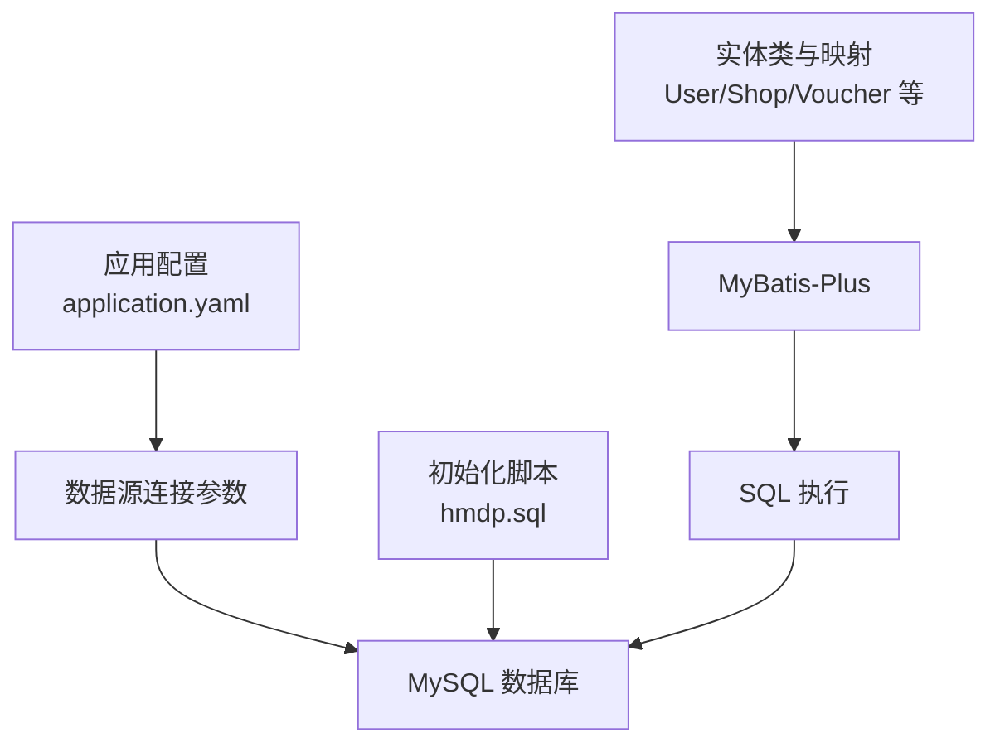
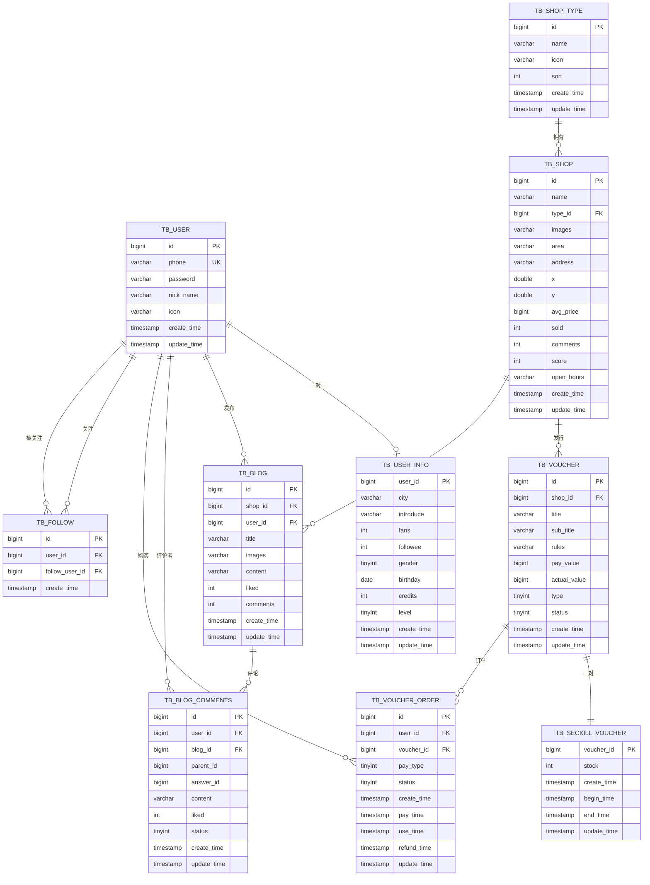
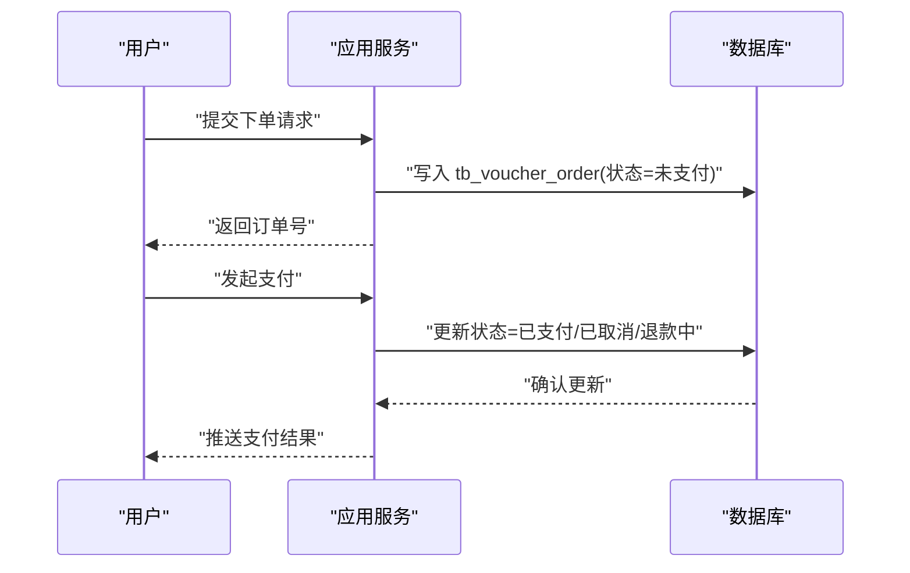
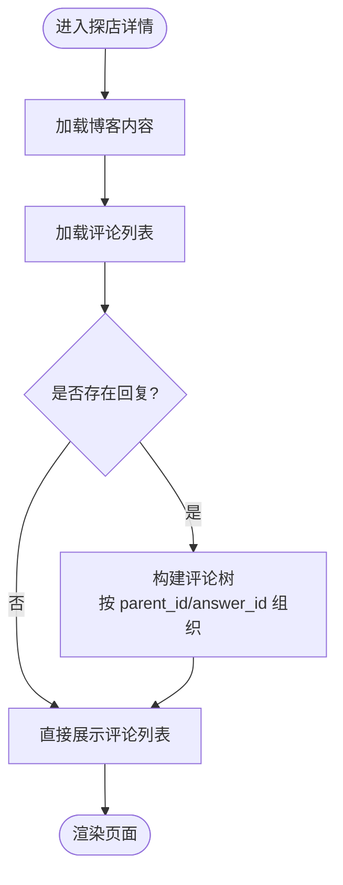
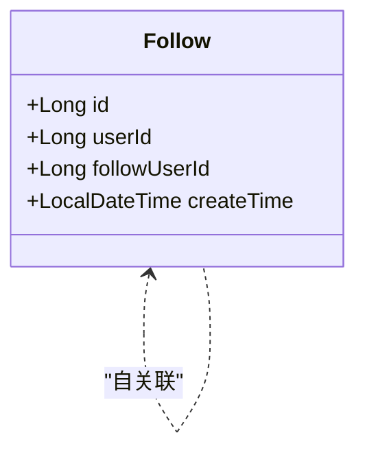
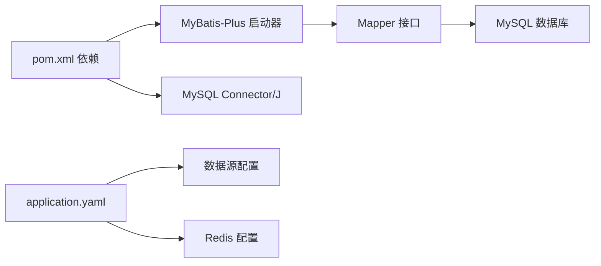

# 数据库概览

<cite>
**本文引用的文件**
- [hmdp.sql](file://src/main/resources/db/hmdp.sql)
- [application.yaml](file://src/main/resources/application.yaml)
- [User.java](file://src/main/java/com/hmdp/entity/User.java)
- [Shop.java](file://src/main/java/com/hmdp/entity/Shop.java)
- [Voucher.java](file://src/main/java/com/hmdp/entity/Voucher.java)
- [VoucherOrder.java](file://src/main/java/com/hmdp/entity/VoucherOrder.java)
- [Blog.java](file://src/main/java/com/hmdp/entity/Blog.java)
- [BlogComments.java](file://src/main/java/com/hmdp/entity/BlogComments.java)
- [Follow.java](file://src/main/java/com/hmdp/entity/Follow.java)
- [ShopType.java](file://src/main/java/com/hmdp/entity/ShopType.java)
- [UserMapper.java](file://src/main/java/com/hmdp/mapper/UserMapper.java)
- [MybatisConfig.java](file://src/main/java/com/hmdp/config/MybatisConfig.java)
- [pom.xml](file://pom.xml)
</cite>

## 目录
1. [简介](#简介)
2. [项目结构](#项目结构)
3. [核心组件](#核心组件)
4. [架构总览](#架构总览)
5. [详细组件分析](#详细组件分析)
6. [依赖分析](#依赖分析)
7. [性能考虑](#性能考虑)
8. [故障排查指南](#故障排查指南)
9. [结论](#结论)
10. [附录](#附录)

## 简介
本文件面向初学者与开发者，系统性梳理 LSMarket 项目的数据库整体架构与设计思路，覆盖数据库版本信息、字符集与时区配置、初始化脚本、核心表结构与关系、以及各业务模块的数据存储策略。通过图示化的方式帮助读者快速建立“从表结构到业务”的整体认知。

## 项目结构
- 数据库初始化脚本位于资源目录，包含完整的建表语句、索引与初始数据。
- 应用配置文件定义了数据源连接参数（主机、端口、数据库名、用户名、密码、时区）。
- 实体类与 MyBatis-Plus 映射文件共同定义了 Java 对象与数据库表之间的对应关系。
- Maven 依赖声明了 MySQL 驱动与 MyBatis-Plus 版本，确保 ORM 正常工作。



**图表来源**
- [application.yaml](file://src/main/resources/application.yaml#L9-L13)
- [hmdp.sql](file://src/main/resources/db/hmdp.sql#L1-L266)
- [MybatisConfig.java](file://src/main/java/com/hmdp/config/MybatisConfig.java#L10-L16)

**章节来源**
- [application.yaml](file://src/main/resources/application.yaml#L1-L42)
- [hmdp.sql](file://src/main/resources/db/hmdp.sql#L1-L266)
- [MybatisConfig.java](file://src/main/java/com/hmdp/config/MybatisConfig.java#L1-L18)

## 核心组件
- 数据库版本与字符集
  - 初始化脚本头部注释显示目标服务器类型为 MySQL，版本为 5.6.22；统一使用 utf8mb4 字符集与排序规则。
- 时区配置
  - 应用配置中 JDBC URL 设置 serverTimezone=UTC，确保与后端时区一致。
- 初始化流程
  - 使用 hmdp.sql 在目标数据库执行建表与插入初始数据，随后应用启动即可读写。
- 连接配置
  - 数据源驱动类名、URL、用户名、密码均在 application.yaml 中集中管理。

**章节来源**
- [hmdp.sql](file://src/main/resources/db/hmdp.sql#L1-L15)
- [application.yaml](file://src/main/resources/application.yaml#L9-L13)

## 架构总览
LSMarket 的数据库围绕“用户、商铺、优惠券、探店内容、关注关系”五大业务域展开，采用 MyBatis-Plus 简化持久层开发，并通过分页插件提升查询性能。



**图表来源**
- [hmdp.sql](file://src/main/resources/db/hmdp.sql#L24-L36)
- [hmdp.sql](file://src/main/resources/db/hmdp.sql#L49-L62)
- [hmdp.sql](file://src/main/resources/db/hmdp.sql#L72-L78)
- [hmdp.sql](file://src/main/resources/db/hmdp.sql#L88-L96)
- [hmdp.sql](file://src/main/resources/db/hmdp.sql#L106-L124)
- [hmdp.sql](file://src/main/resources/db/hmdp.sql#L148-L156)
- [hmdp.sql](file://src/main/resources/db/hmdp.sql#L176-L186)
- [hmdp.sql](file://src/main/resources/db/hmdp.sql#L199-L213)
- [hmdp.sql](file://src/main/resources/db/hmdp.sql#L222-L236)
- [hmdp.sql](file://src/main/resources/db/hmdp.sql#L246-L259)

## 详细组件分析

### 用户与用户信息
- 表结构要点
  - tb_user：手机号唯一索引，便于登录与绑定；包含昵称、头像、密码字段。
  - tb_user_info：以 user_id 作为主键，存储城市、介绍、粉丝数、关注数、性别、生日、积分、等级等扩展信息。
- 设计理念
  - 将基础凭据与扩展资料分离，降低主表膨胀，提升读写效率。
- 实体映射
  - User 实体映射 tb_user；UserInfo 实体映射 tb_user_info（项目中存在对应实体类，但未在 SQL 中展示其字段定义）。

```mermaid
classDiagram
class User {
+Long id
+String phone
+String password
+String nickName
+String icon
+LocalDateTime createTime
+LocalDateTime updateTime
}
class UserInfo {
+Long userId
+String city
+String introduce
+Integer fans
+Integer followee
+Integer gender
+Date birthday
+Integer credits
+Integer level
+LocalDateTime createTime
+LocalDateTime updateTime
}
User ||--|| UserInfo : "一对一"
```

**图表来源**
- [User.java](file://src/main/java/com/hmdp/entity/User.java#L24-L66)
- [hmdp.sql](file://src/main/resources/db/hmdp.sql#L176-L186)
- [hmdp.sql](file://src/main/resources/db/hmdp.sql#L199-L213)

**章节来源**
- [User.java](file://src/main/java/com/hmdp/entity/User.java#L1-L67)
- [hmdp.sql](file://src/main/resources/db/hmdp.sql#L176-L213)

### 商铺与类型
- 表结构要点
  - tb_shop：包含名称、类型、图片、商圈、地址、经纬度、均价、销量、评论数、评分、营业时间等字段。
  - tb_shop_type：类型名称、图标、排序等，与 tb_shop 通过 type_id 关联。
- 设计理念
  - 类型表独立，支持动态扩展与排序；商铺表集中存储地理与业务指标，便于检索与统计。

```mermaid
classDiagram
class ShopType {
+Long id
+String name
+String icon
+Integer sort
+LocalDateTime createTime
+LocalDateTime updateTime
}
class Shop {
+Long id
+String name
+Long typeId
+String images
+String area
+String address
+Double x
+Double y
+Long avgPrice
+Integer sold
+Integer comments
+Integer score
+String openHours
+LocalDateTime createTime
+LocalDateTime updateTime
}
ShopType ||--o{ Shop : "拥有"
```

**图表来源**
- [ShopType.java](file://src/main/java/com/hmdp/entity/ShopType.java#L25-L64)
- [Shop.java](file://src/main/java/com/hmdp/entity/Shop.java#L25-L109)
- [hmdp.sql](file://src/main/resources/db/hmdp.sql#L148-L156)
- [hmdp.sql](file://src/main/resources/db/hmdp.sql#L106-L124)

**章节来源**
- [ShopType.java](file://src/main/java/com/hmdp/entity/ShopType.java#L1-L65)
- [Shop.java](file://src/main/java/com/hmdp/entity/Shop.java#L1-L110)
- [hmdp.sql](file://src/main/resources/db/hmdp.sql#L106-L156)

### 优惠券与秒杀
- 表结构要点
  - tb_voucher：标题、副标题、规则、支付金额、抵扣金额、类型、状态等。
  - tb_seckill_voucher：与优惠券一对一，记录库存、生效/失效时间。
- 设计理念
  - 将普通券与秒杀券分离，便于差异化控制与性能优化；秒杀库存单独管理，减少并发冲突下的锁竞争。

```mermaid
classDiagram
class Voucher {
+Long id
+Long shopId
+String title
+String subTitle
+String rules
+Long payValue
+Long actualValue
+Integer type
+Integer status
+LocalDateTime createTime
+LocalDateTime updateTime
}
class SeckillVoucher {
+Long voucherId
+Integer stock
+LocalDateTime beginTime
+LocalDateTime endTime
+LocalDateTime createTime
+LocalDateTime updateTime
}
Voucher ||--|| SeckillVoucher : "一对一"
```

**图表来源**
- [Voucher.java](file://src/main/java/com/hmdp/entity/Voucher.java#L25-L105)
- [hmdp.sql](file://src/main/resources/db/hmdp.sql#L222-L236)
- [hmdp.sql](file://src/main/resources/db/hmdp.sql#L88-L96)

**章节来源**
- [Voucher.java](file://src/main/java/com/hmdp/entity/Voucher.java#L1-L106)
- [hmdp.sql](file://src/main/resources/db/hmdp.sql#L88-L236)

### 优惠券订单
- 表结构要点
  - tb_voucher_order：主键采用输入型（INPUT），记录用户、优惠券、支付方式、状态及各关键时间点。
- 设计理念
  - 主键由业务生成，便于幂等与分布式一致性；状态字段覆盖完整生命周期。



**图表来源**
- [VoucherOrder.java](file://src/main/java/com/hmdp/entity/VoucherOrder.java#L24-L81)
- [hmdp.sql](file://src/main/resources/db/hmdp.sql#L246-L259)

**章节来源**
- [VoucherOrder.java](file://src/main/java/com/hmdp/entity/VoucherOrder.java#L1-L82)
- [hmdp.sql](file://src/main/resources/db/hmdp.sql#L246-L259)

### 探店内容与评论
- 表结构要点
  - tb_blog：标题、图片、内容、点赞/评论数、关联用户与商铺。
  - tb_blog_comments：支持一级/二级评论，父子关系通过 parent_id/answer_id 表达。
- 设计理念
  - 内容与互动分离，便于内容聚合与评论树渲染；通过索引与分页提升查询性能。



**图表来源**
- [Blog.java](file://src/main/java/com/hmdp/entity/Blog.java#L25-L95)
- [BlogComments.java](file://src/main/java/com/hmdp/entity/BlogComments.java#L24-L80)
- [hmdp.sql](file://src/main/resources/db/hmdp.sql#L24-L36)
- [hmdp.sql](file://src/main/resources/db/hmdp.sql#L49-L62)

**章节来源**
- [Blog.java](file://src/main/java/com/hmdp/entity/Blog.java#L1-L96)
- [BlogComments.java](file://src/main/java/com/hmdp/entity/BlogComments.java#L1-L81)
- [hmdp.sql](file://src/main/resources/db/hmdp.sql#L24-L62)

### 关注关系
- 表结构要点
  - tb_follow：记录用户与被关注用户的关联，带创建时间。
- 设计理念
  - 简洁的多对多关系表，支持社交推荐与动态流构建。



**图表来源**
- [Follow.java](file://src/main/java/com/hmdp/entity/Follow.java#L24-L50)
- [hmdp.sql](file://src/main/resources/db/hmdp.sql#L72-L78)

**章节来源**
- [Follow.java](file://src/main/java/com/hmdp/entity/Follow.java#L1-L51)
- [hmdp.sql](file://src/main/resources/db/hmdp.sql#L72-L78)

## 依赖分析
- 连接与驱动
  - JDBC 驱动类名与 URL 在 application.yaml 中定义；MySQL Connector/J 版本在 pom.xml 中声明。
- ORM 与分页
  - MyBatis-Plus 启动器与拦截器在 pom.xml 与 MybatisConfig.java 中配置，启用 MySQL 分页内核。
- 缓存与会话
  - Redis 配置存在于 application.yaml，用于缓存与分布式锁等场景（与数据库协同）。



**图表来源**
- [pom.xml](file://pom.xml#L70-L73)
- [pom.xml](file://pom.xml#L54-L58)
- [application.yaml](file://src/main/resources/application.yaml#L9-L18)
- [MybatisConfig.java](file://src/main/java/com/hmdp/config/MybatisConfig.java#L10-L16)

**章节来源**
- [pom.xml](file://pom.xml#L1-L108)
- [application.yaml](file://src/main/resources/application.yaml#L1-L42)
- [MybatisConfig.java](file://src/main/java/com/hmdp/config/MybatisConfig.java#L1-L18)

## 性能考虑
- 字符集与排序规则
  - 全库统一 utf8mb4，兼顾表情与多语言，避免后续迁移成本。
- 索引策略
  - tb_shop 表对 type_id 建有索引，有利于按类型筛选；tb_user 对 phone 建有唯一索引，保障登录效率。
- 分页与查询
  - 已启用 MyBatis-Plus 分页插件，建议在高频查询接口使用分页并限制每页大小，避免全表扫描。
- 并发与库存
  - 秒杀库存独立表，结合 Lua 脚本与 Redis 预热可进一步降低数据库压力（项目包含相关脚本文件）。

[本节为通用性能建议，不直接分析具体代码文件]

## 故障排查指南
- 连接失败
  - 检查 application.yaml 中的 host、port、database、username、password 是否正确；确认 serverTimezone 与应用时区一致。
- 字符乱码
  - 确认数据库、表、列字符集均为 utf8mb4；客户端连接参数需匹配。
- 启动报错
  - 确认 MySQL 服务运行且版本兼容；检查 pom.xml 中 MySQL Connector/J 与数据库版本匹配。
- 分页异常
  - 确认 MyBatis-Plus 分页插件已注册；查询方法需使用 Page 参数或分页构造器。

**章节来源**
- [application.yaml](file://src/main/resources/application.yaml#L9-L13)
- [hmdp.sql](file://src/main/resources/db/hmdp.sql#L1-L15)
- [MybatisConfig.java](file://src/main/java/com/hmdp/config/MybatisConfig.java#L10-L16)
- [pom.xml](file://pom.xml#L54-L58)

## 结论
LSMarket 的数据库设计遵循“业务域清晰、表结构简洁、索引合理、字符与时区统一”的原则。通过 MyBatis-Plus 与分页插件，项目在保证开发效率的同时兼顾了查询性能。建议在后续迭代中持续完善索引策略、引入缓存与异步化处理，以应对高并发场景。

[本节为总结性内容，不直接分析具体代码文件]

## 附录
- 数据库初始化步骤
  - 在目标数据库执行 hmdp.sql 完成建表与初始数据导入。
- 常用配置项速览
  - 数据源：驱动类名、URL、用户名、密码、时区。
  - Redis：主机、端口、数据库编号、连接池参数。
  - MyBatis-Plus：分页插件已启用，实体别名包已配置。

**章节来源**
- [hmdp.sql](file://src/main/resources/db/hmdp.sql#L1-L266)
- [application.yaml](file://src/main/resources/application.yaml#L9-L28)
- [MybatisConfig.java](file://src/main/java/com/hmdp/config/MybatisConfig.java#L10-L16)