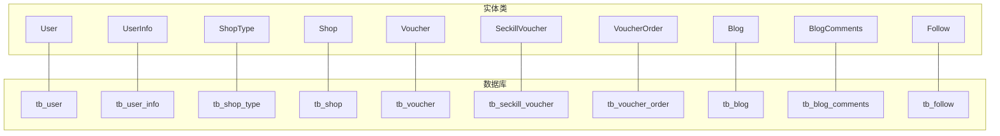
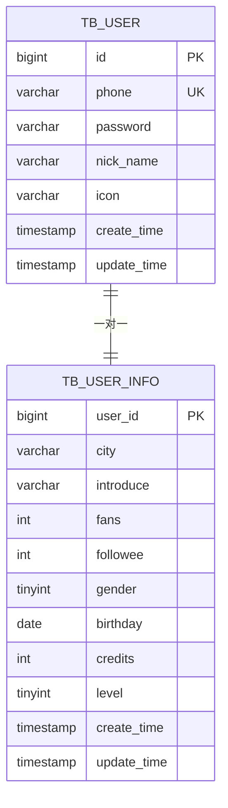
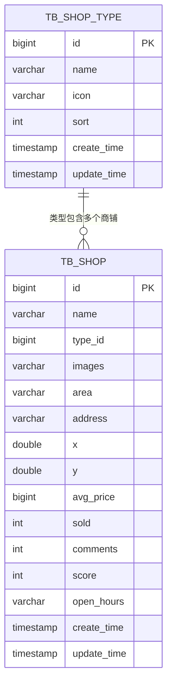
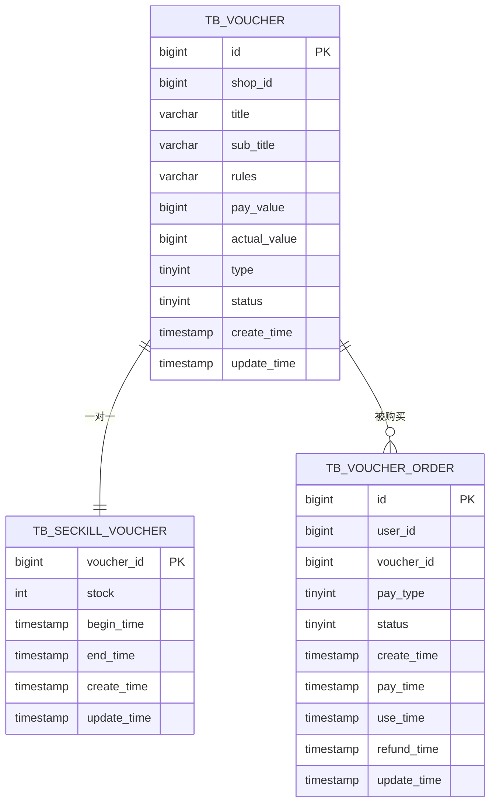
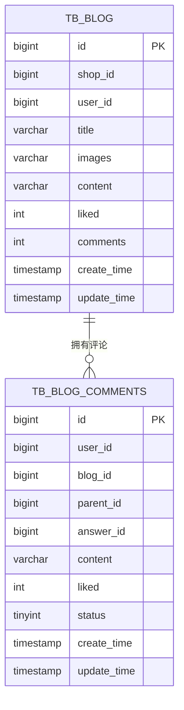
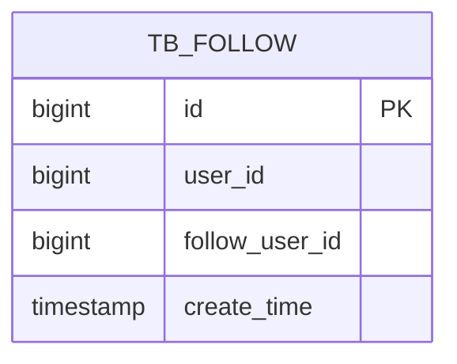
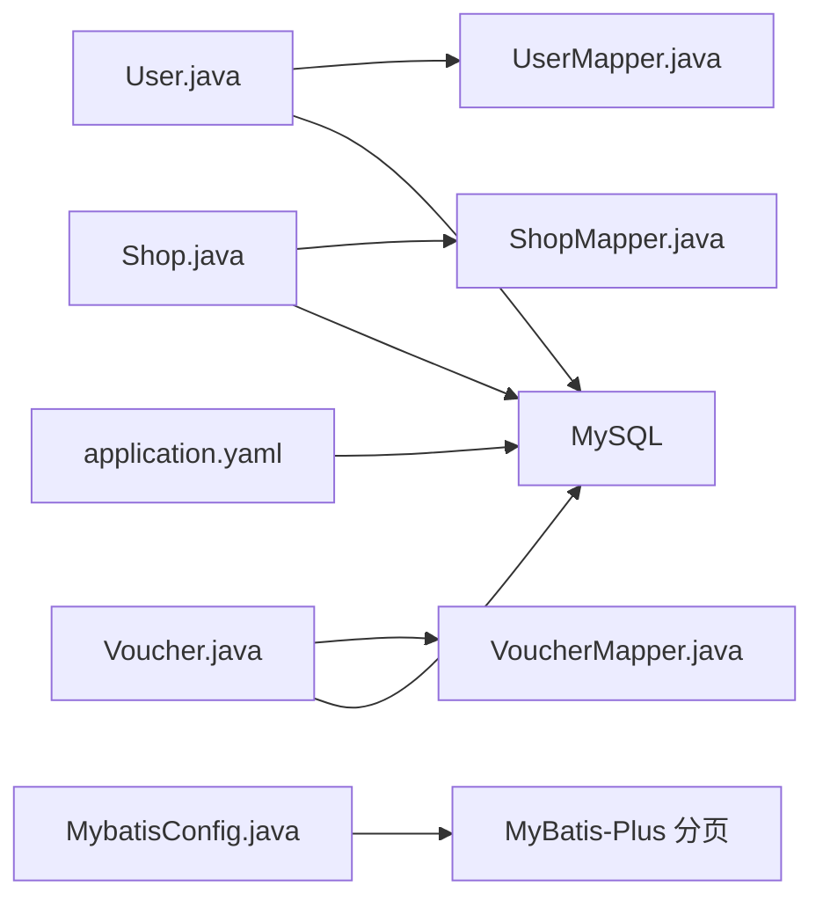

# 数据库设计

<cite>
**本文引用的文件**
- [hmdp.sql](file://src/main/resources/db/hmdp.sql)
- [User.java](file://src/main/java/com/hmdp/entity/User.java)
- [Shop.java](file://src/main/java/com/hmdp/entity/Shop.java)
- [Voucher.java](file://src/main/java/com/hmdp/entity/Voucher.java)
- [Blog.java](file://src/main/java/com/hmdp/entity/Blog.java)
- [ShopType.java](file://src/main/java/com/hmdp/entity/ShopType.java)
- [UserInfo.java](file://src/main/java/com/hmdp/entity/UserInfo.java)
- [Follow.java](file://src/main/java/com/hmdp/entity/Follow.java)
- [BlogComments.java](file://src/main/java/com/hmdp/entity/BlogComments.java)
- [VoucherOrder.java](file://src/main/java/com/hmdp/entity/VoucherOrder.java)
- [SeckillVoucher.java](file://src/main/java/com/hmdp/entity/SeckillVoucher.java)
- [UserMapper.java](file://src/main/java/com/hmdp/mapper/UserMapper.java)
- [ShopMapper.java](file://src/main/java/com/hmdp/mapper/ShopMapper.java)
- [VoucherMapper.java](file://src/main/java/com/hmdp/mapper/VoucherMapper.java)
- [application.yaml](file://src/main/resources/application.yaml)
- [MybatisConfig.java](file://src/main/java/com/hmdp/config/MybatisConfig.java)
</cite>

## 目录
1. 引言
2. 项目结构
3. 核心组件
4. 架构总览
5. 详细组件分析
6. 依赖分析
7. 性能考虑
8. 故障排查指南
9. 结论
10. 附录

## 引言
本文件面向 LSMarket（原 HmDianPing）项目，系统化梳理数据库表结构设计、实体类与数据库表的映射关系、MyBatis-Plus 注解使用、索引与约束策略、数据完整性保障、初始化脚本说明以及数据字典，并给出最佳实践与性能优化建议。读者无需深入技术背景即可理解整体设计思路。

## 项目结构
- 数据库初始化脚本位于 resources/db/hmdp.sql，包含用户、商铺、优惠券、博客、关注、秒杀等核心表的建表与示例数据。
- 实体类位于 entity 包，采用 MyBatis-Plus 的 @TableName/@TableId 等注解进行 ORM 映射。
- Mapper 接口位于 mapper 包，继承 BaseMapper 即可获得通用 CRUD 能力。
- MyBatis-Plus 分页插件在 MybatisConfig 中启用，应用配置在 application.yaml 中。

图表来源
- [hmdp.sql](file://src/main/resources/db/hmdp.sql#L173-L266)
- [User.java](file://src/main/java/com/hmdp/entity/User.java#L24-L66)
- [UserInfo.java](file://src/main/java/com/hmdp/entity/UserInfo.java#L25-L87)
- [ShopType.java](file://src/main/java/com/hmdp/entity/ShopType.java#L25-L64)
- [Shop.java](file://src/main/java/com/hmdp/entity/Shop.java#L25-L109)
- [Voucher.java](file://src/main/java/com/hmdp/entity/Voucher.java#L25-L105)
- [SeckillVoucher.java](file://src/main/java/com/hmdp/entity/SeckillVoucher.java#L24-L61)
- [VoucherOrder.java](file://src/main/java/com/hmdp/entity/VoucherOrder.java#L24-L81)
- [Blog.java](file://src/main/java/com/hmdp/entity/Blog.java#L25-L95)
- [BlogComments.java](file://src/main/java/com/hmdp/entity/BlogComments.java#L23-L80)
- [Follow.java](file://src/main/java/com/hmdp/entity/Follow.java#L23-L50)

章节来源
- [hmdp.sql](file://src/main/resources/db/hmdp.sql#L1-L266)
- [application.yaml](file://src/main/resources/application.yaml#L9-L13)
- [MybatisConfig.java](file://src/main/java/com/hmdp/config/MybatisConfig.java#L9-L17)

## 核心组件
本节聚焦于用户、商铺、优惠券、博客等核心实体的表结构、字段定义、索引与约束，以及实体类与数据库表的映射关系。

- 用户表（tb_user）
  - 字段要点：自增主键 id，唯一索引 phone，密码、昵称、头像、创建/更新时间。
  - 实体映射：User，@TableName("tb_user")，@TableId("id", IdType.AUTO)。
  - 约束：UNIQUE(phone)。
  - 参考路径：[hmdp.sql](file://src/main/resources/db/hmdp.sql#L173-L186)，[User.java](file://src/main/java/com/hmdp/entity/User.java#L24-L66)

- 用户扩展信息表（tb_user_info）
  - 字段要点：主键 user_id（与用户表一对一），城市、介绍、粉丝数、关注数、性别、生日、积分、等级、创建/更新时间。
  - 实体映射：UserInfo，@TableName("tb_user_info")，@TableId("user_id", IdType.AUTO)。
  - 约束：主键 user_id。
  - 参考路径：[hmdp.sql](file://src/main/resources/db/hmdp.sql#L197-L213)，[UserInfo.java](file://src/main/java/com/hmdp/entity/UserInfo.java#L25-L87)

- 商铺类型表（tb_shop_type）
  - 字段要点：自增主键 id，名称、图标、排序、创建/更新时间。
  - 实体映射：ShopType，@TableName("tb_shop_type")，@TableId("id", IdType.AUTO)。
  - 约束：主键 id。
  - 参考路径：[hmdp.sql](file://src/main/resources/db/hmdp.sql#L145-L156)，[ShopType.java](file://src/main/java/com/hmdp/entity/ShopType.java#L25-L64)

- 商铺表（tb_shop）
  - 字段要点：自增主键 id，名称、类型 id、图片集合、商圈、地址、经纬度、均价、销量、评论数、评分、营业时间、创建/更新时间。
  - 索引：INDEX(type_id)。
  - 实体映射：Shop，@TableName("tb_shop")，@TableId("id", IdType.AUTO)，类型字段为 Long typeId。
  - 参考路径：[hmdp.sql](file://src/main/resources/db/hmdp.sql#L103-L124)，[Shop.java](file://src/main/java/com/hmdp/entity/Shop.java#L25-L109)

- 优惠券表（tb_voucher）
  - 字段要点：自增主键 id，shop_id（可空）、标题、副标题、使用规则、支付金额（分）、抵扣金额（分）、类型（普通/秒杀）、状态（上架/下架/过期）、创建/更新时间。
  - 实体映射：Voucher，@TableName("tb_voucher")，@TableId("id", IdType.AUTO)。
  - 参考路径：[hmdp.sql](file://src/main/resources/db/hmdp.sql#L220-L236)，[Voucher.java](file://src/main/java/com/hmdp/entity/Voucher.java#L25-L105)

- 秒杀优惠券表（tb_seckill_voucher）
  - 字段要点：主键 voucher_id（与优惠券一对一），库存 stock，生效/失效时间，创建/更新时间。
  - 实体映射：SeckillVoucher，@TableName("tb_seckill_voucher")，@TableId("voucher_id", IdType.INPUT)。
  - 参考路径：[hmdp.sql](file://src/main/resources/db/hmdp.sql#L85-L96)，[SeckillVoucher.java](file://src/main/java/com/hmdp/entity/SeckillVoucher.java#L24-L61)

- 优惠券订单表（tb_voucher_order）
  - 字段要点：主键 id（雪花 ID），user_id、voucher_id、支付方式、订单状态、下单/支付/核销/退款时间、更新时间。
  - 实体映射：VoucherOrder，@TableName("tb_voucher_order")，@TableId("id", IdType.INPUT)。
  - 参考路径：[hmdp.sql](file://src/main/resources/db/hmdp.sql#L244-L259)，[VoucherOrder.java](file://src/main/java/com/hmdp/entity/VoucherOrder.java#L24-L81)

- 博客表（tb_blog）
  - 字段要点：自增主键 id，shop_id、user_id、标题、图片集合、内容、点赞数、评论数、创建/更新时间。
  - 实体映射：Blog，@TableName("tb_blog")，@TableId("id", IdType.AUTO)。
  - 参考路径：[hmdp.sql](file://src/main/resources/db/hmdp.sql#L21-L36)，[Blog.java](file://src/main/java/com/hmdp/entity/Blog.java#L25-L95)

- 博客评论表（tb_blog_comments）
  - 字段要点：自增主键 id，user_id、blog_id、父评论 id、回复评论 id、内容、点赞数、状态、创建/更新时间。
  - 实体映射：BlogComments，@TableName("tb_blog_comments")，@TableId("id", IdType.AUTO)。
  - 参考路径：[hmdp.sql](file://src/main/resources/db/hmdp.sql#L47-L62)，[BlogComments.java](file://src/main/java/com/hmdp/entity/BlogComments.java#L23-L80)

- 关注表（tb_follow）
  - 字段要点：自增主键 id，user_id、follow_user_id、创建时间。
  - 实体映射：Follow，@TableName("tb_follow")，@TableId("id", IdType.AUTO)。
  - 参考路径：[hmdp.sql](file://src/main/resources/db/hmdp.sql#L69-L78)，[Follow.java](file://src/main/java/com/hmdp/entity/Follow.java#L23-L50)

章节来源
- [hmdp.sql](file://src/main/resources/db/hmdp.sql#L21-L266)
- [User.java](file://src/main/java/com/hmdp/entity/User.java#L24-L66)
- [UserInfo.java](file://src/main/java/com/hmdp/entity/UserInfo.java#L25-L87)
- [ShopType.java](file://src/main/java/com/hmdp/entity/ShopType.java#L25-L64)
- [Shop.java](file://src/main/java/com/hmdp/entity/Shop.java#L25-L109)
- [Voucher.java](file://src/main/java/com/hmdp/entity/Voucher.java#L25-L105)
- [SeckillVoucher.java](file://src/main/java/com/hmdp/entity/SeckillVoucher.java#L24-L61)
- [VoucherOrder.java](file://src/main/java/com/hmdp/entity/VoucherOrder.java#L24-L81)
- [Blog.java](file://src/main/java/com/hmdp/entity/Blog.java#L25-L95)
- [BlogComments.java](file://src/main/java/com/hmdp/entity/BlogComments.java#L23-L80)
- [Follow.java](file://src/main/java/com/hmdp/entity/Follow.java#L23-L50)

## 架构总览
- 数据访问层：每个实体对应一个 Mapper 接口，继承 BaseMapper，即可获得通用 CRUD 能力。
- ORM 映射：实体类通过 @TableName 指定表名，@TableId 指定主键及生成策略，部分字段通过 @TableField(exist=false) 表示非持久化字段。
- 分页能力：MyBatis-Plus 在 MybatisConfig 中注入分页插件，支持 MySQL。
- 数据源：application.yaml 中配置 MySQL 数据源 URL、用户名、密码。

```mermaid
classDiagram
class User {
+Long id
+String phone
+String password
+String nickName
+String icon
+LocalDateTime createTime
+LocalDateTime updateTime
}
class UserInfo {
+Long userId
+String city
+String introduce
+Integer fans
+Integer followee
+Boolean gender
+LocalDate birthday
+Integer credits
+Boolean level
+LocalDateTime createTime
+LocalDateTime updateTime
}
class ShopType {
+Long id
+String name
+String icon
+Integer sort
+LocalDateTime createTime
+LocalDateTime updateTime
}
class Shop {
+Long id
+String name
+Long typeId
+String images
+String area
+String address
+Double x
+Double y
+Long avgPrice
+Integer sold
+Integer comments
+Integer score
+String openHours
+LocalDateTime createTime
+LocalDateTime updateTime
+Double distance
}
class Voucher {
+Long id
+Long shopId
+String title
+String subTitle
+String rules
+Long payValue
+Long actualValue
+Integer type
+Integer status
+Integer stock
+LocalDateTime beginTime
+LocalDateTime endTime
+LocalDateTime createTime
+LocalDateTime updateTime
}
class SeckillVoucher {
+Long voucherId
+Integer stock
+LocalDateTime beginTime
+LocalDateTime endTime
+LocalDateTime createTime
+LocalDateTime updateTime
}
class VoucherOrder {
+Long id
+Long userId
+Long voucherId
+Integer payType
+Integer status
+LocalDateTime createTime
+LocalDateTime payTime
+LocalDateTime useTime
+LocalDateTime refundTime
+LocalDateTime updateTime
}
class Blog {
+Long id
+Long shopId
+Long userId
+String title
+String images
+String content
+Integer liked
+Integer comments
+LocalDateTime createTime
+LocalDateTime updateTime
+String icon
+String name
+Boolean isLike
}
class BlogComments {
+Long id
+Long userId
+Long blogId
+Long parentId
+Long answerId
+String content
+Integer liked
+Boolean status
+LocalDateTime createTime
+LocalDateTime updateTime
}
class Follow {
+Long id
+Long userId
+Long followUserId
+LocalDateTime createTime
}
```

图表来源
- [User.java](file://src/main/java/com/hmdp/entity/User.java#L24-L66)
- [UserInfo.java](file://src/main/java/com/hmdp/entity/UserInfo.java#L25-L87)
- [ShopType.java](file://src/main/java/com/hmdp/entity/ShopType.java#L25-L64)
- [Shop.java](file://src/main/java/com/hmdp/entity/Shop.java#L25-L109)
- [Voucher.java](file://src/main/java/com/hmdp/entity/Voucher.java#L25-L105)
- [SeckillVoucher.java](file://src/main/java/com/hmdp/entity/SeckillVoucher.java#L24-L61)
- [VoucherOrder.java](file://src/main/java/com/hmdp/entity/VoucherOrder.java#L24-L81)
- [Blog.java](file://src/main/java/com/hmdp/entity/Blog.java#L25-L95)
- [BlogComments.java](file://src/main/java/com/hmdp/entity/BlogComments.java#L23-L80)
- [Follow.java](file://src/main/java/com/hmdp/entity/Follow.java#L23-L50)

章节来源
- [UserMapper.java](file://src/main/java/com/hmdp/mapper/UserMapper.java#L14-L16)
- [ShopMapper.java](file://src/main/java/com/hmdp/mapper/ShopMapper.java#L14-L16)
- [VoucherMapper.java](file://src/main/java/com/hmdp/mapper/VoucherMapper.java#L17-L20)
- [MybatisConfig.java](file://src/main/java/com/hmdp/config/MybatisConfig.java#L9-L17)
- [application.yaml](file://src/main/resources/application.yaml#L9-L13)

## 详细组件分析

### 用户与用户信息
- 设计要点
  - 用户表提供登录凭据与基础资料；用户信息表承载扩展属性，实现“冷热分离”。
  - 通过一对一关系（UserInfo.user_id 对应 User.id）保证数据一致性。
- 索引与约束
  - tb_user.phone 唯一索引，确保手机号唯一性。
  - tb_user_info.user_id 主键，作为用户信息的唯一标识。
- 实体映射
  - User：@TableName("tb_user")，@TableId("id", IdType.AUTO)。
  - UserInfo：@TableName("tb_user_info")，@TableId("user_id", IdType.AUTO)。

图表来源
- [hmdp.sql](file://src/main/resources/db/hmdp.sql#L173-L213)
- [User.java](file://src/main/java/com/hmdp/entity/User.java#L24-L66)
- [UserInfo.java](file://src/main/java/com/hmdp/entity/UserInfo.java#L25-L87)

章节来源
- [hmdp.sql](file://src/main/resources/db/hmdp.sql#L173-L213)
- [User.java](file://src/main/java/com/hmdp/entity/User.java#L24-L66)
- [UserInfo.java](file://src/main/java/com/hmdp/entity/UserInfo.java#L25-L87)

### 商铺与类型
- 设计要点
  - 商铺类型表用于分类管理；商铺表记录地理与业务信息，包含评分、销量、评论等指标。
  - 类型字段为 Long typeId，对应 tb_shop_type.id。
- 索引与约束
  - tb_shop.type_id 建有普通索引，便于按类型查询。
- 实体映射
  - ShopType：@TableName("tb_shop_type")，@TableId("id", IdType.AUTO)。
  - Shop：@TableName("tb_shop")，@TableId("id", IdType.AUTO)，@TableField(exist=false) distance 用于排序或展示距离。

图表来源
- [hmdp.sql](file://src/main/resources/db/hmdp.sql#L103-L156)
- [ShopType.java](file://src/main/java/com/hmdp/entity/ShopType.java#L25-L64)
- [Shop.java](file://src/main/java/com/hmdp/entity/Shop.java#L25-L109)

章节来源
- [hmdp.sql](file://src/main/resources/db/hmdp.sql#L103-L156)
- [ShopType.java](file://src/main/java/com/hmdp/entity/ShopType.java#L25-L64)
- [Shop.java](file://src/main/java/com/hmdp/entity/Shop.java#L25-L109)

### 优惠券与秒杀
- 设计要点
  - 优惠券表记录通用规则与状态；秒杀优惠券表与之为一对一关系，独立维护库存与生效时间。
  - 订单表记录购买行为与状态流转，主键采用雪花 ID。
- 实体映射
  - Voucher：@TableName("tb_voucher")，@TableId("id", IdType.AUTO)。
  - SeckillVoucher：@TableName("tb_seckill_voucher")，@TableId("voucher_id", IdType.INPUT)。
  - VoucherOrder：@TableName("tb_voucher_order")，@TableId("id", IdType.INPUT)。

图表来源
- [hmdp.sql](file://src/main/resources/db/hmdp.sql#L220-L259)
- [Voucher.java](file://src/main/java/com/hmdp/entity/Voucher.java#L25-L105)
- [SeckillVoucher.java](file://src/main/java/com/hmdp/entity/SeckillVoucher.java#L24-L61)
- [VoucherOrder.java](file://src/main/java/com/hmdp/entity/VoucherOrder.java#L24-L81)

章节来源
- [hmdp.sql](file://src/main/resources/db/hmdp.sql#L220-L259)
- [Voucher.java](file://src/main/java/com/hmdp/entity/Voucher.java#L25-L105)
- [SeckillVoucher.java](file://src/main/java/com/hmdp/entity/SeckillVoucher.java#L24-L61)
- [VoucherOrder.java](file://src/main/java/com/hmdp/entity/VoucherOrder.java#L24-L81)

### 博客与评论
- 设计要点
  - 博客表记录探店内容与互动指标；评论表支持层级回复，parent_id 为 0 表示一级评论。
  - 实体中通过 @TableField(exist=false) 容纳非持久化字段（如作者头像、昵称、是否点赞）。
- 实体映射
  - Blog：@TableName("tb_blog")，@TableId("id", IdType.AUTO)。
  - BlogComments：@TableName("tb_blog_comments")，@TableId("id", IdType.AUTO)。

图表来源
- [hmdp.sql](file://src/main/resources/db/hmdp.sql#L21-L62)
- [Blog.java](file://src/main/java/com/hmdp/entity/Blog.java#L25-L95)
- [BlogComments.java](file://src/main/java/com/hmdp/entity/BlogComments.java#L23-L80)

章节来源
- [hmdp.sql](file://src/main/resources/db/hmdp.sql#L21-L62)
- [Blog.java](file://src/main/java/com/hmdp/entity/Blog.java#L25-L95)
- [BlogComments.java](file://src/main/java/com/hmdp/entity/BlogComments.java#L23-L80)

### 关注关系
- 设计要点
  - 关注表记录用户之间的关注关系，便于动态推荐与内容流构建。
- 实体映射
  - Follow：@TableName("tb_follow")，@TableId("id", IdType.AUTO)。

图表来源
- [hmdp.sql](file://src/main/resources/db/hmdp.sql#L69-L78)
- [Follow.java](file://src/main/java/com/hmdp/entity/Follow.java#L23-L50)

章节来源
- [hmdp.sql](file://src/main/resources/db/hmdp.sql#L69-L78)
- [Follow.java](file://src/main/java/com/hmdp/entity/Follow.java#L23-L50)

## 依赖分析
- 实体与表的映射关系清晰：每个实体类通过 @TableName 指向对应表，主键通过 @TableId 指定生成策略。
- Mapper 接口统一继承 BaseMapper，获得通用 CRUD 能力，减少重复代码。
- MyBatis-Plus 分页插件在配置类中启用，全局生效。
- 数据源配置在 application.yaml 中，驱动、URL、账号密码集中管理。

图表来源
- [User.java](file://src/main/java/com/hmdp/entity/User.java#L24-L66)
- [Shop.java](file://src/main/java/com/hmdp/entity/Shop.java#L25-L109)
- [Voucher.java](file://src/main/java/com/hmdp/entity/Voucher.java#L25-L105)
- [UserMapper.java](file://src/main/java/com/hmdp/mapper/UserMapper.java#L14-L16)
- [ShopMapper.java](file://src/main/java/com/hmdp/mapper/ShopMapper.java#L14-L16)
- [VoucherMapper.java](file://src/main/java/com/hmdp/mapper/VoucherMapper.java#L17-L20)
- [application.yaml](file://src/main/resources/application.yaml#L9-L13)
- [MybatisConfig.java](file://src/main/java/com/hmdp/config/MybatisConfig.java#L9-L17)

章节来源
- [UserMapper.java](file://src/main/java/com/hmdp/mapper/UserMapper.java#L14-L16)
- [ShopMapper.java](file://src/main/java/com/hmdp/mapper/ShopMapper.java#L14-L16)
- [VoucherMapper.java](file://src/main/java/com/hmdp/mapper/VoucherMapper.java#L17-L20)
- [application.yaml](file://src/main/resources/application.yaml#L9-L13)
- [MybatisConfig.java](file://src/main/java/com/hmdp/config/MybatisConfig.java#L9-L17)

## 性能考虑
- 索引设计
  - tb_shop.type_id 建有普通索引，适合按类型筛选。
  - tb_user.phone 建有唯一索引，确保登录与去重效率。
- 查询优化
  - 使用分页插件（PaginationInnerInterceptor）限制结果集大小，避免全表扫描。
  - 对热点字段（如 shop_id、user_id、voucher_id）建立合适索引，结合查询条件评估覆盖索引。
- 写入优化
  - 订单表主键采用雪花 ID，避免跨节点冲突；批量写入时注意控制事务大小。
  - 秒杀场景建议结合缓存与 Lua 原子扣减库存，降低数据库压力。
- 存储引擎与字符集
  - 初始化脚本使用 InnoDB 与 utf8mb4，满足高并发与多语言需求。
- 缓存策略
  - 用户信息、商铺信息等读多写少的数据可引入 Redis 缓存，缩短热点查询链路。

## 故障排查指南
- 登录失败或重复注册
  - 检查 tb_user.phone 是否唯一，确认唯一索引是否存在。
  - 参考路径：[hmdp.sql](file://src/main/resources/db/hmdp.sql#L173-L186)，[User.java](file://src/main/java/com/hmdp/entity/User.java#L24-L66)
- 商铺查询异常
  - 确认 tb_shop.type_id 索引存在，检查查询 SQL 是否命中索引。
  - 参考路径：[hmdp.sql](file://src/main/resources/db/hmdp.sql#L103-L124)，[Shop.java](file://src/main/java/com/hmdp/entity/Shop.java#L25-L109)
- 优惠券库存扣减异常
  - 核对 tb_seckill_voucher.stock 字段与业务逻辑，避免超卖。
  - 参考路径：[hmdp.sql](file://src/main/resources/db/hmdp.sql#L85-L96)，[SeckillVoucher.java](file://src/main/java/com/hmdp/entity/SeckillVoucher.java#L24-L61)
- 订单状态不一致
  - 检查 tb_voucher_order.status 字段取值范围与业务流程映射。
  - 参考路径：[hmdp.sql](file://src/main/resources/db/hmdp.sql#L244-L259)，[VoucherOrder.java](file://src/main/java/com/hmdp/entity/VoucherOrder.java#L24-L81)
- 分页无效
  - 确认 MyBatis-Plus 分页插件已注入，且 SQL 使用了分页参数。
  - 参考路径：[MybatisConfig.java](file://src/main/java/com/hmdp/config/MybatisConfig.java#L9-L17)

章节来源
- [hmdp.sql](file://src/main/resources/db/hmdp.sql#L85-L259)
- [User.java](file://src/main/java/com/hmdp/entity/User.java#L24-L66)
- [Shop.java](file://src/main/java/com/hmdp/entity/Shop.java#L25-L109)
- [SeckillVoucher.java](file://src/main/java/com/hmdp/entity/SeckillVoucher.java#L24-L61)
- [VoucherOrder.java](file://src/main/java/com/hmdp/entity/VoucherOrder.java#L24-L81)
- [MybatisConfig.java](file://src/main/java/com/hmdp/config/MybatisConfig.java#L9-L17)

## 结论
LSMarket 的数据库设计遵循“冷热分离、主键策略明确、索引与约束合理”的原则，实体类与表之间映射清晰，结合 MyBatis-Plus 的注解与通用 Mapper，开发效率与可维护性得到显著提升。建议在后续迭代中持续优化热点查询索引、完善缓存策略与事务边界，并在秒杀等高并发场景引入原子操作与异步处理，进一步提升系统稳定性与吞吐量。

## 附录

### 数据库初始化脚本说明
- 文件位置：src/main/resources/db/hmdp.sql
- 功能概述：包含用户、用户信息、商铺类型、商铺、优惠券、秒杀优惠券、优惠券订单、博客、博客评论、关注等表的建表语句与示例数据。
- 使用步骤：
  1) 准备 MySQL 环境（版本兼容）。
  2) 在目标数据库中执行脚本，自动创建所有表并插入示例数据。
  3) 启动应用后，确认 application.yaml 中的数据库连接配置正确。
- 注意事项：
  - 如需调整字符集或存储引擎，请同步修改脚本与应用配置。
  - 若迁移至生产环境，建议删除示例数据，仅保留结构。

章节来源
- [hmdp.sql](file://src/main/resources/db/hmdp.sql#L1-L266)
- [application.yaml](file://src/main/resources/application.yaml#L9-L13)

### 数据字典
- 用户表（tb_user）
  - 字段：id（主键，自增）、phone（唯一索引）、password、nick_name、icon、create_time、update_time
  - 参考路径：[hmdp.sql](file://src/main/resources/db/hmdp.sql#L173-L186)，[User.java](file://src/main/java/com/hmdp/entity/User.java#L24-L66)

- 用户信息表（tb_user_info）
  - 字段：user_id（主键）、city、introduce、fans、followee、gender、birthday、credits、level、create_time、update_time
  - 参考路径：[hmdp.sql](file://src/main/resources/db/hmdp.sql#L197-L213)，[UserInfo.java](file://src/main/java/com/hmdp/entity/UserInfo.java#L25-L87)

- 商铺类型表（tb_shop_type）
  - 字段：id（主键）、name、icon、sort、create_time、update_time
  - 参考路径：[hmdp.sql](file://src/main/resources/db/hmdp.sql#L145-L156)，[ShopType.java](file://src/main/java/com/hmdp/entity/ShopType.java#L25-L64)

- 商铺表（tb_shop）
  - 字段：id（主键）、name、type_id（索引）、images、area、address、x、y、avg_price、sold、comments、score、open_hours、create_time、update_time
  - 参考路径：[hmdp.sql](file://src/main/resources/db/hmdp.sql#L103-L124)，[Shop.java](file://src/main/java/com/hmdp/entity/Shop.java#L25-L109)

- 优惠券表（tb_voucher）
  - 字段：id（主键）、shop_id、title、sub_title、rules、pay_value、actual_value、type、status、create_time、update_time
  - 参考路径：[hmdp.sql](file://src/main/resources/db/hmdp.sql#L220-L236)，[Voucher.java](file://src/main/java/com/hmdp/entity/Voucher.java#L25-L105)

- 秒杀优惠券表（tb_seckill_voucher）
  - 字段：voucher_id（主键）、stock、begin_time、end_time、create_time、update_time
  - 参考路径：[hmdp.sql](file://src/main/resources/db/hmdp.sql#L85-L96)，[SeckillVoucher.java](file://src/main/java/com/hmdp/entity/SeckillVoucher.java#L24-L61)

- 优惠券订单表（tb_voucher_order）
  - 字段：id（主键，雪花 ID）、user_id、voucher_id、pay_type、status、create_time、pay_time、use_time、refund_time、update_time
  - 参考路径：[hmdp.sql](file://src/main/resources/db/hmdp.sql#L244-L259)，[VoucherOrder.java](file://src/main/java/com/hmdp/entity/VoucherOrder.java#L24-L81)

- 博客表（tb_blog）
  - 字段：id（主键）、shop_id、user_id、title、images、content、liked、comments、create_time、update_time
  - 参考路径：[hmdp.sql](file://src/main/resources/db/hmdp.sql#L21-L36)，[Blog.java](file://src/main/java/com/hmdp/entity/Blog.java#L25-L95)

- 博客评论表（tb_blog_comments）
  - 字段：id（主键）、user_id、blog_id、parent_id、answer_id、content、liked、status、create_time、update_time
  - 参考路径：[hmdp.sql](file://src/main/resources/db/hmdp.sql#L47-L62)，[BlogComments.java](file://src/main/java/com/hmdp/entity/BlogComments.java#L23-L80)

- 关注表（tb_follow）
  - 字段：id（主键）、user_id、follow_user_id、create_time
  - 参考路径：[hmdp.sql](file://src/main/resources/db/hmdp.sql#L69-L78)，[Follow.java](file://src/main/java/com/hmdp/entity/Follow.java#L23-L50)