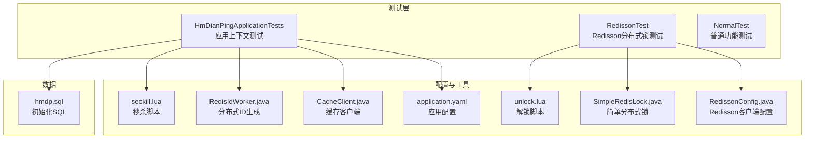
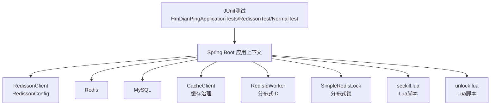
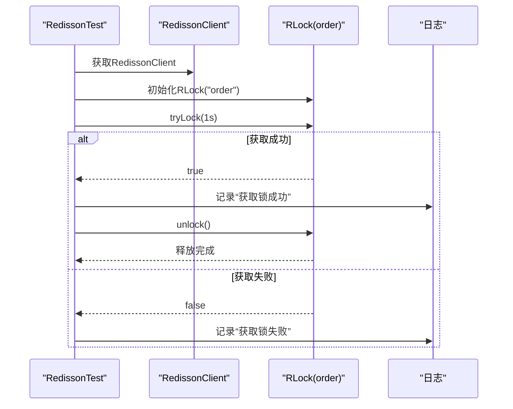
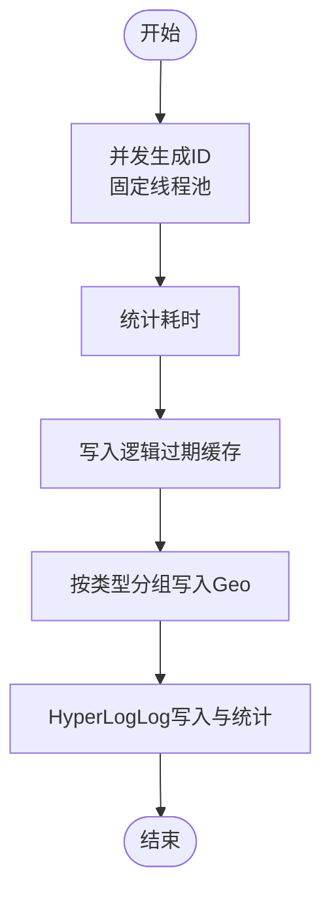
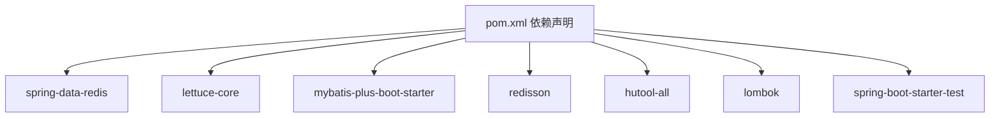

# 测试与部署

<cite>
**本文引用的文件**
- [pom.xml](file://pom.xml)
- [application.yaml](file://src/main/resources/application.yaml)
- [RedissonConfig.java](file://src/main/java/com/hmdp/config/RedissonConfig.java)
- [CacheClient.java](file://src/main/java/com/hmdp/utils/CacheClient.java)
- [RedisIdWorker.java](file://src/main/java/com/hmdp/utils/RedisIdWorker.java)
- [RedisConstants.java](file://src/main/java/com/hmdp/utils/RedisConstants.java)
- [SimpleRedisLock.java](file://src/main/java/com/hmdp/utils/SimpleRedisLock.java)
- [seckill.lua](file://src/main/resources/seckill.lua)
- [unlock.lua](file://src/main/resources/unlock.lua)
- [HmDianPingApplicationTests.java](file://src/test/java/com/hmdp/HmDianPingApplicationTests.java)
- [RedissonTest.java](file://src/test/java/com/hmdp/RedissonTest.java)
- [NormalTest.java](file://src/test/java/com/hmdp/NormalTest.java)
- [hmdp.sql](file://src/main/resources/db/hmdp.sql)
- [README.md](file://README.md)
</cite>

## 目录
1. [引言](#引言)
2. [项目结构](#项目结构)
3. [核心组件](#核心组件)
4. [架构总览](#架构总览)
5. [详细组件分析](#详细组件分析)
6. [依赖分析](#依赖分析)
7. [性能考虑](#性能考虑)
8. [故障排查指南](#故障排查指南)
9. [结论](#结论)
10. [附录](#附录)

## 引言
本文件面向测试与部署场景，围绕本项目的测试策略（单元测试、集成测试）、Redisson分布式锁测试、普通功能测试示例展开；同时给出生产环境部署建议、性能监控与日志管理、容器化与CI/CD流水线配置思路，并提供性能测试方法、压力测试工具与监控指标建议，帮助开发者完成从开发到运维的全链路交付。

## 项目结构
- 测试位于 src/test 下，包含应用上下文测试、Redisson分布式锁测试、普通功能测试示例。
- 生产配置集中在 application.yaml，包含数据库、Redis、日志等基础配置。
- Redisson客户端在配置类中初始化，供测试与业务使用。
- 工具类 CacheClient、RedisIdWorker、SimpleRedisLock 等支撑缓存、分布式ID、分布式锁等能力。
- Lua脚本 seckill.lua、unlock.lua 用于秒杀与解锁原子性保障。
- 数据库初始化脚本 hmdp.sql 位于 resources/db。

**图表来源**
- [application.yaml](file://src/main/resources/application.yaml#L1-L42)
- [RedissonConfig.java](file://src/main/java/com/hmdp/config/RedissonConfig.java#L1-L21)
- [CacheClient.java](file://src/main/java/com/hmdp/utils/CacheClient.java#L1-L180)
- [RedisIdWorker.java](file://src/main/java/com/hmdp/utils/RedisIdWorker.java#L1-L43)
- [SimpleRedisLock.java](file://src/main/java/com/hmdp/utils/SimpleRedisLock.java#L1-L61)
- [seckill.lua](file://src/main/resources/seckill.lua#L1-L32)
- [unlock.lua](file://src/main/resources/unlock.lua#L1-L6)
- [HmDianPingApplicationTests.java](file://src/test/java/com/hmdp/HmDianPingApplicationTests.java#L1-L113)
- [RedissonTest.java](file://src/test/java/com/hmdp/RedissonTest.java#L1-L60)
- [NormalTest.java](file://src/test/java/com/hmdp/NormalTest.java#L1-L43)
- [hmdp.sql](file://src/main/resources/db/hmdp.sql#L1-L200)

**章节来源**
- [pom.xml](file://pom.xml#L1-L108)
- [application.yaml](file://src/main/resources/application.yaml#L1-L42)
- [README.md](file://README.md#L333-L420)

## 核心组件
- Redisson客户端：通过配置类创建单机模式客户端，供测试与业务使用。
- 缓存客户端 CacheClient：封装缓存穿透、互斥锁、逻辑过期等缓存治理方案。
- 分布式ID生成器 RedisIdWorker：基于Redis自增实现带时间戳与日期分片的全局ID。
- 简单分布式锁 SimpleRedisLock：基于Redis SET key value NX EX ttl 与Lua解锁脚本实现。
- Lua脚本：seckill.lua 原子扣减库存与下单；unlock.lua 原子解锁。
- 测试套件：应用上下文测试、Redisson分布式锁测试、普通功能测试。

**章节来源**
- [RedissonConfig.java](file://src/main/java/com/hmdp/config/RedissonConfig.java#L1-L21)
- [CacheClient.java](file://src/main/java/com/hmdp/utils/CacheClient.java#L1-L180)
- [RedisIdWorker.java](file://src/main/java/com/hmdp/utils/RedisIdWorker.java#L1-L43)
- [SimpleRedisLock.java](file://src/main/java/com/hmdp/utils/SimpleRedisLock.java#L1-L61)
- [seckill.lua](file://src/main/resources/seckill.lua#L1-L32)
- [unlock.lua](file://src/main/resources/unlock.lua#L1-L6)
- [HmDianPingApplicationTests.java](file://src/test/java/com/hmdp/HmDianPingApplicationTests.java#L1-L113)
- [RedissonTest.java](file://src/test/java/com/hmdp/RedissonTest.java#L1-L60)
- [NormalTest.java](file://src/test/java/com/hmdp/NormalTest.java#L1-L43)

## 架构总览
下图展示了测试与部署相关的组件交互：测试通过Spring Boot应用上下文访问Redis与数据库；Redisson用于分布式锁；缓存工具负责缓存治理；Lua脚本保障秒杀流程原子性。

**图表来源**
- [application.yaml](file://src/main/resources/application.yaml#L1-L42)
- [RedissonConfig.java](file://src/main/java/com/hmdp/config/RedissonConfig.java#L1-L21)
- [CacheClient.java](file://src/main/java/com/hmdp/utils/CacheClient.java#L1-L180)
- [RedisIdWorker.java](file://src/main/java/com/hmdp/utils/RedisIdWorker.java#L1-L43)
- [SimpleRedisLock.java](file://src/main/java/com/hmdp/utils/SimpleRedisLock.java#L1-L61)
- [seckill.lua](file://src/main/resources/seckill.lua#L1-L32)
- [unlock.lua](file://src/main/resources/unlock.lua#L1-L6)
- [HmDianPingApplicationTests.java](file://src/test/java/com/hmdp/HmDianPingApplicationTests.java#L1-L113)
- [RedissonTest.java](file://src/test/java/com/hmdp/RedissonTest.java#L1-L60)
- [NormalTest.java](file://src/test/java/com/hmdp/NormalTest.java#L1-L43)

## 详细组件分析

### 测试策略与最佳实践
- 单元测试
  - 使用 JUnit 与 Spring Boot Test 注解，构造最小化上下文，注入所需组件进行验证。
  - 示例参考：应用上下文测试、普通功能测试。
- 集成测试
  - 依赖真实外部系统（Redis、MySQL），验证跨组件协作。
  - 示例参考：Redisson分布式锁测试、缓存与ID生成测试。
- 最佳实践
  - 使用固定线程池与倒计时门闩控制并发测试节奏。
  - 对关键路径（如分布式ID生成、缓存写入、Geo数据写入、HyperLogLog统计）进行压测与回归。
  - 对Lua脚本与分布式锁进行隔离测试，确保原子性与幂等性。

**章节来源**
- [HmDianPingApplicationTests.java](file://src/test/java/com/hmdp/HmDianPingApplicationTests.java#L1-L113)
- [RedissonTest.java](file://src/test/java/com/hmdp/RedissonTest.java#L1-L60)
- [NormalTest.java](file://src/test/java/com/hmdp/NormalTest.java#L1-L43)

### Redisson分布式锁测试
- 测试目标
  - 验证同一把锁在不同方法间的可重入/可释放行为。
  - 验证 tryLock 与 unlock 的正确性与日志输出。
- 测试流程
  - 在每个测试方法中获取同一把锁，尝试加锁、执行业务、释放锁。
  - 通过日志观察加锁/释放状态，确保异常路径也能正确释放。

**图表来源**
- [RedissonTest.java](file://src/test/java/com/hmdp/RedissonTest.java#L1-L60)
- [RedissonConfig.java](file://src/main/java/com/hmdp/config/RedissonConfig.java#L1-L21)

**章节来源**
- [RedissonTest.java](file://src/test/java/com/hmdp/RedissonTest.java#L1-L60)

### 普通功能测试示例
- 位图计数对比测试：通过两种位运算方式对比性能差异，验证算法正确性与效率。
- 适用场景：算法优化、性能回归测试。

**章节来源**
- [NormalTest.java](file://src/test/java/com/hmdp/NormalTest.java#L1-L43)

### 缓存与ID生成测试
- 分布式ID生成测试
  - 使用固定线程池并发生成ID，统计耗时，验证高并发下的稳定性与性能。
- 缓存写入与Geo数据写入
  - 将查询结果按类型分组，批量写入Redis GEO，验证地理数据写入正确性。
- HyperLogLog统计
  - 模拟百万级UV写入，验证基数估算准确性与性能。

**图表来源**
- [HmDianPingApplicationTests.java](file://src/test/java/com/hmdp/HmDianPingApplicationTests.java#L1-L113)
- [CacheClient.java](file://src/main/java/com/hmdp/utils/CacheClient.java#L1-L180)
- [RedisIdWorker.java](file://src/main/java/com/hmdp/utils/RedisIdWorker.java#L1-L43)

**章节来源**
- [HmDianPingApplicationTests.java](file://src/test/java/com/hmdp/HmDianPingApplicationTests.java#L1-L113)

### Lua脚本与解锁测试
- 秒杀脚本
  - 原子判断库存、去重下单、扣减库存、下单记录、消息入队。
- 解锁脚本
  - 原子比较锁值与线程标识，一致则删除锁，避免误删。
- 测试建议
  - 使用Redis命令行或测试脚本调用Lua，验证边界条件（超卖、重复下单、库存不足）。

**章节来源**
- [seckill.lua](file://src/main/resources/seckill.lua#L1-L32)
- [unlock.lua](file://src/main/resources/unlock.lua#L1-L6)

## 依赖分析
- Maven依赖
  - Spring Data Redis、Lettuce、MyBatis-Plus、Redisson、Hutool、Lombok等。
- 运行时依赖
  - MySQL驱动、Redis连接池、日志配置等。

**图表来源**
- [pom.xml](file://pom.xml#L1-L108)

**章节来源**
- [pom.xml](file://pom.xml#L1-L108)

## 性能考虑
- 缓存治理
  - 使用逻辑过期与互斥锁避免缓存击穿；缓存空值与布隆过滤器缓解穿透；TTL随机值应对雪崩。
- 分布式ID
  - 基于Redis自增与时间戳组合，支持高并发且具备单调递增特性。
- Lua原子性
  - 秒杀流程通过Lua脚本保证库存扣减与下单的原子性，降低数据库压力。
- 日志与监控
  - application.yaml中配置日志级别与格式，便于定位性能瓶颈。
- 压测建议
  - 使用JMeter或Gatling对秒杀接口进行并发压测，关注TP99延迟、错误率与Redis命中率。

**章节来源**
- [CacheClient.java](file://src/main/java/com/hmdp/utils/CacheClient.java#L1-L180)
- [RedisIdWorker.java](file://src/main/java/com/hmdp/utils/RedisIdWorker.java#L1-L43)
- [seckill.lua](file://src/main/resources/seckill.lua#L1-L32)
- [application.yaml](file://src/main/resources/application.yaml#L38-L42)
- [README.md](file://README.md#L284-L298)

## 故障排查指南
- Redis连接问题
  - 检查 application.yaml 中 Redis地址、端口、连接池配置。
- 分布式锁异常
  - 确认解锁脚本与锁键命名一致；避免跨实例误删；检查锁超时时间。
- 缓存不一致
  - 核对逻辑过期与互斥锁实现；确认缓存重建线程池与异常处理。
- Lua脚本报错
  - 核对脚本参数与键名；确保Redis版本兼容性。
- 日志定位
  - 调整日志级别与格式，结合测试日志快速定位问题。

**章节来源**
- [application.yaml](file://src/main/resources/application.yaml#L1-L42)
- [RedissonConfig.java](file://src/main/java/com/hmdp/config/RedissonConfig.java#L1-L21)
- [CacheClient.java](file://src/main/java/com/hmdp/utils/CacheClient.java#L1-L180)
- [SimpleRedisLock.java](file://src/main/java/com/hmdp/utils/SimpleRedisLock.java#L1-L61)
- [seckill.lua](file://src/main/resources/seckill.lua#L1-L32)
- [unlock.lua](file://src/main/resources/unlock.lua#L1-L6)

## 结论
本项目在测试层面提供了应用上下文测试、Redisson分布式锁测试与普通功能测试的完整样例；在部署层面建议结合生产配置、容器化与CI/CD流水线，配合性能监控与日志管理，形成从开发到运维的闭环。通过Lua脚本与缓存治理策略，系统在高并发场景下具备良好的稳定性与可维护性。

## 附录

### 部署配置要点
- 数据库初始化
  - 使用 hmdp.sql 初始化数据库结构与基础数据。
- 应用配置
  - 修改 application.yaml 中数据库与Redis连接信息，确保连接池参数合理。
- 启动方式
  - 参考 README 的快速开始章节，编译打包后通过Java命令启动。

**章节来源**
- [hmdp.sql](file://src/main/resources/db/hmdp.sql#L1-L200)
- [application.yaml](file://src/main/resources/application.yaml#L1-L42)
- [README.md](file://README.md#L333-L420)

### Docker容器化与CI/CD建议
- Docker镜像
  - 基于OpenJDK镜像构建，复制打包产物并暴露端口。
- 容器编排
  - 使用Compose编排应用、Redis与MySQL服务，统一网络与卷。
- CI/CD流水线
  - Maven构建与测试阶段；容器镜像构建与推送；Kubernetes部署与滚动更新。

[本节为通用建议，不直接分析具体文件，故无“章节来源”]

### 性能测试与监控指标
- 性能测试
  - 使用JMeter/Gatling对核心接口进行并发压测，记录吞吐、延迟与错误率。
- 监控指标
  - 应用：QPS、响应时间、错误率、GC与堆内存。
  - Redis：连接数、命中率、慢查询、内存使用。
  - MySQL：连接数、查询缓存命中率、慢查询。
- 日志管理
  - 统一日志格式与级别，接入集中式日志系统（如ELK）进行检索与告警。

[本节为通用建议，不直接分析具体文件，故无“章节来源”]