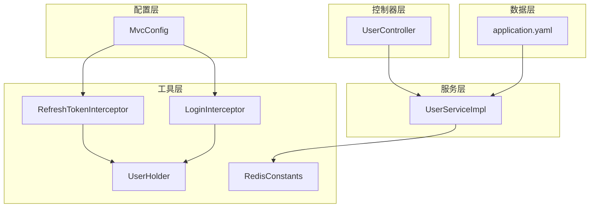
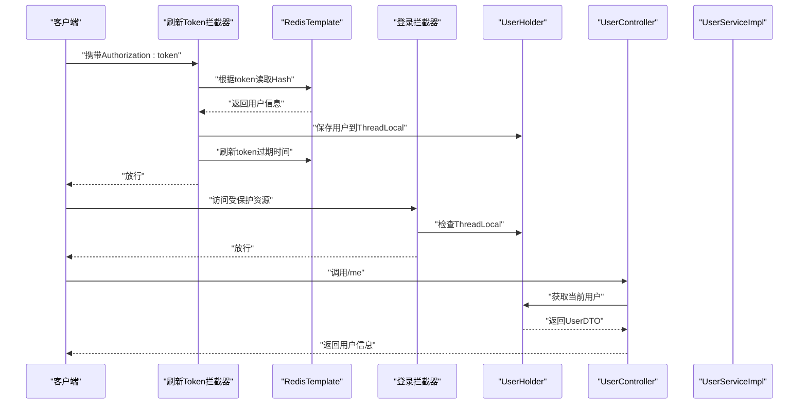
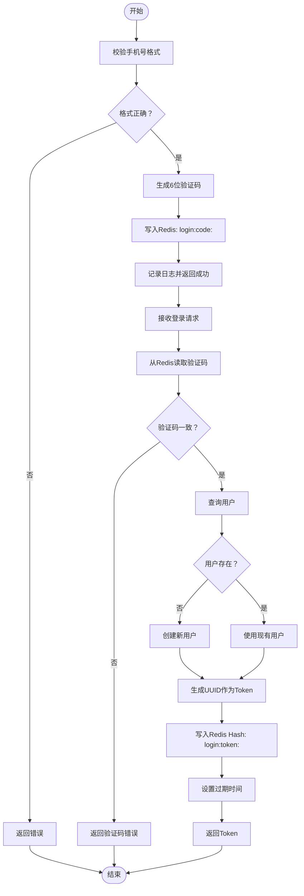
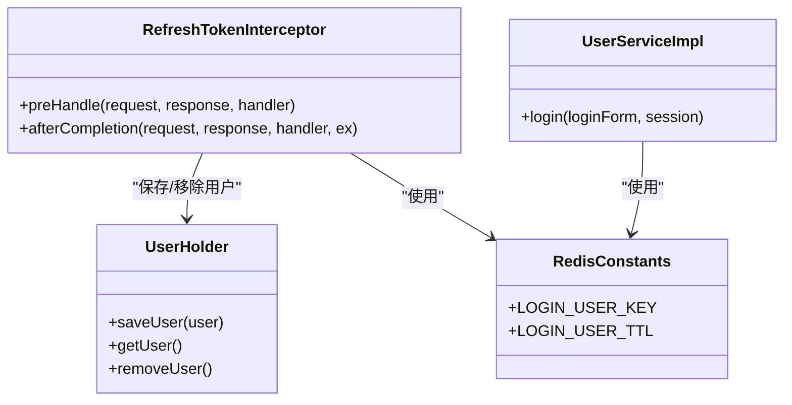
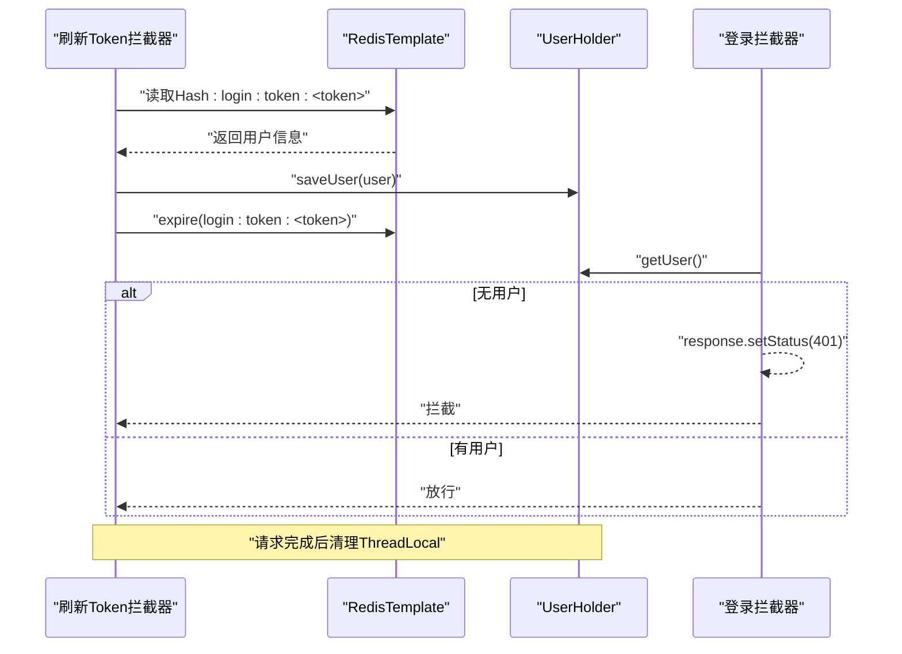
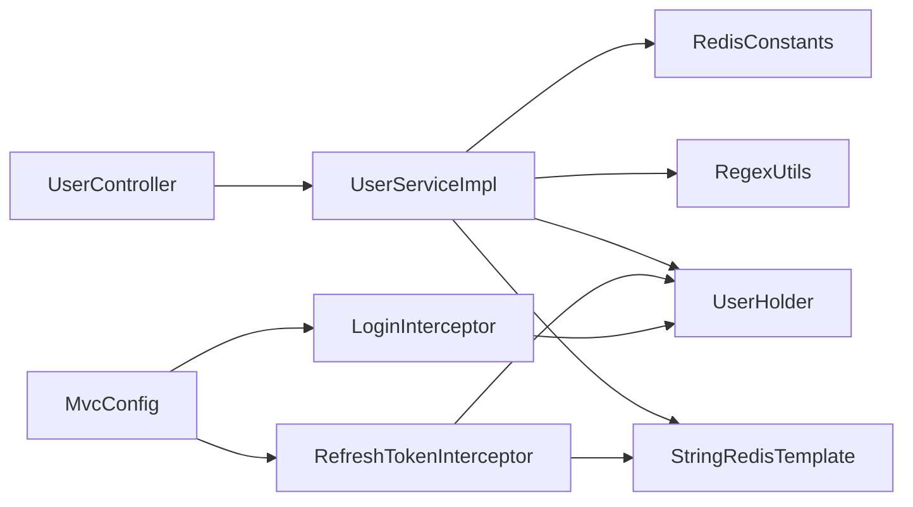

# 用户认证系统

<cite>
**本文引用的文件**
- [UserController.java](file://src/main/java/com/hmdp/controller/UserController.java)
- [UserServiceImpl.java](file://src/main/java/com/hmdp/service/impl/UserServiceImpl.java)
- [LoginInterceptor.java](file://src/main/java/com/hmdp/utils/LoginInterceptor.java)
- [RefreshTokenInterceptor.java](file://src/main/java/com/hmdp/utils/RefreshTokenInterceptor.java)
- [UserHolder.java](file://src/main/java/com/hmdp/utils/UserHolder.java)
- [MvcConfig.java](file://src/main/java/com/hmdp/config/MvcConfig.java)
- [RedisConstants.java](file://src/main/java/com/hmdp/utils/RedisConstants.java)
- [LoginFormDTO.java](file://src/main/java/com/hmdp/dto/LoginFormDTO.java)
- [User.java](file://src/main/java/com/hmdp/entity/User.java)
- [application.yaml](file://src/main/resources/application.yaml)
- [README.md](file://README.md)
</cite>

## 目录
1. [简介](#简介)
2. [项目结构](#项目结构)
3. [核心组件](#核心组件)
4. [架构总览](#架构总览)
5. [详细组件分析](#详细组件分析)
6. [依赖关系分析](#依赖关系分析)
7. [性能考量](#性能考量)
8. [故障排查指南](#故障排查指南)
9. [结论](#结论)
10. [附录](#附录)

## 简介
本项目是一个基于 Spring Boot + Redis 的本地生活服务平台后端系统，重点展示了 Redis 在用户认证与会话管理中的深度应用。本文围绕“基于 Redis 的短信验证码登录机制”、“分布式会话管理（Redis Hash + Token）”、“双层拦截器 + ThreadLocal 的 Token 自动刷新机制”，以及“用户登录、登出、信息获取等 API 接口”的设计与实现进行系统化技术文档整理，同时给出安全、性能与故障处理策略，帮助开发者快速落地完整的用户认证解决方案。

## 项目结构
项目采用标准的 Spring Boot 层次化组织方式：
- controller：对外暴露 REST API，负责接收请求与返回结果
- service/impl：业务逻辑实现，包含用户认证、会话管理、签到等功能
- utils：通用工具类，如拦截器、用户上下文、Redis 常量、正则校验等
- config：Web MVC 配置，注册拦截器
- dto/entity：数据传输对象与实体类
- resources：配置文件与 Mapper XML

图表来源
- [UserController.java](file://src/main/java/com/hmdp/controller/UserController.java#L1-L108)
- [UserServiceImpl.java](file://src/main/java/com/hmdp/service/impl/UserServiceImpl.java#L1-L179)
- [MvcConfig.java](file://src/main/java/com/hmdp/config/MvcConfig.java#L1-L35)
- [LoginInterceptor.java](file://src/main/java/com/hmdp/utils/LoginInterceptor.java#L1-L23)
- [RefreshTokenInterceptor.java](file://src/main/java/com/hmdp/utils/RefreshTokenInterceptor.java#L1-L55)
- [UserHolder.java](file://src/main/java/com/hmdp/utils/UserHolder.java#L1-L20)
- [RedisConstants.java](file://src/main/java/com/hmdp/utils/RedisConstants.java#L1-L26)
- [application.yaml](file://src/main/resources/application.yaml#L1-L42)

章节来源
- [README.md](file://README.md#L1-L578)

## 核心组件
- 用户控制器：提供验证码发送、登录、登出、当前用户信息查询、用户详情查询、签到与签到统计等接口
- 用户服务实现：实现验证码生成与校验、用户登录、Token 生成与存储、签到与统计逻辑
- 双层拦截器：刷新 Token 并将用户信息写入 ThreadLocal；登录拦截器用于校验 ThreadLocal 中的用户
- 用户上下文：基于 ThreadLocal 的用户信息持有器
- Redis 常量：集中定义验证码与会话相关的键前缀与过期时间
- Web 配置：注册拦截器并设置拦截路径与顺序

章节来源
- [UserController.java](file://src/main/java/com/hmdp/controller/UserController.java#L1-L108)
- [UserServiceImpl.java](file://src/main/java/com/hmdp/service/impl/UserServiceImpl.java#L1-L179)
- [LoginInterceptor.java](file://src/main/java/com/hmdp/utils/LoginInterceptor.java#L1-L23)
- [RefreshTokenInterceptor.java](file://src/main/java/com/hmdp/utils/RefreshTokenInterceptor.java#L1-L55)
- [UserHolder.java](file://src/main/java/com/hmdp/utils/UserHolder.java#L1-L20)
- [RedisConstants.java](file://src/main/java/com/hmdp/utils/RedisConstants.java#L1-L26)
- [MvcConfig.java](file://src/main/java/com/hmdp/config/MvcConfig.java#L1-L35)

## 架构总览
系统采用“双层拦截器 + ThreadLocal + Redis Hash + Token”的分布式会话管理方案：
- 请求进入时，先由“刷新 Token 拦截器”解析请求头中的 Token，从 Redis Hash 中读取用户信息，填充到 ThreadLocal，并刷新 Token 过期时间
- 再由“登录拦截器”检查 ThreadLocal 是否存在用户，若不存在则返回 401
- 业务层通过 UserHolder 获取当前用户，避免重复访问 Redis
- 登录成功后，服务端生成 UUID 作为 Token，将用户信息以 Hash 形式存储到 Redis，并设置过期时间

图表来源
- [RefreshTokenInterceptor.java](file://src/main/java/com/hmdp/utils/RefreshTokenInterceptor.java#L25-L47)
- [LoginInterceptor.java](file://src/main/java/com/hmdp/utils/LoginInterceptor.java#L10-L21)
- [UserHolder.java](file://src/main/java/com/hmdp/utils/UserHolder.java#L8-L18)
- [UserController.java](file://src/main/java/com/hmdp/controller/UserController.java#L66-L71)
- [UserServiceImpl.java](file://src/main/java/com/hmdp/service/impl/UserServiceImpl.java#L92-L108)

## 详细组件分析

### 验证码登录流程（短信验证码）
- 输入校验：对手机号进行正则校验
- 验证码生成：生成 6 位数字验证码
- 验证码存储：将验证码写入 Redis，键前缀为“login:code:”，过期时间为 2 分钟
- 验证码发送：记录日志，返回成功
- 登录校验：从 Redis 读取验证码并与请求参数比对，一致则查询或创建用户，生成 Token 并写入 Redis Hash，设置过期时间，返回 Token

图表来源
- [UserServiceImpl.java](file://src/main/java/com/hmdp/service/impl/UserServiceImpl.java#L48-L109)
- [RedisConstants.java](file://src/main/java/com/hmdp/utils/RedisConstants.java#L4-L7)
- [LoginFormDTO.java](file://src/main/java/com/hmdp/dto/LoginFormDTO.java#L1-L11)

章节来源
- [UserServiceImpl.java](file://src/main/java/com/hmdp/service/impl/UserServiceImpl.java#L48-L109)
- [LoginFormDTO.java](file://src/main/java/com/hmdp/dto/LoginFormDTO.java#L1-L11)
- [RedisConstants.java](file://src/main/java/com/hmdp/utils/RedisConstants.java#L1-L26)

### 分布式会话管理（Redis Hash + Token）
- Token 生成：使用 UUID 生成全局唯一的 Token
- 用户信息存储：将 UserDTO 转换为 Map，写入 Redis Hash，键为“login:token:<token>”
- 过期时间：设置为 36000 分钟（约 25 天），结合拦截器刷新机制延长在线时长
- 读取与刷新：拦截器从 Hash 读取用户信息，填充 ThreadLocal，并刷新过期时间

图表来源
- [UserHolder.java](file://src/main/java/com/hmdp/utils/UserHolder.java#L1-L20)
- [RefreshTokenInterceptor.java](file://src/main/java/com/hmdp/utils/RefreshTokenInterceptor.java#L1-L55)
- [UserServiceImpl.java](file://src/main/java/com/hmdp/service/impl/UserServiceImpl.java#L92-L108)
- [RedisConstants.java](file://src/main/java/com/hmdp/utils/RedisConstants.java#L6-L7)

章节来源
- [UserServiceImpl.java](file://src/main/java/com/hmdp/service/impl/UserServiceImpl.java#L92-L108)
- [RefreshTokenInterceptor.java](file://src/main/java/com/hmdp/utils/RefreshTokenInterceptor.java#L25-L47)
- [UserHolder.java](file://src/main/java/com/hmdp/utils/UserHolder.java#L8-L18)
- [RedisConstants.java](file://src/main/java/com/hmdp/utils/RedisConstants.java#L6-L7)

### 双层拦截器 + ThreadLocal 的 Token 自动刷新机制
- 刷新 Token 拦截器（order=0）：从请求头提取 Authorization，若存在则从 Redis Hash 读取用户信息，填充到 ThreadLocal，并刷新 Token 过期时间
- 登录拦截器（order=1）：检查 ThreadLocal 是否存在用户，不存在则返回 401
- afterCompletion：请求完成后清理 ThreadLocal，避免内存泄漏

图表来源
- [MvcConfig.java](file://src/main/java/com/hmdp/config/MvcConfig.java#L18-L33)
- [RefreshTokenInterceptor.java](file://src/main/java/com/hmdp/utils/RefreshTokenInterceptor.java#L25-L53)
- [LoginInterceptor.java](file://src/main/java/com/hmdp/utils/LoginInterceptor.java#L10-L21)
- [UserHolder.java](file://src/main/java/com/hmdp/utils/UserHolder.java#L16-L18)

章节来源
- [MvcConfig.java](file://src/main/java/com/hmdp/config/MvcConfig.java#L18-L33)
- [RefreshTokenInterceptor.java](file://src/main/java/com/hmdp/utils/RefreshTokenInterceptor.java#L25-L53)
- [LoginInterceptor.java](file://src/main/java/com/hmdp/utils/LoginInterceptor.java#L10-L21)
- [UserHolder.java](file://src/main/java/com/hmdp/utils/UserHolder.java#L16-L18)

### API 接口说明
- 发送验证码
  - 方法：POST
  - 路径：/user/code
  - 参数：phone（手机号）
  - 行为：校验手机号，生成 6 位验证码，写入 Redis，返回成功
  - 错误：手机号格式错误时返回错误
- 登录
  - 方法：POST
  - 路径：/user/login
  - 参数：LoginFormDTO（phone、code、password）
  - 行为：校验验证码，查询或创建用户，生成 Token，写入 Redis Hash，返回 Token
  - 错误：手机号格式错误或验证码错误时返回错误
- 当前用户信息
  - 方法：GET
  - 路径：/user/me
  - 行为：从 ThreadLocal 获取当前用户并返回
- 用户详情
  - 方法：GET
  - 路径：/user/info/{id}
  - 行为：查询用户详情，若为空返回空对象
- 用户基本信息
  - 方法：GET
  - 路径：/user/{id}
  - 行为：查询用户并转换为 DTO 返回
- 签到
  - 方法：POST
  - 路径：/user/sign
  - 行为：基于当前用户在 Redis BitMap 中标记签到
- 签到统计
  - 方法：GET
  - 路径：/user/sign/count
  - 行为：统计当月连续签到天数

章节来源
- [UserController.java](file://src/main/java/com/hmdp/controller/UserController.java#L37-L107)
- [UserServiceImpl.java](file://src/main/java/com/hmdp/service/impl/UserServiceImpl.java#L111-L167)
- [LoginFormDTO.java](file://src/main/java/com/hmdp/dto/LoginFormDTO.java#L1-L11)
- [User.java](file://src/main/java/com/hmdp/entity/User.java#L1-L67)

## 依赖关系分析
- 控制器依赖服务层接口，服务层依赖 RedisTemplate、正则校验工具与 UserHolder
- 拦截器依赖 RedisTemplate 与 UserHolder，MvcConfig 注册拦截器并设置排除路径
- Redis 常量集中管理键前缀与过期时间，便于统一维护

图表来源
- [UserController.java](file://src/main/java/com/hmdp/controller/UserController.java#L1-L108)
- [UserServiceImpl.java](file://src/main/java/com/hmdp/service/impl/UserServiceImpl.java#L1-L179)
- [MvcConfig.java](file://src/main/java/com/hmdp/config/MvcConfig.java#L1-L35)
- [LoginInterceptor.java](file://src/main/java/com/hmdp/utils/LoginInterceptor.java#L1-L23)
- [RefreshTokenInterceptor.java](file://src/main/java/com/hmdp/utils/RefreshTokenInterceptor.java#L1-L55)
- [UserHolder.java](file://src/main/java/com/hmdp/utils/UserHolder.java#L1-L20)
- [RedisConstants.java](file://src/main/java/com/hmdp/utils/RedisConstants.java#L1-L26)

章节来源
- [MvcConfig.java](file://src/main/java/com/hmdp/config/MvcConfig.java#L18-L33)
- [UserServiceImpl.java](file://src/main/java/com/hmdp/service/impl/UserServiceImpl.java#L45-L108)

## 性能考量
- Redis Hash 存储用户信息，避免频繁序列化，读写效率高
- Token 过期时间较长（约 25 天），结合拦截器刷新，减少频繁登录成本
- 使用 ThreadLocal 缓存当前用户，避免每次业务调用都访问 Redis
- 验证码仅保留 2 分钟，降低 Redis 压力
- 配置合理的 Redis 连接池参数，确保高并发下的稳定性

章节来源
- [RedisConstants.java](file://src/main/java/com/hmdp/utils/RedisConstants.java#L4-L7)
- [RefreshTokenInterceptor.java](file://src/main/java/com/hmdp/utils/RefreshTokenInterceptor.java#L43-L44)
- [application.yaml](file://src/main/resources/application.yaml#L20-L26)

## 故障排查指南
- 登录失败（验证码错误）
  - 检查验证码是否在 Redis 中且未过期
  - 确认请求参数中的验证码与 Redis 中一致
- 401 未授权
  - 检查请求头是否包含正确的 Authorization: token
  - 确认 Redis 中是否存在对应的 Hash 记录
  - 查看拦截器是否正确刷新了 Token 过期时间
- 用户信息为空
  - 确认 ThreadLocal 是否正确保存了用户信息
  - 检查拦截器 afterCompletion 是否被调用清理了 ThreadLocal
- Redis 连接异常
  - 检查 application.yaml 中 Redis 配置是否正确
  - 确认 Redis 服务可用，连接池参数合理

章节来源
- [UserServiceImpl.java](file://src/main/java/com/hmdp/service/impl/UserServiceImpl.java#L75-L81)
- [RefreshTokenInterceptor.java](file://src/main/java/com/hmdp/utils/RefreshTokenInterceptor.java#L27-L46)
- [LoginInterceptor.java](file://src/main/java/com/hmdp/utils/LoginInterceptor.java#L12-L18)
- [UserHolder.java](file://src/main/java/com/hmdp/utils/UserHolder.java#L16-L18)
- [application.yaml](file://src/main/resources/application.yaml#L14-L28)

## 结论
本系统通过“双层拦截器 + ThreadLocal + Redis Hash + Token”的组合，实现了高性能、可扩展的分布式会话管理。短信验证码登录流程简洁可靠，配合自动刷新机制提升了用户体验与系统稳定性。建议在生产环境中结合布隆过滤器、限流与监控体系进一步增强安全性与可观测性。

## 附录
- 安全建议
  - 对手机号与验证码进行严格的正则校验
  - 限制验证码发送频率，防止滥用
  - 登录失败次数限制与封禁策略
  - Token 传输使用 HTTPS，避免中间人攻击
- 性能优化建议
  - 合理设置 Redis 过期时间与连接池参数
  - 使用 Pipeline 批量写入 Hash
  - 对热点用户信息进行本地缓存兜底
- 故障处理建议
  - 拦截器异常时降级返回，避免影响主流程
  - 记录关键链路日志，便于定位问题
  - 对 Redis 异常进行熔断与重试策略