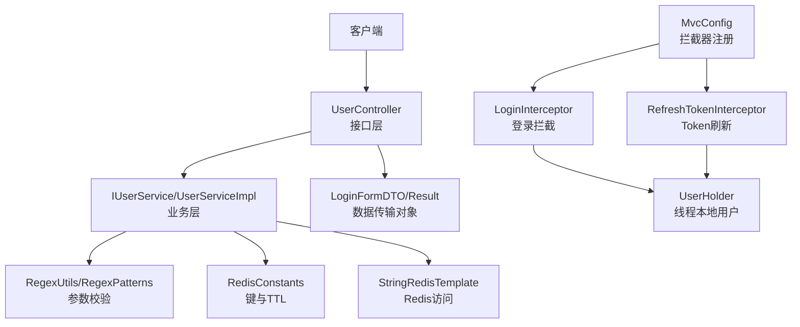
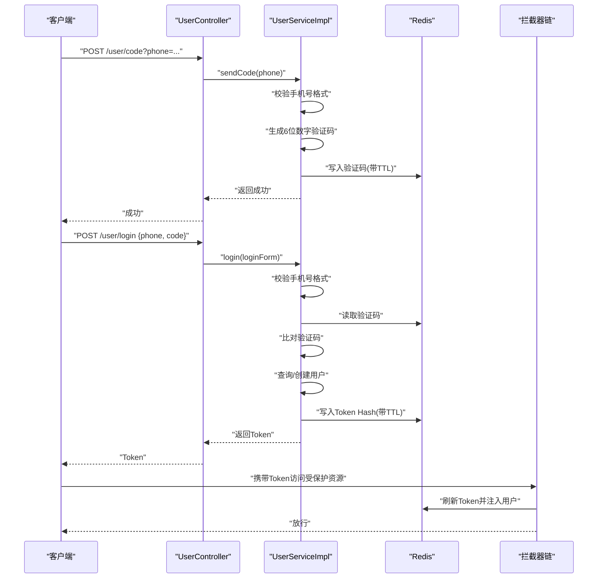
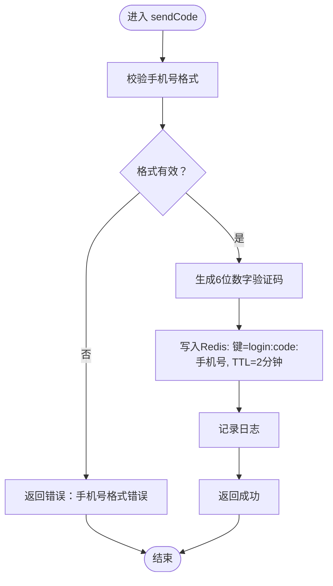
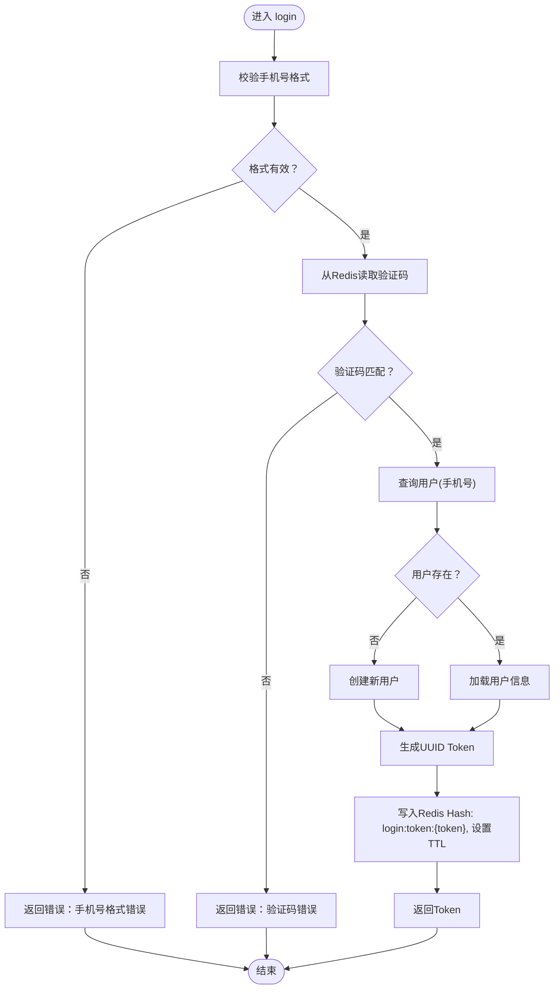
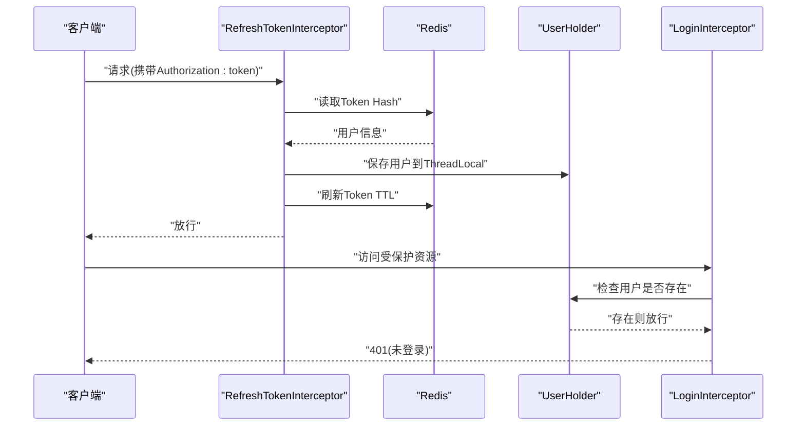
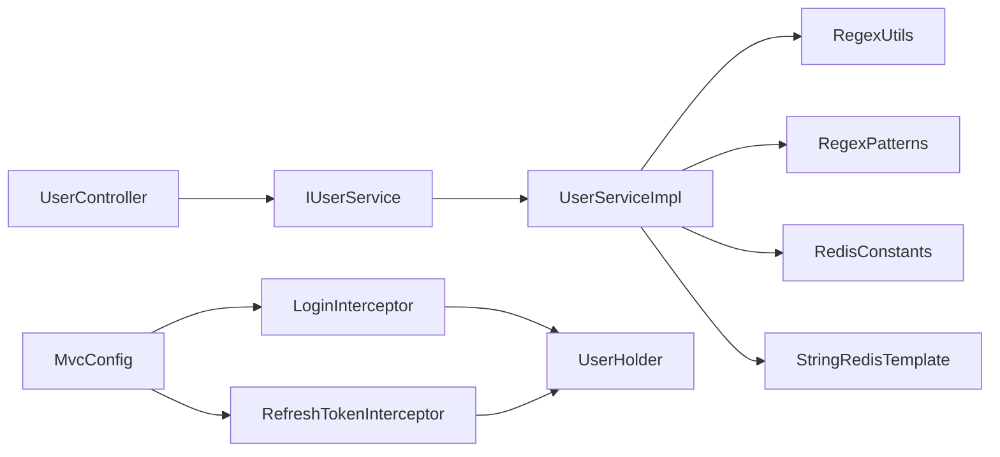

# 短信验证码登录

<cite>
**本文引用的文件**
- [UserController.java](file://src/main/java/com/hmdp/controller/UserController.java)
- [IUserService.java](file://src/main/java/com/hmdp/service/IUserService.java)
- [UserServiceImpl.java](file://src/main/java/com/hmdp/service/impl/UserServiceImpl.java)
- [LoginFormDTO.java](file://src/main/java/com/hmdp/dto/LoginFormDTO.java)
- [RegexPatterns.java](file://src/main/java/com/hmdp/utils/RegexPatterns.java)
- [RegexUtils.java](file://src/main/java/com/hmdp/utils/RegexUtils.java)
- [RedisConstants.java](file://src/main/java/com/hmdp/utils/RedisConstants.java)
- [UserHolder.java](file://src/main/java/com/hmdp/utils/UserHolder.java)
- [MvcConfig.java](file://src/main/java/com/hmdp/config/MvcConfig.java)
- [LoginInterceptor.java](file://src/main/java/com/hmdp/utils/LoginInterceptor.java)
- [RefreshTokenInterceptor.java](file://src/main/java/com/hmdp/utils/RefreshTokenInterceptor.java)
- [Result.java](file://src/main/java/com/hmdp/dto/Result.java)
- [application.yaml](file://src/main/resources/application.yaml)
</cite>

## 目录
1. [引言](#引言)
2. [项目结构](#项目结构)
3. [核心组件](#核心组件)
4. [架构总览](#架构总览)
5. [详细组件分析](#详细组件分析)
6. [依赖分析](#依赖分析)
7. [性能考量](#性能考量)
8. [故障排查指南](#故障排查指南)
9. [结论](#结论)
10. [附录](#附录)

## 引言
本技术文档围绕“短信验证码登录”功能展开，系统性阐述验证码生成算法、短信发送流程、登录参数验证、API接口规范、安全与防刷策略以及可复用的实现方案。该系统采用 Redis 作为验证码与会话存储，结合拦截器与 Token 机制实现分布式会话与自动刷新，具备高可用与可扩展能力。

## 项目结构
- 控制层：对外暴露 /user/code（发送验证码）、/user/login（登录）等接口
- 服务层：负责验证码生成与校验、用户登录、签到等业务
- 工具层：正则校验、Redis 常量、拦截器、用户上下文等
- 配置层：拦截器注册、Redis 连接配置

图表来源
- [UserController.java](file://src/main/java/com/hmdp/controller/UserController.java#L27-L54)
- [IUserService.java](file://src/main/java/com/hmdp/service/IUserService.java#L18-L27)
- [UserServiceImpl.java](file://src/main/java/com/hmdp/service/impl/UserServiceImpl.java#L43-L109)
- [RegexUtils.java](file://src/main/java/com/hmdp/utils/RegexUtils.java#L8-L42)
- [RegexPatterns.java](file://src/main/java/com/hmdp/utils/RegexPatterns.java#L6-L24)
- [RedisConstants.java](file://src/main/java/com/hmdp/utils/RedisConstants.java#L3-L25)
- [MvcConfig.java](file://src/main/java/com/hmdp/config/MvcConfig.java#L13-L33)
- [LoginInterceptor.java](file://src/main/java/com/hmdp/utils/LoginInterceptor.java#L8-L21)
- [RefreshTokenInterceptor.java](file://src/main/java/com/hmdp/utils/RefreshTokenInterceptor.java#L17-L53)
- [UserHolder.java](file://src/main/java/com/hmdp/utils/UserHolder.java#L5-L19)
- [Result.java](file://src/main/java/com/hmdp/dto/Result.java#L12-L30)

章节来源
- [UserController.java](file://src/main/java/com/hmdp/controller/UserController.java#L27-L54)
- [MvcConfig.java](file://src/main/java/com/hmdp/config/MvcConfig.java#L13-L33)

## 核心组件
- 接口控制器：提供发送验证码与登录入口
- 业务服务：生成验证码、校验验证码、用户登录、创建用户、会话令牌发放
- 参数校验：手机号格式校验、验证码格式校验
- 缓存常量：验证码键前缀与TTL、Token键前缀与TTL
- 拦截器体系：登录拦截与Token刷新，配合线程本地用户上下文

章节来源
- [UserController.java](file://src/main/java/com/hmdp/controller/UserController.java#L37-L54)
- [IUserService.java](file://src/main/java/com/hmdp/service/IUserService.java#L18-L27)
- [UserServiceImpl.java](file://src/main/java/com/hmdp/service/impl/UserServiceImpl.java#L48-L109)
- [RegexUtils.java](file://src/main/java/com/hmdp/utils/RegexUtils.java#L14-L33)
- [RedisConstants.java](file://src/main/java/com/hmdp/utils/RedisConstants.java#L4-L7)

## 架构总览
短信验证码登录的整体流程如下：
- 客户端请求发送验证码，服务端校验手机号格式，生成6位数字验证码并写入Redis，同时记录日志
- 客户端提交登录请求，服务端校验手机号格式，从Redis取出验证码并与请求验证码比对，匹配则查询或创建用户，生成UUID Token并写入Redis Hash，设置过期时间，返回Token给客户端
- 客户端后续请求携带Token，拦截器刷新Token并注入线程本地用户上下文

图表来源
- [UserController.java](file://src/main/java/com/hmdp/controller/UserController.java#L40-L54)
- [UserServiceImpl.java](file://src/main/java/com/hmdp/service/impl/UserServiceImpl.java#L48-L109)
- [RedisConstants.java](file://src/main/java/com/hmdp/utils/RedisConstants.java#L4-L7)
- [MvcConfig.java](file://src/main/java/com/hmdp/config/MvcConfig.java#L18-L33)
- [RefreshTokenInterceptor.java](file://src/main/java/com/hmdp/utils/RefreshTokenInterceptor.java#L25-L47)

## 详细组件分析

### 验证码生成算法
- 输入：手机号字符串
- 校验：使用正则表达式校验手机号格式
- 生成：生成6位纯数字验证码
- 存储：以“login:code:手机号”为键，写入Redis，TTL为2分钟
- 日志：记录验证码便于调试（生产环境建议脱敏）

图表来源
- [UserServiceImpl.java](file://src/main/java/com/hmdp/service/impl/UserServiceImpl.java#L48-L65)
- [RegexUtils.java](file://src/main/java/com/hmdp/utils/RegexUtils.java#L14-L16)
- [RegexPatterns.java](file://src/main/java/com/hmdp/utils/RegexPatterns.java#L10)
- [RedisConstants.java](file://src/main/java/com/hmdp/utils/RedisConstants.java#L4-L5)

章节来源
- [UserServiceImpl.java](file://src/main/java/com/hmdp/service/impl/UserServiceImpl.java#L48-L65)
- [RegexUtils.java](file://src/main/java/com/hmdp/utils/RegexUtils.java#L14-L16)
- [RegexPatterns.java](file://src/main/java/com/hmdp/utils/RegexPatterns.java#L10)
- [RedisConstants.java](file://src/main/java/com/hmdp/utils/RedisConstants.java#L4-L5)

### 登录参数验证
- 手机号格式：使用统一正则校验
- 验证码格式：6位数字
- 用户状态：若用户不存在则自动创建（昵称前缀+随机串）

图表来源
- [UserServiceImpl.java](file://src/main/java/com/hmdp/service/impl/UserServiceImpl.java#L67-L109)
- [RegexUtils.java](file://src/main/java/com/hmdp/utils/RegexUtils.java#L14-L16)
- [RedisConstants.java](file://src/main/java/com/hmdp/utils/RedisConstants.java#L6-L7)

章节来源
- [UserServiceImpl.java](file://src/main/java/com/hmdp/service/impl/UserServiceImpl.java#L67-L109)
- [LoginFormDTO.java](file://src/main/java/com/hmdp/dto/LoginFormDTO.java#L6-L10)
- [RegexUtils.java](file://src/main/java/com/hmdp/utils/RegexUtils.java#L14-L16)

### 会话与拦截器
- Token生成：UUID
- 会话存储：Redis Hash，键为“login:token:{token}”，TTL为36000分钟
- 自动刷新：请求头携带Token，拦截器读取并刷新TTL
- 登录拦截：未登录请求返回401

图表来源
- [RefreshTokenInterceptor.java](file://src/main/java/com/hmdp/utils/RefreshTokenInterceptor.java#L25-L47)
- [LoginInterceptor.java](file://src/main/java/com/hmdp/utils/LoginInterceptor.java#L10-L21)
- [MvcConfig.java](file://src/main/java/com/hmdp/config/MvcConfig.java#L18-L33)
- [UserHolder.java](file://src/main/java/com/hmdp/utils/UserHolder.java#L5-L19)
- [RedisConstants.java](file://src/main/java/com/hmdp/utils/RedisConstants.java#L6-L7)

章节来源
- [MvcConfig.java](file://src/main/java/com/hmdp/config/MvcConfig.java#L18-L33)
- [RefreshTokenInterceptor.java](file://src/main/java/com/hmdp/utils/RefreshTokenInterceptor.java#L25-L47)
- [LoginInterceptor.java](file://src/main/java/com/hmdp/utils/LoginInterceptor.java#L10-L21)
- [UserHolder.java](file://src/main/java/com/hmdp/utils/UserHolder.java#L5-L19)

### API 接口说明

- 发送验证码
  - 方法：POST
  - 路径：/user/code
  - 请求参数：phone（手机号，查询参数）
  - 响应：Result.success=true 表示成功；失败时 Result.errorMsg 包含错误信息
  - 示例：/user/code?phone=13800001111

- 登录
  - 方法：POST
  - 路径：/user/login
  - 请求体：LoginFormDTO（phone、code）
  - 响应：成功返回 Result.success=true 且 data 为字符串 Token；失败返回 Result.success=false 且 errorMsg 为错误信息

- 登出
  - 方法：POST
  - 路径：/user/logout
  - 当前实现：返回失败提示（功能未完成）

- 其他
  - /user/me：获取当前登录用户信息
  - /user/info/{id}：获取用户详情
  - /user/{id}：按ID查询用户
  - /user/sign、/user/sign/count：签到与签到统计（与验证码登录同属会话体系）

章节来源
- [UserController.java](file://src/main/java/com/hmdp/controller/UserController.java#L40-L107)
- [LoginFormDTO.java](file://src/main/java/com/hmdp/dto/LoginFormDTO.java#L6-L10)
- [Result.java](file://src/main/java/com/hmdp/dto/Result.java#L18-L29)

### 错误码与返回结构
- 成功：Result.success=true，data 可为空或包含数据
- 失败：Result.success=false，errorMsg 描述错误原因
- 登录拦截：未登录返回401（由拦截器设置）

章节来源
- [Result.java](file://src/main/java/com/hmdp/dto/Result.java#L12-L30)
- [LoginInterceptor.java](file://src/main/java/com/hmdp/utils/LoginInterceptor.java#L13-L18)

### 安全考虑与防刷策略
- 验证码有效期：2分钟，过期即失效，降低被复用风险
- Token有效期：36000分钟，配合拦截器自动刷新，提升用户体验
- 频率限制：当前代码未实现显式限流，建议在网关或服务层增加基于手机号/IP的限流策略（例如基于Redis计数器或令牌桶）
- 防刷建议：
  - 引入滑动窗口/漏桶限流，限制同一手机号/IP单位时间内的发送次数
  - 对异常IP或手机号进行临时封禁
  - 验证码发送与登录接口间增加人机验证（如图形验证码）
- 敏感信息：日志中避免打印完整验证码；生产环境脱敏输出

章节来源
- [RedisConstants.java](file://src/main/java/com/hmdp/utils/RedisConstants.java#L4-L7)
- [MvcConfig.java](file://src/main/java/com/hmdp/config/MvcConfig.java#L18-L33)

## 依赖分析
- 控制器依赖服务接口，服务实现依赖正则工具与Redis常量
- 拦截器依赖Redis模板与用户上下文，实现会话与自动刷新
- 配置类注册拦截器，排除登录与验证码接口，避免循环拦截

图表来源
- [UserController.java](file://src/main/java/com/hmdp/controller/UserController.java#L31-L35)
- [IUserService.java](file://src/main/java/com/hmdp/service/IUserService.java#L18-L27)
- [UserServiceImpl.java](file://src/main/java/com/hmdp/service/impl/UserServiceImpl.java#L43-L46)
- [RegexUtils.java](file://src/main/java/com/hmdp/utils/RegexUtils.java#L8-L42)
- [RegexPatterns.java](file://src/main/java/com/hmdp/utils/RegexPatterns.java#L6-L24)
- [RedisConstants.java](file://src/main/java/com/hmdp/utils/RedisConstants.java#L3-L25)
- [MvcConfig.java](file://src/main/java/com/hmdp/config/MvcConfig.java#L18-L33)
- [LoginInterceptor.java](file://src/main/java/com/hmdp/utils/LoginInterceptor.java#L8-L21)
- [RefreshTokenInterceptor.java](file://src/main/java/com/hmdp/utils/RefreshTokenInterceptor.java#L17-L53)
- [UserHolder.java](file://src/main/java/com/hmdp/utils/UserHolder.java#L5-L19)

章节来源
- [MvcConfig.java](file://src/main/java/com/hmdp/config/MvcConfig.java#L18-L33)

## 性能考量
- Redis热点键：验证码与Token键均带TTL，避免长期驻留内存
- 会话存储：Hash结构存储用户信息，减少序列化开销
- 自动刷新：拦截器在每次请求刷新TTL，降低会话丢失概率
- 建议：对高并发场景引入连接池与合理的超时配置，确保Redis访问稳定

章节来源
- [RedisConstants.java](file://src/main/java/com/hmdp/utils/RedisConstants.java#L4-L7)
- [application.yaml](file://src/main/resources/application.yaml#L14-L28)

## 故障排查指南
- 手机号格式错误
  - 现象：返回“手机号格式错误”
  - 排查：确认手机号是否符合正则；检查请求参数名与编码
- 验证码错误或过期
  - 现象：返回“验证码错误”
  - 排查：确认验证码是否在2分钟内；检查Redis键是否存在；核对请求中的验证码
- 登录拦截返回401
  - 现象：访问受保护资源返回401
  - 排查：确认请求头是否携带正确的Authorization；检查Token是否过期或被删除
- Redis连接异常
  - 现象：验证码写入/读取失败
  - 排查：检查Redis地址、端口、密码与连接池配置；查看应用日志

章节来源
- [UserServiceImpl.java](file://src/main/java/com/hmdp/service/impl/UserServiceImpl.java#L51-L54)
- [UserServiceImpl.java](file://src/main/java/com/hmdp/service/impl/UserServiceImpl.java#L75-L81)
- [LoginInterceptor.java](file://src/main/java/com/hmdp/utils/LoginInterceptor.java#L13-L18)
- [application.yaml](file://src/main/resources/application.yaml#L14-L28)

## 结论
短信验证码登录模块以Redis为核心，结合拦截器与Token机制，实现了高可用的会话管理与便捷的登录体验。通过严格的参数校验、短时有效的验证码与自动刷新的Token，系统在安全性与易用性之间取得平衡。建议在现有基础上补充频率限制与人机验证，进一步增强抗攻击能力。

## 附录

### Redis键命名与TTL
- 验证码键：login:code:{phone}，TTL=2分钟
- Token键：login:token:{token}，TTL=36000分钟

章节来源
- [RedisConstants.java](file://src/main/java/com/hmdp/utils/RedisConstants.java#L4-L7)