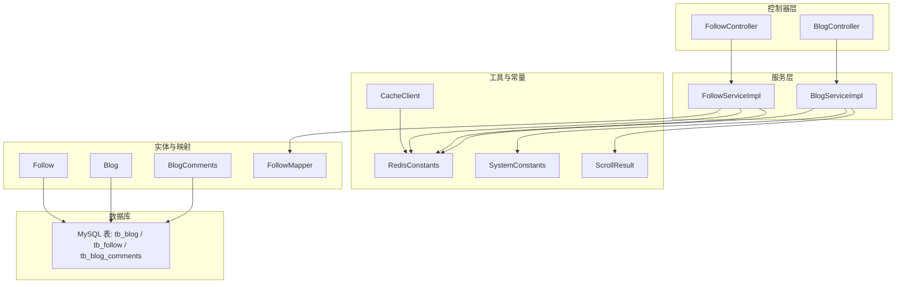
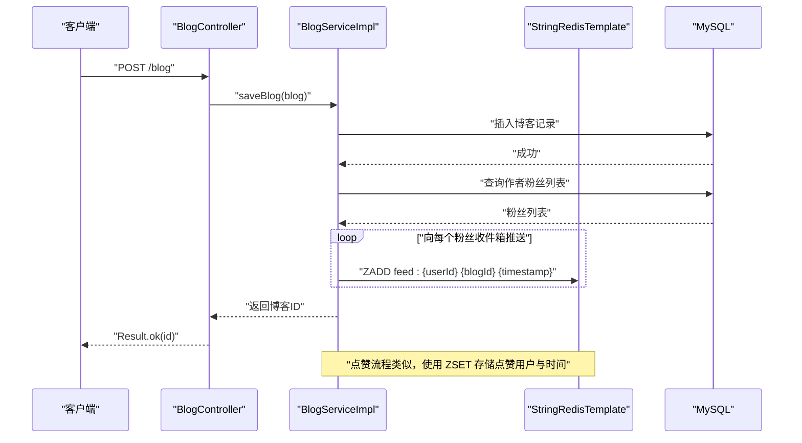
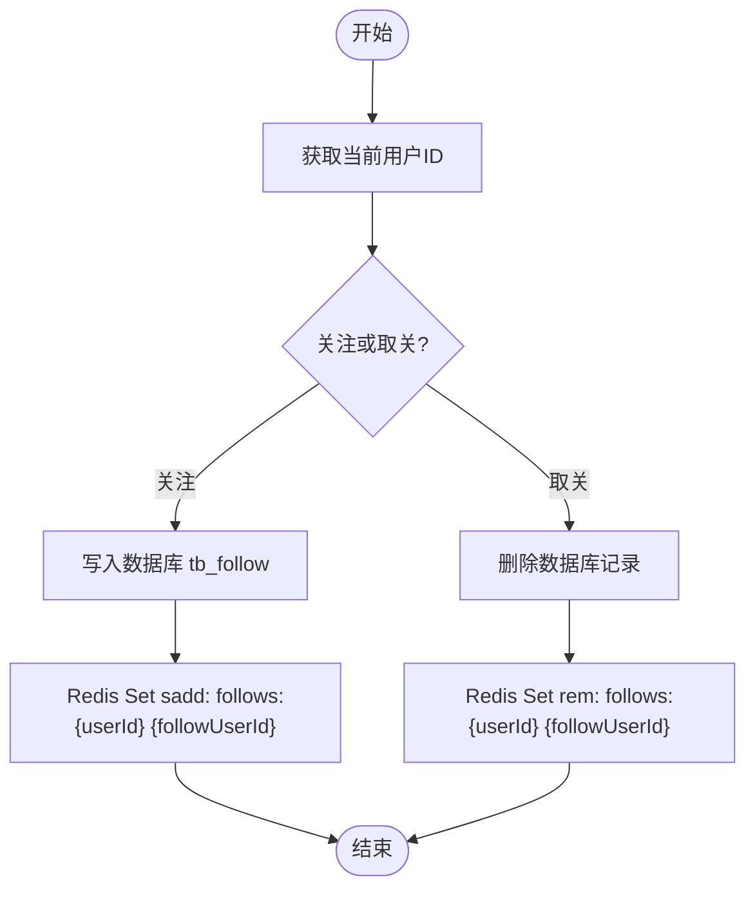
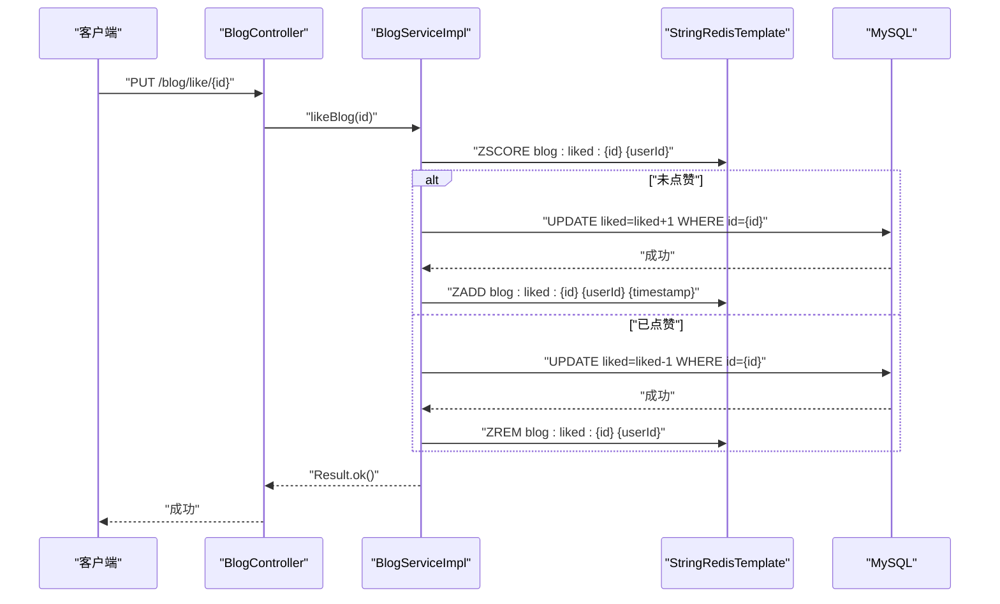
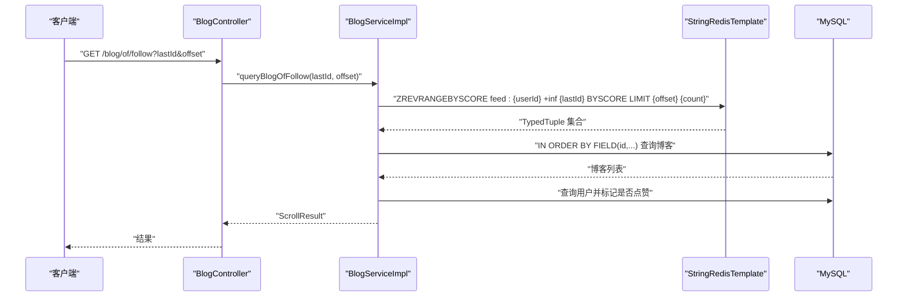
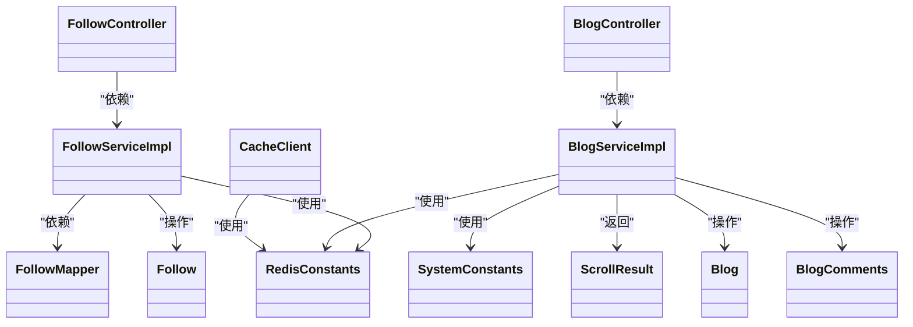

# 社交功能模块

<cite>
**本文引用的文件**
- [FollowServiceImpl.java](file://src/main/java/com/hmdp/service/impl/FollowServiceImpl.java)
- [FollowController.java](file://src/main/java/com/hmdp/controller/FollowController.java)
- [Follow.java](file://src/main/java/com/hmdp/entity/Follow.java)
- [FollowMapper.java](file://src/main/java/com/hmdp/mapper/FollowMapper.java)
- [BlogServiceImpl.java](file://src/main/java/com/hmdp/service/impl/BlogServiceImpl.java)
- [BlogController.java](file://src/main/java/com/hmdp/controller/BlogController.java)
- [Blog.java](file://src/main/java/com/hmdp/entity/Blog.java)
- [BlogCommentsServiceImpl.java](file://src/main/java/com/hmdp/service/impl/BlogCommentsServiceImpl.java)
- [BlogCommentsController.java](file://src/main/java/com/hmdp/controller/BlogCommentsController.java)
- [BlogComments.java](file://src/main/java/com/hmdp/entity/BlogComments.java)
- [RedisConstants.java](file://src/main/java/com/hmdp/utils/RedisConstants.java)
- [CacheClient.java](file://src/main/java/com/hmdp/utils/CacheClient.java)
- [SystemConstants.java](file://src/main/java/com/hmdp/utils/SystemConstants.java)
- [ScrollResult.java](file://src/main/java/com/hmdp/dto/ScrollResult.java)
- [hmdp.sql](file://src/main/resources/db/hmdp.sql)
</cite>

## 目录
1. [简介](#简介)
2. [项目结构](#项目结构)
3. [核心组件](#核心组件)
4. [架构总览](#架构总览)
5. [组件详解](#组件详解)
6. [依赖关系分析](#依赖关系分析)
7. [性能考量](#性能考量)
8. [故障排查指南](#故障排查指南)
9. [结论](#结论)
10. [附录](#附录)

## 简介
本技术文档聚焦于社交功能模块，围绕基于 Redis 的点赞、关注与 Feed 流三大核心能力，系统阐述其数据模型、实现细节、流程控制、性能优化与扩展性设计。同时给出博客发布、评论管理的完整实现方案，帮助开发者快速构建高并发、低延迟的社交功能。

## 项目结构
社交功能模块主要由以下层次构成：
- 控制器层：对外暴露 REST 接口，负责参数接收与结果返回
- 服务层：业务编排与 Redis 操作协调，保证一致性与性能
- 实体与映射：持久化层的数据模型与 SQL 映射
- 工具与常量：Redis 键空间、缓存工具、系统常量等

图表来源
- [FollowController.java](file://src/main/java/com/hmdp/controller/FollowController.java#L1-L39)
- [BlogController.java](file://src/main/java/com/hmdp/controller/BlogController.java#L1-L85)
- [FollowServiceImpl.java](file://src/main/java/com/hmdp/service/impl/FollowServiceImpl.java#L1-L98)
- [BlogServiceImpl.java](file://src/main/java/com/hmdp/service/impl/BlogServiceImpl.java#L1-L225)
- [Follow.java](file://src/main/java/com/hmdp/entity/Follow.java#L1-L51)
- [Blog.java](file://src/main/java/com/hmdp/entity/Blog.java#L1-L96)
- [BlogComments.java](file://src/main/java/com/hmdp/entity/BlogComments.java#L1-L81)
- [FollowMapper.java](file://src/main/java/com/hmdp/mapper/FollowMapper.java#L1-L17)
- [RedisConstants.java](file://src/main/java/com/hmdp/utils/RedisConstants.java#L1-L26)
- [CacheClient.java](file://src/main/java/com/hmdp/utils/CacheClient.java#L1-L180)
- [SystemConstants.java](file://src/main/java/com/hmdp/utils/SystemConstants.java#L1-L9)
- [ScrollResult.java](file://src/main/java/com/hmdp/dto/ScrollResult.java#L1-L13)
- [hmdp.sql](file://src/main/resources/db/hmdp.sql#L21-L82)

章节来源
- [FollowController.java](file://src/main/java/com/hmdp/controller/FollowController.java#L1-L39)
- [BlogController.java](file://src/main/java/com/hmdp/controller/BlogController.java#L1-L85)
- [FollowServiceImpl.java](file://src/main/java/com/hmdp/service/impl/FollowServiceImpl.java#L1-L98)
- [BlogServiceImpl.java](file://src/main/java/com/hmdp/service/impl/BlogServiceImpl.java#L1-L225)
- [RedisConstants.java](file://src/main/java/com/hmdp/utils/RedisConstants.java#L1-L26)

## 核心组件
- 关注与共同关注：基于 Redis Set 存储用户关注集合，支持关注/取关与共同关注查询
- 点赞：基于 Redis ZSet 记录点赞用户与时间，支持点赞/取消与热门点赞用户查询
- Feed 流：基于 Redis ZSet 维护用户收件箱，支持分页滚动查询
- 博客与评论：提供博客发布、点赞、热榜、个人与他人博客列表、关注用户 Feed 流等接口

章节来源
- [FollowServiceImpl.java](file://src/main/java/com/hmdp/service/impl/FollowServiceImpl.java#L38-L96)
- [BlogServiceImpl.java](file://src/main/java/com/hmdp/service/impl/BlogServiceImpl.java#L98-L216)
- [BlogController.java](file://src/main/java/com/hmdp/controller/BlogController.java#L30-L83)
- [Blog.java](file://src/main/java/com/hmdp/entity/Blog.java#L26-L96)
- [BlogComments.java](file://src/main/java/com/hmdp/entity/BlogComments.java#L24-L81)

## 架构总览
社交功能采用“控制器-服务-Redis-数据库”的分层架构。服务层通过 StringRedisTemplate 操作 Redis，结合数据库完成最终一致性保障。缓存工具提供逻辑过期与互斥锁策略，确保热点数据的高可用与一致性。

图表来源
- [BlogController.java](file://src/main/java/com/hmdp/controller/BlogController.java#L30-L33)
- [BlogServiceImpl.java](file://src/main/java/com/hmdp/service/impl/BlogServiceImpl.java#L146-L167)
- [RedisConstants.java](file://src/main/java/com/hmdp/utils/RedisConstants.java#L22-L22)

## 组件详解

### 关注与共同关注（基于 Redis Set）
- 数据模型
  - 用户关注集合：key 为 follows:{userId}，value 为被关注用户的 ID
  - 关注关系持久化：tb_follow 表记录用户与被关注用户的关系
- 关注/取关
  - 关注：写入数据库成功后，向 Redis Set 添加被关注用户 ID
  - 取关：删除数据库记录后，从 Redis Set 移除对应 ID
- 共同关注
  - 对两个用户的关注集合求交集，再批量查询用户信息

图表来源
- [FollowServiceImpl.java](file://src/main/java/com/hmdp/service/impl/FollowServiceImpl.java#L38-L64)
- [Follow.java](file://src/main/java/com/hmdp/entity/Follow.java#L34-L42)
- [FollowMapper.java](file://src/main/java/com/hmdp/mapper/FollowMapper.java#L14-L16)

章节来源
- [FollowServiceImpl.java](file://src/main/java/com/hmdp/service/impl/FollowServiceImpl.java#L38-L96)
- [FollowController.java](file://src/main/java/com/hmdp/controller/FollowController.java#L24-L37)
- [Follow.java](file://src/main/java/com/hmdp/entity/Follow.java#L24-L47)
- [hmdp.sql](file://src/main/resources/db/hmdp.sql#L69-L78)

### 点赞（基于 Redis ZSet）
- 数据模型
  - 博客点赞集合：key 为 blog:liked:{blogId}，value 为用户 ID，score 为点赞时间戳
  - 热门点赞用户：取 ZSET 前若干名作为“热门点赞者”
- 点赞/取消
  - 未点赞：数据库点赞数 +1，ZSET 中添加用户 ID 与当前时间戳
  - 已点赞：数据库点赞数 -1，ZSET 中移除用户 ID
- 热门点赞用户
  - 使用 ZRANGE 0 4 获取前 5 名，再按 ID 顺序回查用户

图表来源
- [BlogController.java](file://src/main/java/com/hmdp/controller/BlogController.java#L35-L38)
- [BlogServiceImpl.java](file://src/main/java/com/hmdp/service/impl/BlogServiceImpl.java#L98-L122)
- [RedisConstants.java](file://src/main/java/com/hmdp/utils/RedisConstants.java#L21-L21)

章节来源
- [BlogServiceImpl.java](file://src/main/java/com/hmdp/service/impl/BlogServiceImpl.java#L83-L143)
- [BlogController.java](file://src/main/java/com/hmdp/controller/BlogController.java#L35-L65)
- [RedisConstants.java](file://src/main/java/com/hmdp/utils/RedisConstants.java#L21-L21)

### Feed 流（基于 Redis ZSet 分页）
- 收件箱模型
  - key 为 feed:{userId}，value 为博客 ID，score 为发布时间（时间戳）
- 推送
  - 发布博客时，遍历作者粉丝，将博客 ID 与时间戳写入各粉丝的收件箱
- 分页查询
  - 使用 ZREVRANGEBYSCOREWITHSCORES 按时间倒序分页，解析最小时间与偏移量，用于下一页滚动

图表来源
- [BlogController.java](file://src/main/java/com/hmdp/controller/BlogController.java#L79-L83)
- [BlogServiceImpl.java](file://src/main/java/com/hmdp/service/impl/BlogServiceImpl.java#L169-L216)
- [ScrollResult.java](file://src/main/java/com/hmdp/dto/ScrollResult.java#L8-L12)
- [RedisConstants.java](file://src/main/java/com/hmdp/utils/RedisConstants.java#L22-L22)

章节来源
- [BlogServiceImpl.java](file://src/main/java/com/hmdp/service/impl/BlogServiceImpl.java#L145-L216)
- [BlogController.java](file://src/main/java/com/hmdp/controller/BlogController.java#L79-L83)
- [ScrollResult.java](file://src/main/java/com/hmdp/dto/ScrollResult.java#L8-L12)

### 博客发布与热榜
- 发布博客
  - 写入数据库后，查询作者粉丝并逐个推送至其收件箱
- 热榜
  - 基于数据库字段排序，前端传入页码与每页最大条数
- 个人与他人博客列表
  - 依据用户 ID 查询博客列表，支持分页

章节来源
- [BlogServiceImpl.java](file://src/main/java/com/hmdp/service/impl/BlogServiceImpl.java#L145-L167)
- [BlogController.java](file://src/main/java/com/hmdp/controller/BlogController.java#L40-L77)
- [SystemConstants.java](file://src/main/java/com/hmdp/utils/SystemConstants.java#L6-L8)
- [hmdp.sql](file://src/main/resources/db/hmdp.sql#L21-L36)

### 评论管理
- 当前实现
  - 提供评论实体与服务实现类占位，控制器暂未开放具体接口
- 扩展建议
  - 引入 Redis Hash 或 ZSet 记录评论热度与层级，结合数据库实现分页与置顶
  - 评论点赞可沿用点赞模式，使用 ZSET 存储点赞用户与时间

章节来源
- [BlogCommentsServiceImpl.java](file://src/main/java/com/hmdp/service/impl/BlogCommentsServiceImpl.java#L1-L21)
- [BlogCommentsController.java](file://src/main/java/com/hmdp/controller/BlogCommentsController.java#L1-L21)
- [BlogComments.java](file://src/main/java/com/hmdp/entity/BlogComments.java#L24-L81)

## 依赖关系分析
- 控制器依赖服务接口，服务实现依赖 Redis 与数据库
- 关注模块依赖 Follow 实体与持久化映射
- 博客模块依赖 Blog 实体、用户服务、关注服务与 Redis 常量
- 缓存工具为其他模块提供逻辑过期与互斥锁能力

图表来源
- [FollowController.java](file://src/main/java/com/hmdp/controller/FollowController.java#L17-L38)
- [BlogController.java](file://src/main/java/com/hmdp/controller/BlogController.java#L23-L84)
- [FollowServiceImpl.java](file://src/main/java/com/hmdp/service/impl/FollowServiceImpl.java#L30-L97)
- [BlogServiceImpl.java](file://src/main/java/com/hmdp/service/impl/BlogServiceImpl.java#L41-L224)
- [Follow.java](file://src/main/java/com/hmdp/entity/Follow.java#L24-L47)
- [Blog.java](file://src/main/java/com/hmdp/entity/Blog.java#L26-L96)
- [BlogComments.java](file://src/main/java/com/hmdp/entity/BlogComments.java#L24-L81)
- [FollowMapper.java](file://src/main/java/com/hmdp/mapper/FollowMapper.java#L14-L16)
- [RedisConstants.java](file://src/main/java/com/hmdp/utils/RedisConstants.java#L3-L25)
- [CacheClient.java](file://src/main/java/com/hmdp/utils/CacheClient.java#L22-L179)
- [SystemConstants.java](file://src/main/java/com/hmdp/utils/SystemConstants.java#L3-L8)
- [ScrollResult.java](file://src/main/java/com/hmdp/dto/ScrollResult.java#L8-L12)

章节来源
- [FollowServiceImpl.java](file://src/main/java/com/hmdp/service/impl/FollowServiceImpl.java#L30-L97)
- [BlogServiceImpl.java](file://src/main/java/com/hmdp/service/impl/BlogServiceImpl.java#L41-L224)

## 性能考量
- Redis 数据结构选择
  - 关注：Set，O(1) 添加/删除，交集计算适合共同关注
  - 点赞：ZSet，天然带时间戳，便于排序与分页
  - Feed：ZSet，时间戳作为分数，支持高效倒序分页
- 分页与滚动
  - 使用 ZSET 的 reverseRangeByScoreWithScores，结合最小时间与偏移量，实现稳定滚动
- 缓存策略
  - 热点博客内容可引入逻辑过期与互斥锁重建，降低缓存穿透与击穿风险
- 一致性
  - 先写数据库，成功后再写 Redis，保证最终一致；必要时使用分布式锁或事务消息
- 扩展性
  - Key 命名规范统一，便于横向扩展与运维监控
  - 将 TTL、键前缀集中管理，减少魔法数字

章节来源
- [CacheClient.java](file://src/main/java/com/hmdp/utils/CacheClient.java#L36-L118)
- [RedisConstants.java](file://src/main/java/com/hmdp/utils/RedisConstants.java#L3-L25)
- [BlogServiceImpl.java](file://src/main/java/com/hmdp/service/impl/BlogServiceImpl.java#L169-L216)

## 故障排查指南
- 关注/取关无效
  - 检查数据库写入是否成功，确认 Redis Set 是否同步更新
  - 核对当前用户 ID 与目标用户 ID 是否正确
- Feed 流为空
  - 确认博客发布时是否向粉丝收件箱推送
  - 检查 ZSET 分页参数 lastId 与 offset 是否合理
- 点赞异常
  - 核对数据库点赞数与 ZSET 用户数是否一致
  - 检查时间戳是否正确写入与读取
- 热门点赞用户为空
  - 确认 ZSET 是否存在且有数据
  - 检查 ID 顺序回查 SQL 是否正确

章节来源
- [FollowServiceImpl.java](file://src/main/java/com/hmdp/service/impl/FollowServiceImpl.java#L38-L96)
- [BlogServiceImpl.java](file://src/main/java/com/hmdp/service/impl/BlogServiceImpl.java#L98-L143)
- [BlogController.java](file://src/main/java/com/hmdp/controller/BlogController.java#L79-L83)

## 结论
该社交功能模块以 Redis 为核心，结合数据库实现高并发的关注、点赞与 Feed 流场景。通过合理的数据结构选择与分页策略，兼顾性能与一致性；通过统一的键命名与缓存工具，提升可维护性与扩展性。后续可在评论体系、权限控制与消息队列等方面进一步完善，以支撑更大规模的社交场景。

## 附录
- 数据库表结构参考
  - 博客表：包含主键、用户 ID、标题、内容、点赞数、评论数、时间戳等
  - 关注表：记录用户与被关注用户的关系
  - 评论表：记录评论内容、层级与状态

章节来源
- [hmdp.sql](file://src/main/resources/db/hmdp.sql#L21-L82)