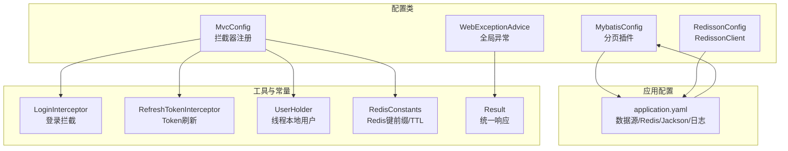
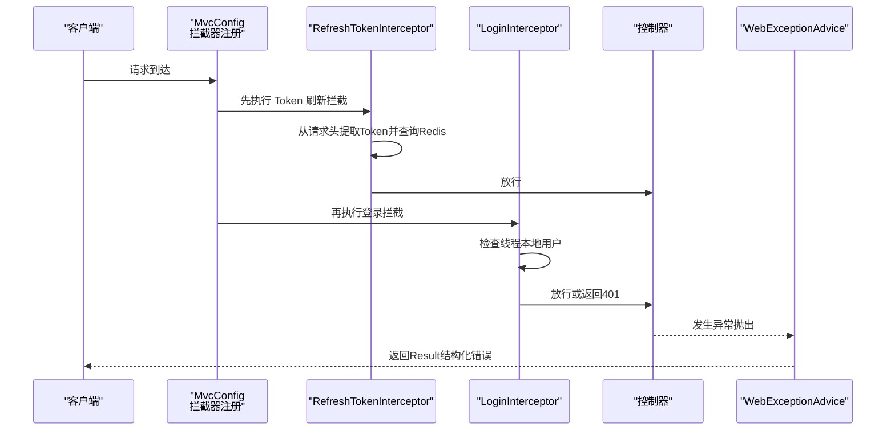
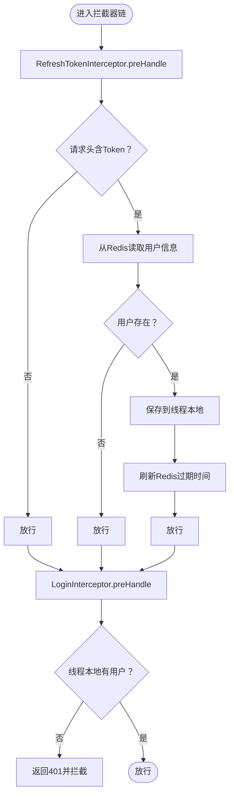
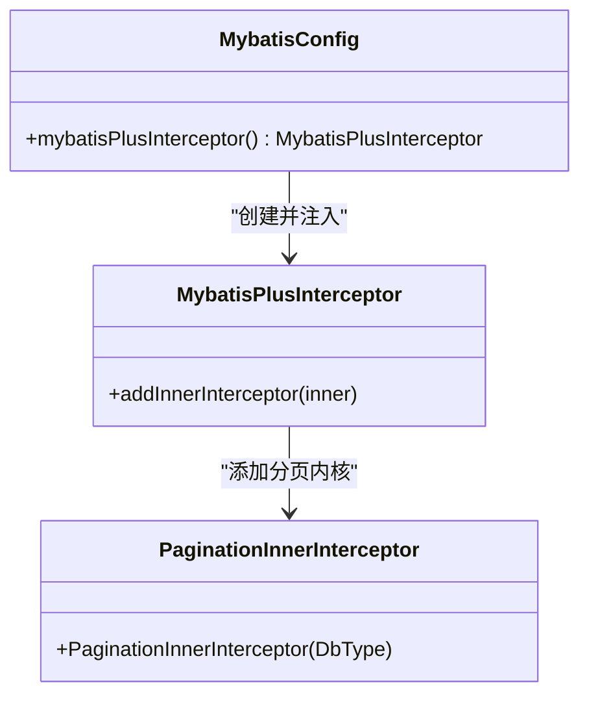
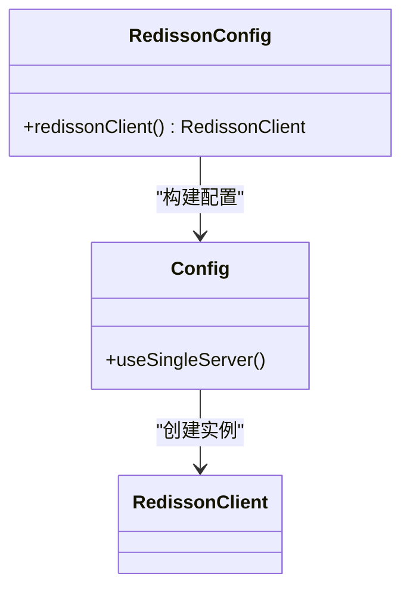
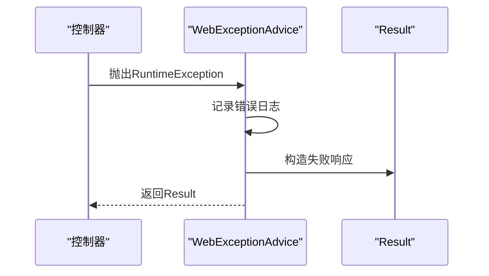
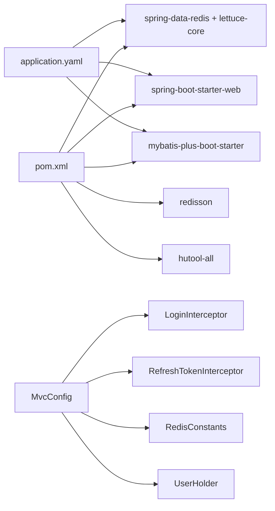

# 配置管理

<cite>
**本文引用的文件列表**
- [MvcConfig.java](file://src/main/java/com/hmdp/config/MvcConfig.java)
- [MybatisConfig.java](file://src/main/java/com/hmdp/config/MybatisConfig.java)
- [RedissonConfig.java](file://src/main/java/com/hmdp/config/RedissonConfig.java)
- [WebExceptionAdvice.java](file://src/main/java/com/hmdp/config/WebExceptionAdvice.java)
- [application.yaml](file://src/main/resources/application.yaml)
- [LoginInterceptor.java](file://src/main/java/com/hmdp/utils/LoginInterceptor.java)
- [RefreshTokenInterceptor.java](file://src/main/java/com/hmdp/utils/RefreshTokenInterceptor.java)
- [RedisConstants.java](file://src/main/java/com/hmdp/utils/RedisConstants.java)
- [Result.java](file://src/main/java/com/hmdp/dto/Result.java)
- [UserHolder.java](file://src/main/java/com/hmdp/utils/UserHolder.java)
- [HmDianPingApplication.java](file://src/main/java/com/hmdp/HmDianPingApplication.java)
- [pom.xml](file://pom.xml)
- [hmdp.sql](file://src/main/resources/db/hmdp.sql)
</cite>

## 目录
1. [简介](#简介)
2. [项目结构](#项目结构)
3. [核心组件](#核心组件)
4. [架构总览](#架构总览)
5. [详细组件分析](#详细组件分析)
6. [依赖关系分析](#依赖关系分析)
7. [性能考量](#性能考量)
8. [故障排查指南](#故障排查指南)
9. [结论](#结论)
10. [附录](#附录)

## 简介
本文件面向开发者，系统性梳理并讲解本项目的配置管理模块，涵盖：
- Spring MVC 配置：拦截器注册、登录校验与 Token 刷新流程
- MyBatis 配置：分页插件启用与别名扫描
- Redisson 客户端配置：单机模式连接与连接池参数
- 配置文件组织与环境差异化建议
- 最佳实践与常见问题排查

目标是帮助开发者快速理解并扩展配置体系，确保在开发、测试、生产环境中保持一致且可维护的配置策略。

## 项目结构
配置相关的核心位置集中在以下目录与文件：
- 配置类：config 包下的 MvcConfig、MybatisConfig、RedissonConfig、WebExceptionAdvice
- 应用配置：resources/application.yaml
- 工具与常量：utils 包下的拦截器、线程本地用户持有者、Redis 常量
- DTO：dto/Result 统一响应封装
- 启动类：HmDianPingApplication 扫描 Mapper
- 依赖：pom.xml 中引入 Redis、MyBatis Plus、Redisson 等

图表来源
- [MvcConfig.java](file://src/main/java/com/hmdp/config/MvcConfig.java#L1-L35)
- [MybatisConfig.java](file://src/main/java/com/hmdp/config/MybatisConfig.java#L1-L18)
- [RedissonConfig.java](file://src/main/java/com/hmdp/config/RedissonConfig.java#L1-L21)
- [WebExceptionAdvice.java](file://src/main/java/com/hmdp/config/WebExceptionAdvice.java#L1-L18)
- [application.yaml](file://src/main/resources/application.yaml#L1-L42)
- [LoginInterceptor.java](file://src/main/java/com/hmdp/utils/LoginInterceptor.java#L1-L23)
- [RefreshTokenInterceptor.java](file://src/main/java/com/hmdp/utils/RefreshTokenInterceptor.java#L1-L55)
- [UserHolder.java](file://src/main/java/com/hmdp/utils/UserHolder.java#L1-L20)
- [RedisConstants.java](file://src/main/java/com/hmdp/utils/RedisConstants.java#L1-L26)
- [Result.java](file://src/main/java/com/hmdp/dto/Result.java#L1-L31)

章节来源
- [MvcConfig.java](file://src/main/java/com/hmdp/config/MvcConfig.java#L1-L35)
- [MybatisConfig.java](file://src/main/java/com/hmdp/config/MybatisConfig.java#L1-L18)
- [RedissonConfig.java](file://src/main/java/com/hmdp/config/RedissonConfig.java#L1-L21)
- [WebExceptionAdvice.java](file://src/main/java/com/hmdp/config/WebExceptionAdvice.java#L1-L18)
- [application.yaml](file://src/main/resources/application.yaml#L1-L42)

## 核心组件
本节从“配置职责”角度拆解各组件的作用与边界：
- MvcConfig：注册拦截器，定义拦截路径与顺序，支撑登录态与 Token 刷新
- MybatisConfig：启用 MyBatis-Plus 分页插件，MySQL 数据库适配
- RedissonConfig：创建 RedissonClient 单例，用于分布式锁、限流等高级能力
- WebExceptionAdvice：统一捕获运行时异常，返回 Result 结构化响应
- application.yaml：集中管理数据源、Redis、Jackson、日志等关键属性
- 工具与常量：拦截器、线程本地用户、Redis 键命名规范与 TTL

章节来源
- [MvcConfig.java](file://src/main/java/com/hmdp/config/MvcConfig.java#L12-L34)
- [MybatisConfig.java](file://src/main/java/com/hmdp/config/MybatisConfig.java#L9-L17)
- [RedissonConfig.java](file://src/main/java/com/hmdp/config/RedissonConfig.java#L9-L19)
- [WebExceptionAdvice.java](file://src/main/java/com/hmdp/config/WebExceptionAdvice.java#L8-L17)
- [application.yaml](file://src/main/resources/application.yaml#L9-L42)

## 架构总览
下图展示配置层与业务层的交互关系，以及拦截器链路如何影响请求生命周期。

图表来源
- [MvcConfig.java](file://src/main/java/com/hmdp/config/MvcConfig.java#L18-L33)
- [RefreshTokenInterceptor.java](file://src/main/java/com/hmdp/utils/RefreshTokenInterceptor.java#L25-L47)
- [LoginInterceptor.java](file://src/main/java/com/hmdp/utils/LoginInterceptor.java#L10-L21)
- [WebExceptionAdvice.java](file://src/main/java/com/hmdp/config/WebExceptionAdvice.java#L12-L16)

## 详细组件分析

### Spring MVC 配置与拦截器链
- 拦截器注册顺序与职责
  - RefreshTokenInterceptor：优先级更高，负责从请求头提取 Token 并刷新 Redis 中的用户缓存，同时将用户信息写入线程本地变量，最后在请求完成后清理
  - LoginInterceptor：检查线程本地是否存在用户，不存在则返回 401，否则放行
- 路径排除策略
  - 对于无需登录即可访问的接口（如商品、优惠券、验证码、登录等）进行排除，避免误拦截
- 与 Redis 的协作
  - 使用 StringRedisTemplate 读取哈希结构的用户信息，结合 RedisConstants 中的键前缀与 TTL 控制缓存有效期

图表来源
- [MvcConfig.java](file://src/main/java/com/hmdp/config/MvcConfig.java#L18-L33)
- [RefreshTokenInterceptor.java](file://src/main/java/com/hmdp/utils/RefreshTokenInterceptor.java#L25-L47)
- [LoginInterceptor.java](file://src/main/java/com/hmdp/utils/LoginInterceptor.java#L10-L21)
- [RedisConstants.java](file://src/main/java/com/hmdp/utils/RedisConstants.java#L3-L7)
- [UserHolder.java](file://src/main/java/com/hmdp/utils/UserHolder.java#L8-L18)

章节来源
- [MvcConfig.java](file://src/main/java/com/hmdp/config/MvcConfig.java#L18-L33)
- [LoginInterceptor.java](file://src/main/java/com/hmdp/utils/LoginInterceptor.java#L8-L22)
- [RefreshTokenInterceptor.java](file://src/main/java/com/hmdp/utils/RefreshTokenInterceptor.java#L17-L54)
- [RedisConstants.java](file://src/main/java/com/hmdp/utils/RedisConstants.java#L3-L7)
- [UserHolder.java](file://src/main/java/com/hmdp/utils/UserHolder.java#L5-L19)

### MyBatis 配置与分页插件
- 插件配置
  - 启用 MybatisPlusInterceptor，并添加 PaginationInnerInterceptor（MySQL 适配）
- 别名扫描
  - 通过 application.yaml 的 mybatis-plus.type-aliases-package 指定实体包，简化 XML 映射中的类型引用
- 与启动类的关系
  - HmDianPingApplication 使用 @MapperScan 扫描 Mapper 接口，确保 MyBatis 能发现映射器

图表来源
- [MybatisConfig.java](file://src/main/java/com/hmdp/config/MybatisConfig.java#L10-L17)
- [HmDianPingApplication.java](file://src/main/java/com/hmdp/HmDianPingApplication.java#L7)

章节来源
- [MybatisConfig.java](file://src/main/java/com/hmdp/config/MybatisConfig.java#L9-L17)
- [application.yaml](file://src/main/resources/application.yaml#L36-L37)
- [HmDianPingApplication.java](file://src/main/java/com/hmdp/HmDianPingApplication.java#L7)

### Redisson 配置与连接池管理
- 单机模式配置
  - 使用 useSingleServer() 指定 Redis 地址，创建 RedissonClient 实例
- 连接池参数
  - application.yaml 中 spring.redis.lettuce.pool 下配置了最大活跃、最大空闲、最小空闲、空闲回收周期等参数，用于控制 Lettuce 连接池行为
- 注意事项
  - RedissonClient 与 Spring Data Redis 的连接池是两个独立的连接池，前者用于 Redisson 特有能力（如分布式锁），后者用于通用 Redis 操作

图表来源
- [RedissonConfig.java](file://src/main/java/com/hmdp/config/RedissonConfig.java#L9-L19)
- [application.yaml](file://src/main/resources/application.yaml#L14-L28)

章节来源
- [RedissonConfig.java](file://src/main/java/com/hmdp/config/RedissonConfig.java#L9-L19)
- [application.yaml](file://src/main/resources/application.yaml#L14-L28)

### 全局异常处理与统一响应
- WebExceptionAdvice
  - 捕获 RuntimeException，记录日志并返回 Result.fail 的统一结构
- Result
  - 提供 ok/fail 静态方法，支持不同载荷组合，便于前端统一处理

图表来源
- [WebExceptionAdvice.java](file://src/main/java/com/hmdp/config/WebExceptionAdvice.java#L12-L16)
- [Result.java](file://src/main/java/com/hmdp/dto/Result.java#L18-L29)

章节来源
- [WebExceptionAdvice.java](file://src/main/java/com/hmdp/config/WebExceptionAdvice.java#L8-L17)
- [Result.java](file://src/main/java/com/hmdp/dto/Result.java#L9-L30)

## 依赖关系分析
- Maven 依赖要点
  - Spring Boot Starter Web、Spring Data Redis（含 Lettuce）、MyBatis Plus、Redisson、Hutool
- 配置与依赖的耦合
  - application.yaml 中的数据源、Redis、Jackson、日志等配置直接影响运行时行为
  - MyBatis 配置与启动类的 Mapper 扫描共同决定持久层可用性

图表来源
- [pom.xml](file://pom.xml#L19-L85)
- [application.yaml](file://src/main/resources/application.yaml#L9-L42)
- [MvcConfig.java](file://src/main/java/com/hmdp/config/MvcConfig.java#L12-L33)
- [LoginInterceptor.java](file://src/main/java/com/hmdp/utils/LoginInterceptor.java#L8)
- [RefreshTokenInterceptor.java](file://src/main/java/com/hmdp/utils/RefreshTokenInterceptor.java#L17-L23)
- [RedisConstants.java](file://src/main/java/com/hmdp/utils/RedisConstants.java#L3-L7)
- [UserHolder.java](file://src/main/java/com/hmdp/utils/UserHolder.java#L5-L19)

章节来源
- [pom.xml](file://pom.xml#L19-L85)
- [application.yaml](file://src/main/resources/application.yaml#L9-L42)

## 性能考量
- 拦截器链路
  - RefreshTokenInterceptor 在每次请求都会进行 Redis 查询与过期刷新，建议合理设置 TTL，避免频繁访问导致热点
- Redis 连接池
  - Lettuce 连接池参数需根据并发与延迟要求调整；RedissonClient 作为独立连接池，注意区分使用场景
- 分页插件
  - 合理设置分页大小，避免一次性加载过多数据；结合数据库索引优化查询性能
- Jackson 配置
  - application.yaml 中的 JSON 处理策略会影响序列化开销，建议按需开启字段过滤

[本节为通用建议，不直接分析具体文件]

## 故障排查指南
- 登录拦截返回 401
  - 检查请求头是否携带 authorization 字段；确认 Redis 中是否存在对应键；核对 UserHolder 是否正确保存用户
- Token 刷新未生效
  - 确认 RedisKey 前缀与 TTL 设置；检查 afterCompletion 是否被调用移除用户
- 全局异常未捕获
  - 确认 WebExceptionAdvice 是否被 Spring 扫描；检查异常类型是否为 RuntimeException
- 数据源或 Redis 连接失败
  - 核对 application.yaml 中的 URL、用户名、密码与主机端口；确认网络连通性

章节来源
- [MvcConfig.java](file://src/main/java/com/hmdp/config/MvcConfig.java#L18-L33)
- [RefreshTokenInterceptor.java](file://src/main/java/com/hmdp/utils/RefreshTokenInterceptor.java#L25-L54)
- [WebExceptionAdvice.java](file://src/main/java/com/hmdp/config/WebExceptionAdvice.java#L12-L16)
- [application.yaml](file://src/main/resources/application.yaml#L9-L28)

## 结论
本项目的配置管理以“约定优于配置”为核心思想：
- 通过 MvcConfig 统一拦截器链，保障登录态与 Token 刷新
- 通过 MybatisConfig 启用分页插件，提升数据访问效率
- 通过 RedissonConfig 提供分布式能力基础
- 通过 WebExceptionAdvice 与 Result 统一异常与响应格式
- application.yaml 集中管理关键属性，便于环境差异化与运维

建议在后续迭代中：
- 将敏感配置迁移到环境变量或外部配置中心
- 引入 Profile 文件实现环境差异化
- 对拦截器链路增加限流与熔断保护
- 对 Redis 缓存策略进行压测与容量规划

[本节为总结性内容，不直接分析具体文件]

## 附录

### 配置文件组织与环境差异化建议
- 当前结构
  - application.yaml 集中管理数据源、Redis、Jackson、日志等
- 建议
  - 按环境拆分：application-dev.yaml、application-test.yaml、application-prod.yaml
  - 将数据库密码、Redis 密码等敏感信息放入环境变量或密钥管理
  - 使用 Spring Profiles 激活不同环境配置

章节来源
- [application.yaml](file://src/main/resources/application.yaml#L1-L42)

### 数据库初始化脚本
- hmdp.sql 提供了项目所需的表结构与示例数据，可用于本地开发与测试环境初始化

章节来源
- [hmdp.sql](file://src/main/resources/db/hmdp.sql#L1-L200)