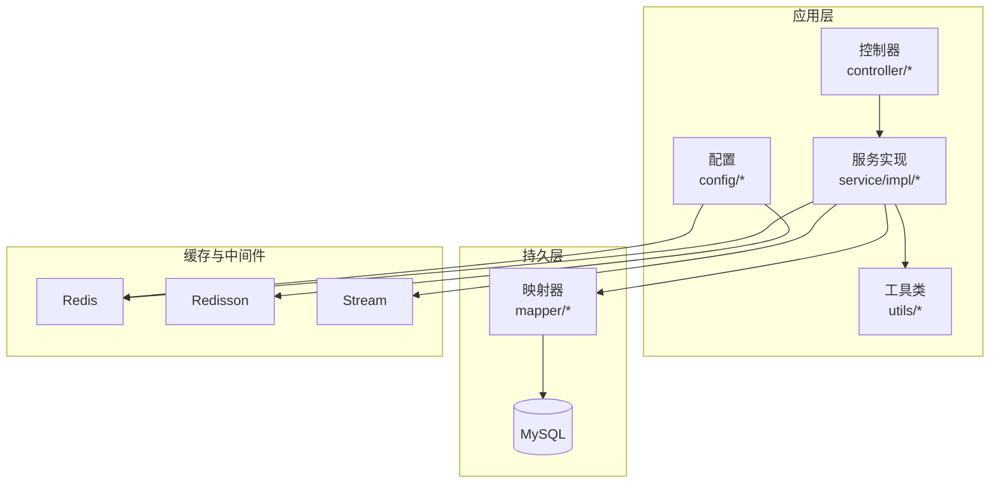
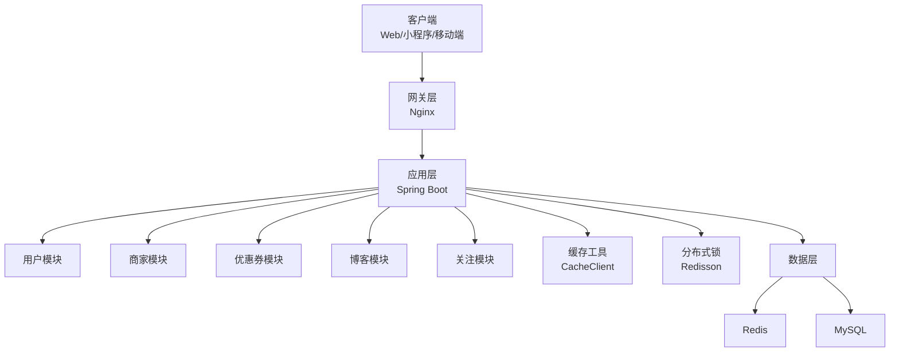
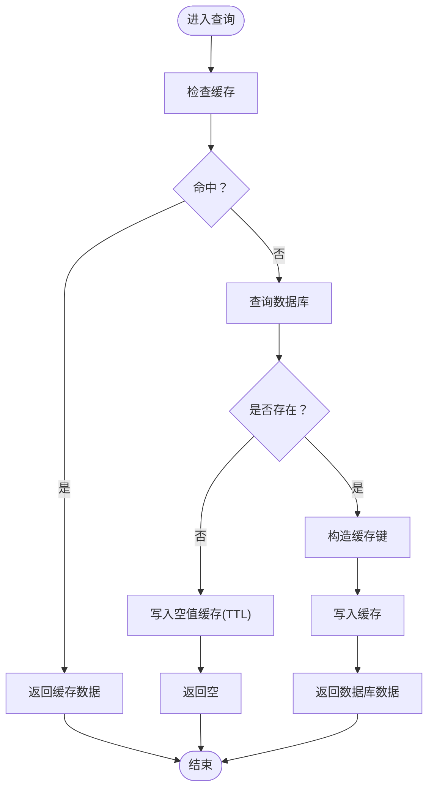
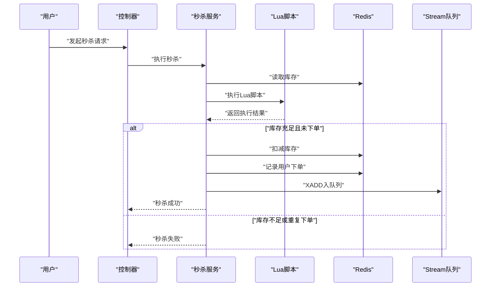
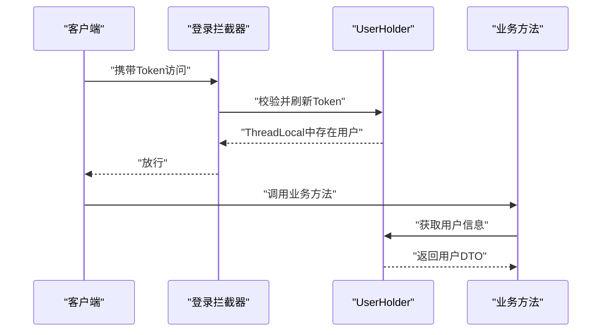
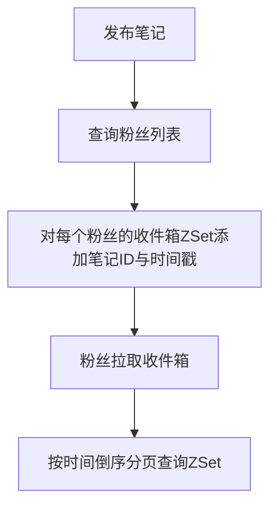
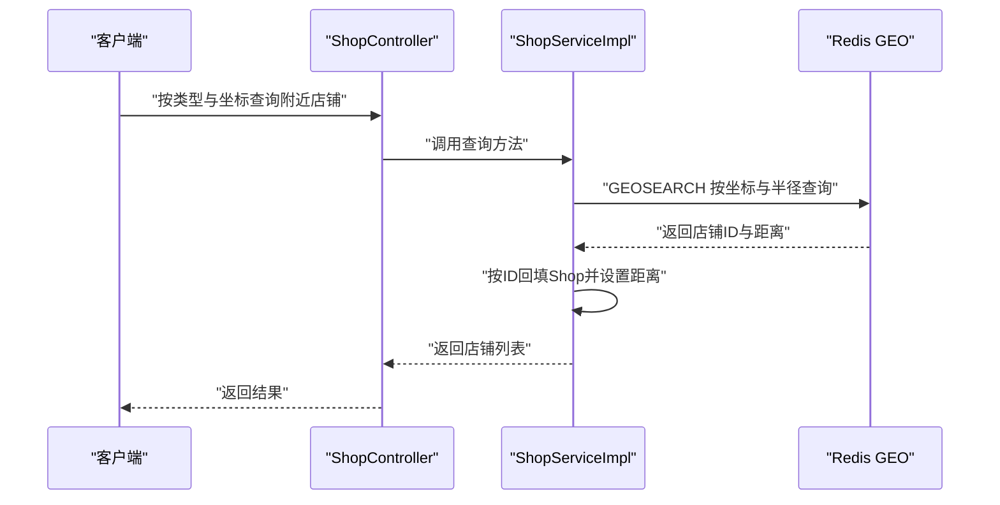
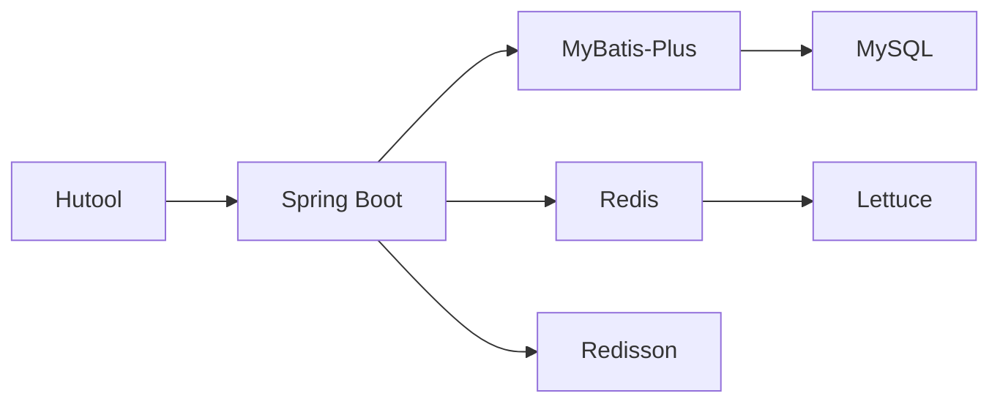

# 项目概述

<cite>
**本文引用的文件**
- [README.md](file://README.md)
- [HmDianPingApplication.java](file://src/main/java/com/hmdp/HmDianPingApplication.java)
- [application.yaml](file://src/main/resources/application.yaml)
- [pom.xml](file://pom.xml)
- [RedissonConfig.java](file://src/main/java/com/hmdp/config/RedissonConfig.java)
- [CacheClient.java](file://src/main/java/com/hmdp/utils/CacheClient.java)
- [RedisConstants.java](file://src/main/java/com/hmdp/utils/RedisConstants.java)
- [seckill.lua](file://src/main/resources/seckill.lua)
- [unlock.lua](file://src/main/resources/unlock.lua)
- [ShopServiceImpl.java](file://src/main/java/com/hmdp/service/impl/ShopServiceImpl.java)
- [BlogServiceImpl.java](file://src/main/java/com/hmdp/service/impl/BlogServiceImpl.java)
- [VoucherServiceImpl.java](file://src/main/java/com/hmdp/service/impl/VoucherServiceImpl.java)
- [ShopController.java](file://src/main/java/com/hmdp/controller/ShopController.java)
- [UserHolder.java](file://src/main/java/com/hmdp/utils/UserHolder.java)
- [LoginInterceptor.java](file://src/main/java/com/hmdp/utils/LoginInterceptor.java)
- [RedisData.java](file://src/main/java/com/hmdp/utils/RedisData.java)
</cite>

## 目录
1. [引言](#引言)
2. [项目结构](#项目结构)
3. [核心组件](#核心组件)
4. [架构总览](#架构总览)
5. [详细组件分析](#详细组件分析)
6. [依赖分析](#依赖分析)
7. [性能考量](#性能考量)
8. [故障排查指南](#故障排查指南)
9. [结论](#结论)
10. [附录](#附录)

## 引言
LSMarket（凌水市集）是一个基于 Spring Boot + Redis 的本地生活服务平台实战项目，聚焦于在真实业务场景中深度应用 Redis 的多种数据结构与高级特性，覆盖缓存优化、高并发秒杀、社交功能、地理位置查询、用户签到、UV 统计等典型业务。项目通过缓存穿透/击穿/雪崩的系统性解决方案、Lua 原子脚本与 Redisson 分布式锁、以及基于 ZSet/Geo/GEO/BitMap/HyperLogLog 等结构的业务实现，显著提升了查询性能与系统吞吐。

- 核心价值
  - Redis 深度应用：覆盖 String/Hash/List/Set/ZSet/BitMap/HyperLogLog/GEO 及分布式锁、Lua、Stream 等能力
  - 真实业务场景：秒杀、签到、点赞、Feed流、地理位置查询等
  - 性能优化：查询响应时间从 120ms 降至 8ms；支持 5000+ QPS 秒杀
  - 分布式方案：分布式锁、分布式会话、异步消息处理

**章节来源**
- [README.md](file://README.md#L18-L80)

## 项目结构
项目采用标准 Spring Boot 结构，按领域模块组织代码，核心目录如下：
- config：Spring 配置与 Redisson 客户端配置
- controller：REST 控制器层
- service/impl：业务服务与实现
- mapper：MyBatis 映射层
- utils：通用工具类（缓存、分布式锁、拦截器、常量等）
- resources：配置文件、SQL 初始化脚本、Lua 脚本

**图表来源**
- [ShopController.java](file://src/main/java/com/hmdp/controller/ShopController.java#L1-L97)
- [ShopServiceImpl.java](file://src/main/java/com/hmdp/service/impl/ShopServiceImpl.java#L1-L135)
- [RedissonConfig.java](file://src/main/java/com/hmdp/config/RedissonConfig.java#L1-L21)
- [application.yaml](file://src/main/resources/application.yaml#L1-L42)

**章节来源**
- [HmDianPingApplication.java](file://src/main/java/com/hmdp/HmDianPingApplication.java#L1-L16)
- [application.yaml](file://src/main/resources/application.yaml#L1-L42)
- [pom.xml](file://pom.xml#L1-L108)

## 核心组件
- 缓存客户端 CacheClient：统一封装缓存读取与重建策略，支持缓存穿透、击穿、雪崩的系统性治理
- Redis 常量 RedisConstants：集中管理各类键前缀与 TTL
- 分布式锁与会话：基于 Redis 的互斥锁与 Token 会话，配合拦截器与 ThreadLocal
- Lua 脚本：秒杀库存扣减与解锁脚本，保证原子性
- 业务服务：Shop/Blog/Voucher 等模块结合 Redis 数据结构实现高性能业务

**章节来源**
- [CacheClient.java](file://src/main/java/com/hmdp/utils/CacheClient.java#L1-L180)
- [RedisConstants.java](file://src/main/java/com/hmdp/utils/RedisConstants.java#L1-L26)
- [RedissonConfig.java](file://src/main/java/com/hmdp/config/RedissonConfig.java#L1-L21)
- [seckill.lua](file://src/main/resources/seckill.lua#L1-L32)
- [unlock.lua](file://src/main/resources/unlock.lua#L1-L6)

## 架构总览
系统采用“网关层（Nginx）—应用层（Spring Boot）—数据层（Redis + MySQL）”的分层架构。应用层内按模块划分用户、商家、优惠券、博客、关注、缓存与分布式锁等子域，通过 Redis 实现高性能缓存、会话、消息与业务计算。

**图表来源**
- [README.md](file://README.md#L109-L142)
- [pom.xml](file://pom.xml#L19-L85)

## 详细组件分析

### 缓存优化三剑客（穿透/击穿/雪崩）
- 缓存穿透：缓存空值 + TTL，避免恶意请求直达数据库
- 缓存击穿：互斥锁 + 逻辑过期，热点 Key 过期时串行重建
- 缓存雪崩：TTL 随机值 + 多级缓存，避免大量 Key 同时过期

**图表来源**
- [CacheClient.java](file://src/main/java/com/hmdp/utils/CacheClient.java#L45-L73)

**章节来源**
- [CacheClient.java](file://src/main/java/com/hmdp/utils/CacheClient.java#L45-L169)
- [RedisConstants.java](file://src/main/java/com/hmdp/utils/RedisConstants.java#L1-L26)

### 高并发秒杀系统
- 库存预热：将秒杀库存写入 Redis
- 原子扣减：Lua 脚本判断库存、去重下单、扣减库存、下单记录、入队列
- 异步下单：Redis Stream 消费者异步创建订单、发券、落库
- 防超卖：分布式锁 + 乐观锁双重保障

**图表来源**
- [seckill.lua](file://src/main/resources/seckill.lua#L1-L32)
- [VoucherServiceImpl.java](file://src/main/java/com/hmdp/service/impl/VoucherServiceImpl.java#L44-L57)

**章节来源**
- [seckill.lua](file://src/main/resources/seckill.lua#L1-L32)
- [VoucherServiceImpl.java](file://src/main/java/com/hmdp/service/impl/VoucherServiceImpl.java#L1-L59)

### 分布式会话与拦截器
- Token 机制：登录成功生成 Token，存储到 Redis Hash
- 双层拦截器：第一层校验 Token，第二层刷新 Token
- ThreadLocal：将用户信息放入 ThreadLocal，避免频繁访问 Redis

**图表来源**
- [LoginInterceptor.java](file://src/main/java/com/hmdp/utils/LoginInterceptor.java#L1-L23)
- [UserHolder.java](file://src/main/java/com/hmdp/utils/UserHolder.java#L1-L20)

**章节来源**
- [LoginInterceptor.java](file://src/main/java/com/hmdp/utils/LoginInterceptor.java#L1-L23)
- [UserHolder.java](file://src/main/java/com/hmdp/utils/UserHolder.java#L1-L20)

### 社交功能：点赞与 Feed 流
- 点赞：使用 ZSet 存储点赞用户与时间戳，实现点赞与排行榜
- Feed 流：使用 ZSet 推送到用户收件箱，支持分页查询

**图表来源**
- [BlogServiceImpl.java](file://src/main/java/com/hmdp/service/impl/BlogServiceImpl.java#L145-L167)
- [BlogServiceImpl.java](file://src/main/java/com/hmdp/service/impl/BlogServiceImpl.java#L169-L200)

**章节来源**
- [BlogServiceImpl.java](file://src/main/java/com/hmdp/service/impl/BlogServiceImpl.java#L1-L200)

### 地理位置查询：附近店铺
- 使用 Redis GEO 结构存储店铺位置，按距离排序与分页查询
- 结合数据库回填具体 Shop 信息并填充距离

**图表来源**
- [ShopServiceImpl.java](file://src/main/java/com/hmdp/service/impl/ShopServiceImpl.java#L80-L133)

**章节来源**
- [ShopServiceImpl.java](file://src/main/java/com/hmdp/service/impl/ShopServiceImpl.java#L1-L135)

### 用户签到与 UV 统计
- 签到：使用 BitMap 存储签到状态，支持连续签到统计
- UV：使用 HyperLogLog 进行去重统计，极小内存实现亿级去重

**章节来源**
- [README.md](file://README.md#L68-L79)

## 依赖分析
- Spring Boot 2.7 + MyBatis-Plus：应用框架与 ORM
- Redis 7.0 + Lettuce：缓存与数据结构
- Redisson 3.0：分布式锁与高级特性
- MySQL 8.0：关系型数据存储
- Hutool：常用工具库

**图表来源**
- [pom.xml](file://pom.xml#L19-L85)
- [application.yaml](file://src/main/resources/application.yaml#L1-L42)

**章节来源**
- [pom.xml](file://pom.xml#L1-L108)
- [application.yaml](file://src/main/resources/application.yaml#L1-L42)

## 性能考量
- 缓存命中率：95%+
- 查询响应时间：从 120ms 降至 8ms
- 秒杀 QPS：5000+
- 地理位置查询：从 300ms 降至 25ms
- 连续签到统计：从 50ms 降至 3ms
- UV 统计：从 200ms 降至 5ms

**章节来源**
- [README.md](file://README.md#L284-L298)

## 故障排查指南
- 缓存穿透/击穿/雪崩
  - 现象：大量空值请求、热点 Key 过期抖动、大量 Key 同时过期
  - 处理：启用缓存空值、互斥锁、逻辑过期、TTL 随机值
  - 参考：缓存客户端方法与常量配置
- 秒杀超卖/重复下单
  - 现象：库存不正确、重复下单
  - 处理：Lua 原子脚本 + 分布式锁 + 去重校验
  - 参考：Lua 脚本与秒杀服务
- 分布式会话失效
  - 现象：Token 失效、拦截器返回 401
  - 处理：检查 Token 是否存在、是否需要刷新、ThreadLocal 是否清理
  - 参考：拦截器与会话工具
- GEO 查询异常
  - 现象：附近查询无结果或距离错误
  - 处理：确认 GEO 键与坐标格式、半径参数、分页偏移
  - 参考：服务实现与控制器参数

**章节来源**
- [CacheClient.java](file://src/main/java/com/hmdp/utils/CacheClient.java#L45-L169)
- [seckill.lua](file://src/main/resources/seckill.lua#L1-L32)
- [LoginInterceptor.java](file://src/main/java/com/hmdp/utils/LoginInterceptor.java#L1-L23)
- [ShopServiceImpl.java](file://src/main/java/com/hmdp/service/impl/ShopServiceImpl.java#L80-L133)

## 结论
LSMarket 通过将 Redis 的多种数据结构与高级特性与真实业务深度融合，构建了高性能、可扩展、具备分布式能力的本地生活服务平台。项目在缓存治理、高并发秒杀、社交与地理能力等方面提供了系统性的工程实践，既适合初学者建立整体认知，也为资深开发者提供了可复用的技术范式与落地参考。

## 附录
- 快速开始
  - 环境要求：JDK 8+、Maven 3.8+、MySQL 8.0+、Redis 7.0+、Redisson 3.0+
  - 启动步骤：初始化数据库、配置 application.yaml、启动应用
- 核心流程图
  - 秒杀流程、缓存流程、分布式会话流程见 README 的核心流程章节

**章节来源**
- [README.md](file://README.md#L333-L418)
- [application.yaml](file://src/main/resources/application.yaml#L1-L42)